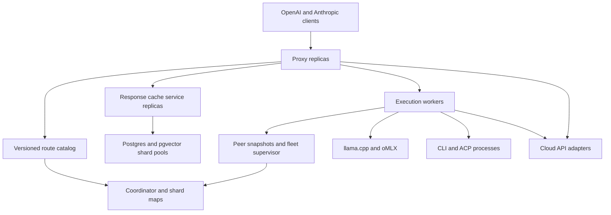
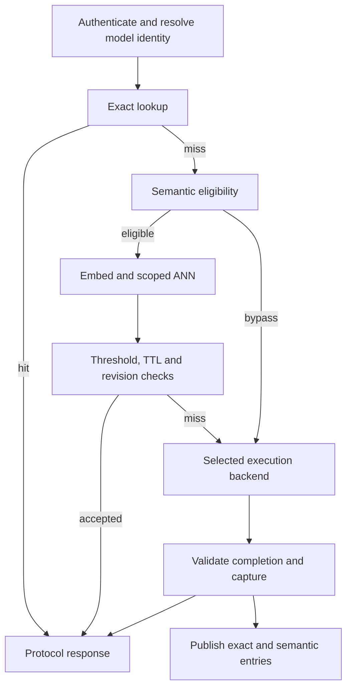
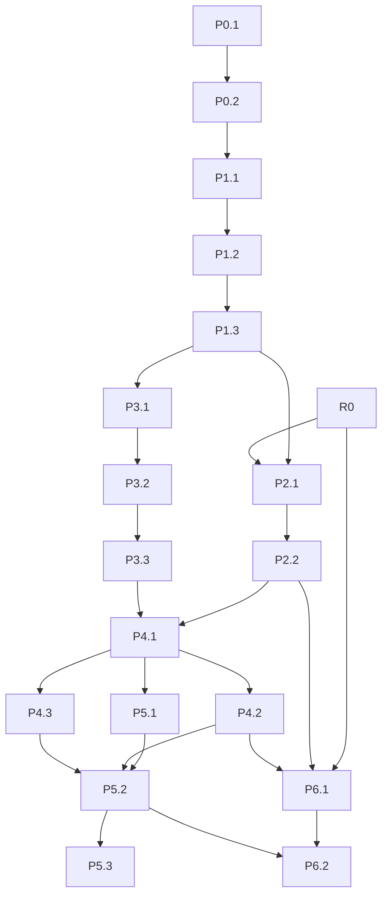

# llamactl: unified AI router architecture and implementation plan

Design review baseline: `frozename/llamactl`, `main` at commit `7443403912ab3976d18bc288de3009e2c23b7afb`. Research date: 2026-09-23. This is a design proposal, not an implementation. The publication changes documentation only; it does not enable runtime features, deploy, or merge implementation.

All paths are complete paths relative to the repository root. Source references S01–S36 and S44 at the end link to immutable GitHub file/line ranges. New module paths and schemas are explicitly proposals and therefore have no existing line numbers. External protocol references E01–E11 identify primary documentation reviewed. Static call-path verification was performed; planned implementation tests are not completion claims, and live provider interoperability is not claimed. The completed Nova contract audit and Penumbra/geo-eval review are in §11; validation results for this documentation publication are recorded in the PR. [S01], [S44]

Roadmap: [#127](https://github.com/frozename/llamactl/issues/127). Documentation PR: [#147](https://github.com/frozename/llamactl/pull/147).

## Ownership revision — 2026-09-24

The [cross-project boundary assessment](./2026-09-24-ai-platform-boundaries.md) revises the recommended ownership below: Sirius owns the full public gateway and final-response cache policy; llamactl owns fleet control, model workers and the direct local endpoint; Embersynth owns synthetic-model composition; Penumbra owns the agentic harness and managed CLI/ACP execution; Nova owns shared model contracts. In particular, replace the proposed llamactl `packages/proxy` destination with a standalone Sirius deployment. The original detailed safety invariants remain applicable, but module allocation and future task fences must be reconciled with the assessment before affected work is dispatched. Preserve active P0.2 work and completed P0.1 evidence. The assessment is a documentation proposal, not a runtime change or a transfer of existing issues.

## 1. Executive decision

Build one **protocol-neutral routing and execution pipeline**, with OpenAI Chat Completions, OpenAI Responses, and Anthropic Messages as ingress/egress codecs. Retain native protocol payloads alongside normalized requests. In llamactl, keep worker/provider transport adapters in `remote` and pure worker policy/schemas in `core`. The full public gateway composition root and response-cache policy belong in Sirius under the 2026-09-24 ownership revision; the original `packages/proxy` references below are migration targets to reallocate, not instructions to build a competing gateway. The “core tier” means execution workers built from `remote` plus `core`; it does not mean putting HTTP or ACP transport in the `core` package. [S01]

Recommended decisions:

1. Publish a unified catalog of local, peer, cloud, CLI and eventually ACP deployments. Separate public model aliases, upstream model IDs, deployment identity, and worker identity.
2. Prefer native Anthropic-to-Anthropic passthrough. Translate only when source and destination protocols differ. Treat compatibility as a capability matrix, not a promise that every backend implements every vendor feature.
3. Keep exact response caching first. Add opt-in, protocol-isolated semantic caching using **pgvector with HNSW**, strict metadata filters, completion validation and a dedicated response-cache schema. Reuse embedding bindings and SQL connectivity, not the current RAG search contract unchanged.
4. Separate request execution placement from response-cache ownership. Use weighted rendezvous hashing over eligible execution replicas and stable virtual cache shards; publish versioned membership/shard maps. Semantic cache affinity is based on a compatibility namespace, not a cryptographic hash of prompt bytes.
5. Use peer snapshots as observations and existing tunnels as transport. Use a transactional coordinator for authoritative epochs, leases and fencing in managed fleet mode; snapshot-based deterministic election is not distributed consensus.
6. Keep CLI/ACP credentials, subprocesses, sessions, filesystem access and KV slots on execution workers. Proxy replicas retain only disposable catalog snapshots, connection pools, and in-flight request state.

### 1.1 Corrections to the supplied current-state assumptions

| Assumption                                                   | Verified result and implication                                                                                                                                                                                                                                                                                                                                                                                                                   |
| ------------------------------------------------------------ | ------------------------------------------------------------------------------------------------------------------------------------------------------------------------------------------------------------------------------------------------------------------------------------------------------------------------------------------------------------------------------------------------------------------------------------------------- |
| Anthropic Messages is fixed to the local endpoint            | **False for correctly labeled JSON requests with a routable model.** `anthropicMessagesContext` initializes a local fallback, but `proxyOpenAI` subsequently calls `resolveRoute`; `resolveJsonBodyRoute` resolves the translated body's preserved model and replaces that target. Local and peer model routing therefore already applies. Add explicit Anthropic/peer coverage; do not describe unified routing as entirely absent. [S03], [S04] |
| Anthropic cloud execution is already native                  | **False in this commit.** Both direct and virtual cloud nodes use `createOpenAICompatProvider`. The Anthropic quirk is catalog fallback, not a native Messages adapter. `anthropic-direct` is a possible configured node name, not a distinct native execution branch. Native support is new work. [S09]                                                                                                                                          |
| Cloud/CLI cannot be reached anywhere on `/v1`                | Too broad. Plain model-based `proxyOpenAI` cannot resolve them, but `/v1/chat/completions` has a `via`/`rag` extension that invokes tRPC `chatComplete`, which can construct providers. This is a separate JSON execution path, not the requested unified model router. [S02], [S11]                                                                                                                                                              |
| The exact cache is an inexpensive streaming pass-through     | Cacheable misses currently call `await upstream.arrayBuffer()` before returning a replay. Thus eligible SSE misses are buffered to completion. Fix bounded streaming capture before expanding this behavior to cloud/agent traffic. [S17]                                                                                                                                                                                                         |
| Anthropic SSE support means `stream:true` is preserved       | The response translator exists, but the Anthropic request type and `translateAnthropicRequest` omit `stream`; the output object does not propagate it. Existing SSE tests use an SSE-returning fixture. Add a test whose upstream streams only when requested. [S05], [S06]                                                                                                                                                                       |
| Tunnels need streaming built from scratch                    | They already have `stream-event`, `stream-done`, `stream-cancel`, subscription bridging and cancellation. Older AGENTS prose is stale. Reuse this and add bounded flow control and execution-specific envelopes. [S23], [S24] Correction (2026-09-23, P0.1 #129): frames and the client bridge exist, but maybeStartTunnelClient wires no handleSubscription, so tunneled subscriptions answer subscription-unsupported; wire it, not reuse.      |
| Response cache only means llama.cpp, KV only means llama.cpp | Exact entries also cover eligible peer routes; oMLX has save-handle/capability integration and stream synthesis. KV eligibility includes `ModelHost/omlx`. Preserve that behavior and keep KV local to the worker. [S15], [S16]                                                                                                                                                                                                                   |
| Provider registration is consistent across all schemas       | `CloudProviderSchema` includes Gemini, but `nodeAddCloud`'s procedure enum omits it. Reuse the shared enum rather than perpetuating drift. [S10], [S12]                                                                                                                                                                                                                                                                                           |

## 2. Current-state request traces

### 2.1 Plain OpenAI request to a local workload

`packages/remote/src/server/serve.ts` authenticates `/v1` traffic. `GET /v1/models` calls `listOpenAIModels`; other requests enter `proxyOpenAI`. Chat POSTs first pass through the RAG-extension handler, which reconstructs and forwards plain requests when neither `via` nor `rag` is supplied. [S02], [S11]

`proxyOpenAI` runs `parseIncoming → resolveRoute → stripVendorFields → exact response-cache lookup → KV lookup → forward → KV persistence → protocol translation/oMLX SSE synthesis → response-cache persistence`. Parsing strips `authorization`, host/connection/content-length headers, stages the singleton local fallback, and routes JSON request bodies by `model`. Unknown models currently retain the fallback rather than producing a strict unknown-model error. [S03], [S04], [S16]

`listLocalRoutes` enumerates tracked runtime directories and live PIDs. ModelHosts contribute their aliases and engine; ModelRuns contribute the model relative path and declared `--alias` values. `buildRouteMap` resolves collisions by ModelRun before ModelHost, then workload name. This loses multiple deployment candidates by design. `RouteEntry` assumes host/port, ModelRun/ModelHost, engine and workload, so it cannot represent a cloud provider or execution binding without pretending it is a local process. [S07], [S08]

The existing tRPC local paths differ: `chatComplete` invokes `proxyOpenAI`, while local `chatStream` constructs an OpenAI-compatible provider against `LLAMA_CPP_HOST/PORT` directly. Convergence must include these callers or behavior, caching and telemetry will remain different between UI and SDK traffic. [S13]

### 2.2 Plain OpenAI request to a peer

The remote peer poller discovers configured peers, fetches fleet snapshots over pinned direct HTTPS or a tunnel tRPC call, flattens reachable model advertisements, and publishes them using `openaiProxy.setPeerSnapshots`. It defaults to a 15-second interval, preserves the previous observation across transient failures, and drops removed peers from its next publication. Poller startup is conditional on agent options. [S21]

`listClusterRoutes` starts with local routes, then traverses configured peers in order, excludes HIGH-pressure and older-than-30-second observations, and appends only previously unseen model IDs. Peer entries are represented as synthetic `ModelRun/llamacpp` routes even if the actual remote backend differs. This is local-first/first-eligible-peer deduplication, not load balancing or consistent hashing. [S08]

The proxy builds a peer URL using `peerEndpoint + pathname`, sets the peer bearer and optional TLS CA, and propagates client cancellation into `fetch`. This forwarding code does not consume tunnel preference metadata; tunneled snapshot discovery does not by itself make peer inference reachable through the tunnel. The peer receives another public request and routes it again. The future worker invocation must pin a deployment and forbid another fleet-selection hop. [S04], [S08], [S21]

Response cache identity for a peer includes `peer:<node>:<model>[:revision]`. A peer restart/model swap invalidates it when the peer advertises a changed revision. A legacy peer without revision lacks that protection; this is a compatibility limitation, not a strong immutable model identity. KV restore/save remains local; cross-node oMLX request handles are rejected. [S16], [S18]

### 2.3 Cloud/API provider

`node add-cloud` builds an input and dispatches registration to `nodeAddCloud`; that procedure creates a binding, optionally probes health, and writes a gateway-kind node under the kubeconfig lock. Provider configuration is held by `CloudBindingSchema` and resolved through `providerForNode → providerForCloudNode`. API key references resolve via `packages/core/src/config/kubeconfig.ts` into `packages/core/src/config/secret.ts`—the older remote-path reference in AGENTS is stale. [S10], [S12], [S22]

`chatComplete` selects the node/project target, builds an `AiProvider`, calls `createResponse`, and records usage. `chatStream` uses `streamNodeChatEvents` and the provider's usage hook. The factory normalizes base URLs, preserves Gemini's `/openai` shim path, strips Gemini `models/` prefixes, and provides catalog fallbacks for Gemini/Anthropic. Sirius/Embersynth virtual nodes resolve their parent cloud binding. Virtual-node naming alone does not enforce upstream provider isolation; route bindings need explicit upstream model and provider-scope metadata. [S09], [S13], [S14]

Why ordinary proxy traffic cannot use this: `buildRouteMap` only consumes workload/peer routes; `forward` only performs a URL fetch; it neither constructs an `AiProvider` nor resolves cloud credentials. Cloud telemetry hooks live on the tRPC/factory path. Merely appending a cloud hostname to the current route type would miss protocol choice, credential resolution, capabilities and telemetry. [S03], [S04], [S07], [S09], [S13]

### 2.4 CLI subscription provider

Agent `cli[]` bindings synthesize `<agent>.<binding>` provider nodes with `provider.source = cli`. `providerForVirtualNode` resolves the declared parent and binding, then constructs `createCliSubprocessProvider`. The adapter flattens role-tagged messages into a text prompt, expands argv, spawns without a shell, and journals execution. Nonstream responses are OpenAI-shaped with byte-based token estimates. Claude is configured as line-streaming; Codex/Gemini/custom presets currently use buffered completion. [S10], [S14], [S19], [S20]

The factory's “hosting agent” comment is not an execution transport: it constructs a provider in the process that calls the factory. The adapter executes `Bun.spawn` there; `agentName` attributes the journal. This code does not independently dispatch to a remote parent machine. Correct remote execution requires dispatch to the owning agent before constructing/spawning the provider. Verify that with a two-worker sentinel test, not a comment. [S09], [S19]

The current tRPC `streamNodeChatEvents` helper emits only `done` when a provider has no `streamResponse`; it does not call `createResponse` to synthesize content. Buffered fallback therefore needs an actual implementation, not just SSE framing. [S36]

Current limitations relevant to proxying: requested `model` does not become a CLI model-selection argument in the inspected `createCliResponse` path; images are flattened to placeholders; arbitrary Chat parameters/tools are not enforced by the CLI adapter; nonstream create uses its own timeout but has no caller-signal argument; stream failures can yield an error followed by a `done`. The new bridge must reject unsupported features and never turn that sequence into successful completion or a cache entry. [S19], [S20]

### 2.5 Anthropic Messages and OpenAI Responses

Both endpoints translate into Chat Completions, retain protocol context, and then pass through the same `resolveRoute` stage. Anthropic stores the original request for tool replay and translates JSON/SSE back; Responses translates input/output and tool items but has an explicit 501 response for streaming conversion. The current Anthropic subset excludes thinking and other native blocks, uses an incomplete `tool_choice` representation, and omits the `stream` field. A native request must be routed **before** attempting that lossy subset translation. [S03], [S04], [S05], [S06]

Anthropic/OpenAI/Responses exact-cache rows have distinct `protocolVariant` values. Current entries store final protocol bytes, not a single protocol-neutral response. The Anthropic completion signal prevents caching truncated streams even when the translator emits a synthetic terminal sequence. Retain the completeness invariant, while replacing success-shaped truncated responses with explicit protocol error handling. [S15], [S17], [S18], [S32]

“Full Anthropic-compatible” here means Messages request/response fidelity, SSE, auth/error conventions, model routing and token-count capability. It does not silently imply Anthropic Files, Batches or every proprietary server tool can be emulated on a local model. Native routes can preserve supported upstream features; translated routes must publish and enforce a documented subset.

### 2.6 Cache, RAG and fleet foundations

The exact cache hashes recursively sorted JSON with SHA-1, excluding two root oMLX fields. Lookup additionally scopes by model, workload, workload epoch and protocol. Cache eligibility is `temperature === 0` or numeric seed, plus the route KV-eligibility gate. The latter wrongly couples reusable response caching to local engine kinds for the proposed new backends. SQLite WAL storage has schema migrations; eviction combines age, payload size and decayed hits. There is no embedding/nearest-neighbor operation on this response-cache path. [S15], [S16], [S17], [S18]

`createEmbedderFromBinding` already builds and reuses an embedding provider. The pgvector RAG adapter already computes cosine distance, but its search SQL has no cache-specific tenant/model/TTL filters, and collection creation does not build an ANN index. Reusing `ragSearch` unchanged would not satisfy cache correctness or ANN requirements. [S25]

Fleet-supervisor already has placement/migration and a deterministic lease-holder calculation over received snapshots. Its local observations do not establish a globally linearizable ownership term during network partitions. Reuse observations, policy and operational interfaces; add authoritative fencing for shared ownership. [S26]

### 2.7 Prior designs: retained and superseded

Reviewed the three requested Anthropic/KV documents. Retain pure translators, staged proxy processing, strict block ordering, workload epochs, slot allocation, tool-argument replay, fake upstream tests and keeping cache writes outside runtime-mtime invalidation trees. Do not replay their now-completed implementation phases. Their original scope deliberately omitted thinking, prompt-cache markers and beta enforcement; native passthrough closes those losses for native upstreams. The old proposal to finish upstream errors with synthetic `end_turn` is superseded by explicit failure events plus non-cacheability. Their oMLX investigation is superseded by current oMLX code. [S27], [S28], [S29], [S15], [S32]

ACP is net-new: a source/dependency search for ACP transport/package names and `session/prompt` found no first-class implementation under `packages/`; the matching TypeScript ACP mention is an evaluation prompt, not an adapter. This absence finding is bounded to this commit and search scope. [S30]

## 3. Target architecture and ownership

Cloud adapters may run in credential-enabled proxy replicas for direct egress, or on designated egress workers. The default shared-proxy deployment uses egress workers so public-edge replicas do not carry provider keys. Both modes invoke the same remote adapter implementation. Embedded mode composes all roles in one agent, preserving a zero-coordinator, exact-cache-only local installation.

| Responsibility                                                                              | Package location proposed                                                                        | Runtime owner                             |
| ------------------------------------------------------------------------------------------- | ------------------------------------------------------------------------------------------------ | ----------------------------------------- |
| Wire-independent schemas, route selection, capability checks, hashing and cache eligibility | `packages/core/src/routing/`, `packages/core/src/inference/`, `packages/core/src/semanticcache/` | Imported pure logic                       |
| Existing Anthropic/Responses transforms                                                     | `packages/core/src/anthropic/`, `packages/core/src/responses/`                                   | Called by protocol codecs                 |
| HTTP request handling, adapters, worker RPC, cache SQL, catalog publication                 | `packages/remote/src/inference/`, `packages/remote/src/proxy/`, `packages/remote/src/cache/`     | Proxy, cache service or worker            |
| Standalone proxy bootstrap and health/drain endpoint                                        | `packages/proxy/src/main.ts`                                                                     | Proxy replica                             |
| Workload process lifecycle, KV slot files/leases, CLI/ACP sessions                          | Existing core lifecycle plus `packages/remote/src/execution/` and `packages/remote/src/acp/`     | Execution worker                          |
| Observation aggregation and placement proposals                                             | Existing `packages/fleet-supervisor/src/`                                                        | Supervisor                                |
| Authoritative catalog generation, shard assignment and session-owner CAS                    | `packages/remote/src/coordination/`                                                              | Coordinator service backed by HA Postgres |
| Operator registration/status/diagnostics                                                    | tRPC procedures; `packages/cli/src/commands/`; app consumes tRPC                                 | Presentation/control plane                |

No `core → remote` import is introduced. Phase 1 creates a remote composition layer that can invoke legacy local forwarding while cloud traffic uses remote adapters. Phase 4 moves transport orchestration out of `openaiProxy.ts`, updates all in-repo imports and tests atomically, and deletes the old transport entrypoint. Preserve public behavior, not a permanent internal backwards-import shim. [S01]

### 3.1 State placement

| Existing/new state                                                   | Destination after extraction                                                           | Durability/consistency                                       |
| -------------------------------------------------------------------- | -------------------------------------------------------------------------------------- | ------------------------------------------------------------ |
| Process-global route/models map and peer snapshots                   | Disposable proxy snapshot keyed by catalog version                                     | Rebuildable; request-time lease/freshness filtering          |
| Kubeconfig, aliases, capability policy, credential references        | Control-plane configuration; redacted route catalog                                    | Versioned publication; compare-and-swap updates              |
| Raw provider keys                                                    | Credential-enabled executor only                                                       | Resolver at execution; bounded cache invalidated on rotation |
| SQLite exact entries and semantic response/vector records            | Cache services; local SQLite in embedded mode, PG-backed durable records in fleet mode | Atomic record completeness; cache failure falls through      |
| Slot allocators, KV registries, oMLX handles and runtime directories | Owning worker                                                                          | Never moved through response-cache shards                    |
| CLI child processes and ACP connection/session pools                 | Owning execution worker                                                                | Active work is not transparently migratable                  |
| Session ownership and request admission/idempotency metadata         | Coordinator/execution store                                                            | CAS and fencing; unknown execution outcome is explicit       |
| Usage records and request outcomes                                   | Worker emits one execution record; proxy emits delivery/cache record                   | Correlated request/attempt IDs; dedupe at collector          |

## 4. Unified contracts, configuration and protocols

The following are design shapes, not production TypeScript. Use Zod discriminated unions at configuration/RPC boundaries and `.js` imports when implemented. [S01]

### 4.1 Model identity and route catalog

**`RouteAdvertisementV1`**:

| Field                                                                   | Meaning                                                                                                                              |
| ----------------------------------------------------------------------- | ------------------------------------------------------------------------------------------------------------------------------------ |
| `routeId`, `deploymentId`, `backendId`, `ownerNodeId`                   | Stable identities; never inferred by splitting an arbitrary model string                                                             |
| `publicModelIds[]`, `upstreamModelId`                                   | Exposed aliases vs exact upstream selector                                                                                           |
| `backendKind`                                                           | `local-model`, `cloud-api`, `cli`, `acp`                                                                                             |
| `transport`                                                             | `local-http`, `worker-rpc`, `cloud-direct`; validated endpoint reference, not client URL                                             |
| `providerKind`, `bindingId`                                             | Resolver keys; no bearer, key value, argv or environment in public catalog                                                           |
| `capabilities`                                                          | Operations, native protocols, streaming mode, modalities, tools, structured output, token counting, cancellation and session support |
| `modelRevision`, `deploymentEpoch`, `adapterRevision`, `policyRevision` | Immutable serving identity/invalidation inputs; unknown revision explicitly represented                                              |
| `weight`, `maxConcurrency`, `queueDepth`, `healthyUntil`, `draining`    | Static capacity plus freshness-bounded observations                                                                                  |
| `credentialScopeId`, `tenantVisibility`, `region`, `trustDomain`        | Authorization and cache isolation labels; no credentials                                                                             |

**`RouteCatalogV1`** contains `schemaVersion`, `catalogVersion`, `configRevision`, `generatedAt`, `expiresAt`, `deployments[]`, and explicit `aliasBindings[]`. Replace `Map<model, RouteEntry>` with `Map<publicModelId, RouteCandidate[]>`; selection happens per request after permission/capability/freshness filtering. A peer is a transport location, not a backend kind. A remote oMLX deployment remains oMLX rather than a fake llama.cpp route.

Preserve legacy unqualified local aliases and collision ordering during rollout. New providers publish namespaced IDs such as `cloud/<node>/<upstream-model>` and `cli/<agent>/<binding>`; bindings can declare friendlier aliases. Do not parse model strings on `/` to recover the upstream ID—IDs themselves contain slashes. Persist the mapping. A conflicting new alias is rejected unless an explicit priority/replica group is configured. Two deployments are replicas only if their serving identities are compatible; equal user-facing names are insufficient.

Catalog discovery runs in the background with per-provider timeouts and last-known-good TTLs. Configured models must work when a provider does not support model listing. A fallback catalog is an unverified hint, not evidence of capabilities or account entitlement. `/v1/models` uses the same authorization-filtered catalog as inference; it does not call every provider on each GET. [S09]

### 4.2 Request and execution seam

**`InferenceEnvelopeV1`** contains:

- `requestId`, `attemptId`, `deadline`, `tenantId`, `projectId`, `credentialScopeId`, `traceContext` from authenticated server context.
- `operation`: `generate`, `embed`, `count-tokens` or an explicitly registered native operation.
- `ingressProtocol`: `openai-chat`, `openai-responses`, `anthropic-messages`.
- `publicModelId`, requested feature set, `stream`, selected policy and optional server-approved session reference.
- Original validated native body plus semantic header allowlist/version fingerprint; lazily derived normalized conversation only when translation is necessary.
- Optional selected `deploymentId`, `expectedDeploymentEpoch`, `catalogVersion`, `membershipEpoch`, `hopCount`, `visitedNodes` for trusted internal calls.

Never trust incoming public headers for tenant identity, owner selection, cache shard, privilege, or hop count. Strip and regenerate internal headers. Keep original bytes or a lossless parsed representation until the destination is chosen; do not run Anthropic through the current translator to extract a model.

Normalized Chat messages, requests, responses, tools and stream payloads reuse `@nova/contracts` directly. The additional lifecycle and transport metadata below are wrappers, not replacement Nova schemas. Required shared cancellation/usage extensions are specified in §11.2 and P0.2.

**`BackendExecutor`** has `describe()`, `execute(envelope, executionContext)`, `cancel(attemptId)` and lifecycle `drain()/close()`. Execution returns either a native response stream with completion metadata, or a normalized result/event iterator. This is a remote adapter interface; pure shared data contracts live in core. An `AiProviderExecutor` adapts existing `createResponse/streamResponse` and quirks without making `AiProvider` the universal lossless representation.

**`ExecutionEventV1`** variants: `accepted`, `message-start`, `text-delta`, `tool-call-start`, `tool-arguments-delta`, `tool-call-end`, `usage`, `finish`, `error`, and internal `agent-progress`. Each carries request/attempt/sequence identity. Tool events mean **client-executed function calls only**. Native byte streaming remains available when normalizing would lose thinking signatures, citations, server-tool content or vendor extension fields.

Terminal state is exactly one of `completed`, `failed`, `cancelled`, `unknown-outcome`. It carries authoritative source-completion evidence separately from presentation events. “Socket closed” and a synthesized `[DONE]` are not success evidence. Usage includes observed/estimated/unknown attribution, cached-input/cache-write tokens where available, pricing revision, and upstream request ID.

### 4.3 Configuration additions

Place `router`, `modelBindings`, `semanticCache` and `fleetRouting` under each cluster; node-specific adapter fields remain on `nodes[].cloud`, `nodes[].cli` and `nodes[].acp`. These are proposed additions to `ClusterSchema` and `ClusterNodeSchema`, not currently accepted configuration. Standalone proxy bootstrap refers to a cluster/control-plane endpoint and service-credential reference rather than copying worker secrets.

Keep `Config.apiVersion = llamactl/v1` with additive optional fields during the rollout. Existing agent/gateway/cloud/provider/rag kinds remain valid. Add process deployment roles separately; do not multiply node kinds for proxy, cache and coordinator processes.

| Schema proposed/changed     | Fields and validation                                                                                                                                                                                                                                                               |
| --------------------------- | ----------------------------------------------------------------------------------------------------------------------------------------------------------------------------------------------------------------------------------------------------------------------------------- | --------------------------------------------------------------------------------------------------------------------------------- | ----------------------------------------------------------------------------------------------------------------------------------------------------------------------------------------------------------------------------------------- |
| `CloudBindingSchema`        | Optional `protocol: openai-compatible                                                                                                                                                                                                                                               | anthropic-messages                                                                                                                | openai-responses`; `models[]`declarations,`aliases`, `executorNodeIds`, `credentialScopeId`, `revision`, capability overrides validated against adapter support. Legacy bindings retain their current protocol until explicitly migrated. |
| `ProxyModelBindingSchema`   | Explicit `{publicId, backendId, upstreamModelId, replicaGroup?, revision?, capabilities, cachePolicy}`; disallow alias conflicts and self-routing cloud URLs.                                                                                                                       |
| `CliBindingSchema`          | Model-to-invocation mapping, `workspaceRef`, environment secret references, concurrency/queue limits, sandbox policy and immutable invocation revision. Advertised models without enforceable selection are rejected for proxy publication.                                         |
| `AcpBindingSchema`          | Agent-only `acp[]`: name, command/argv reference, stdio transport, SDK/protocol version profile, workspace/MCP allowlists, auth reference, model/mode mapping, pool/session limits, permission policy. `provider.source` gains `acp`; virtual provider node remains the projection. |
| `RouterPolicySchema`        | `mode: legacy                                                                                                                                                                                                                                                                       | unified`; unknown-model policy; protocol capability policy; retry/timeout limits; model aliases and allowed fallback deployments. |
| `SemanticCachePolicySchema` | `mode: off                                                                                                                                                                                                                                                                          | shadow                                                                                                                            | serve`; embedder binding and revision/dimensions; pgvector connection reference; namespace, per-model threshold, TTL, topK, embedding/query budgets, byte limit, eligibility profile. No universal default threshold.                     |
| `FleetRoutingSchema`        | `mode: legacy                                                                                                                                                                                                                                                                       | observe                                                                                                                           | rendezvous`; coordinator reference, membership/shard schema versions, stable virtual shard count, replication/read policy, draining and lease bounds.                                                                                     |

Share `CloudProviderSchema` across CLI/tRPC validation, fixing the Gemini discrepancy. Configuration writes remain through remote tRPC and existing CLI dispatcher. Older binaries must not rewrite files containing unsupported new settings; add capability/version diagnostics and stage config publication after compatible readers are deployed. Use separate new cache schema/table names for reversible rollout. [S10], [S12], [S31]

### 4.4 Protocol behavior matrix

| Ingress            | Native same-protocol upstream                                                     | Other HTTP/API backend                                                          | CLI/ACP                                                                            |
| ------------------ | --------------------------------------------------------------------------------- | ------------------------------------------------------------------------------- | ---------------------------------------------------------------------------------- |
| Chat Completions   | Preserve request fields and OpenAI SSE, rewrite only bound model/approved headers | Translate supported features through the adapter                                | Supported text conversation → execution → Chat JSON/SSE                            |
| Anthropic Messages | Native Messages body and SSE passthrough; preserve native blocks/signatures       | Existing translator extended and capability-checked → backend → Anthropic codec | Text-only compatibility initially; reject unsupported tool/image/thinking features |
| OpenAI Responses   | Native Responses passthrough where advertised                                     | Translate supported input/output items; add Responses SSE codec                 | Same executor; Responses codec renders supported text output                       |

**Native Anthropic decision:** select `protocol: anthropic-messages` by configuration/capability, not by node name. Apply resolved `x-api-key` and configured/allowed `anthropic-version`/beta headers only on the Anthropic upstream request. Preserve prompt-cache markers, thinking/redacted blocks and signatures, citations, native stop reasons and native error events. Do not fold these into an OpenAI body for cache identity. Native extensions that are not understood may pass through, but disable caching unless all identity-relevant inputs are understood. [E06]

For non-native backends, support real Anthropic object-form tool choices and retain old string aliases only as documented accepted input during migration. Propagate `stream` deliberately; reject unrepresentable input with a protocol-shaped 400 before inference. Add Messages `count_tokens` as `operation=count-tokens` in the same router: native passthrough to Anthropic, model-tokenizer implementation only when the selected backend exposes a trustworthy capability, otherwise explicit unsupported-operation response. Never label a rough character count as an exact model token count. [S05, E07]

The current native Messages schema is the compatibility reference for required fields and object-form tool choice; pin SDK fixtures to that schema rather than the existing handwritten subset. [E11]

Support Anthropic SDK authentication by accepting the **llamactl access credential** in `x-api-key` on the Anthropic public surface, or existing bearer auth. If both exist and disagree, reject. Neither public credential is forwarded. Redact request IDs/headers appropriately; use Anthropic error JSON and named SSE `error` events for Messages, OpenAI error JSON/SSE conventions for OpenAI endpoints. Do not fabricate `end_turn` or `response.completed` on an upstream error. Current bearer validation can be reused, but tenant/project/scoped authorization is an addition. [S22, S32, E06]

Responses streaming is a prerequisite for declaring three-protocol streaming support. Add a codec with stable response/item/output indices and lifecycle events, text/tool deltas, final usage and completed/failed/incomplete state. Preserve native Responses semantics where available; reject unsupported stateful `previous_response_id`, background/store or built-in tools on translated routes until an explicit implementation exists. Session extensions are not a substitute for native Responses storage semantics. [E10]

### 4.5 Streaming, cancellation, retry and telemetry invariants

- Parse frames incrementally across arbitrary UTF-8 and SSE boundary splits. Preserve multi-choice/tool indices. Bound pending output bytes, maximum event size and accumulated tool arguments.
- Capture cache bytes through a bounded pass-through transform. Deliver the first upstream token immediately; stop collecting when the entry limit is exceeded while continuing delivery. Do not use an unconsumed `tee()` branch that can grow without bound. Commit only on validated upstream completion.
- Separate connect, first-token, idle and whole-request deadlines. Propagate disconnect through proxy RPC/tunnel to fetch/subprocess/ACP cancellation. Complete cleanup after the response body finishes, not when the HTTP handler returns its `Response`.
- A buffered CLI may yield one synthetic chunk after completion; advertise `streaming: buffered`, not token streaming. An adapter `error` followed by `done` remains a failed attempt.
- Retry only before client-visible output and when the executor can establish safe non-acceptance or upstream idempotency. A network timeout after acceptance is not safe to retry for CLI/ACP. Disable speculative hedging for side-effecting execution. No retry or backend switch after emitting output.
- Emit one billable execution record per attempt from the execution owner; cache hits emit delivery records with no new generation charge. Preserve original usage in replay metadata separately from billed usage. Embedding calls are separately metered. Do not represent unknown CLI usage as zero-cost measured tokens. Move existing router usage helpers into a shared remote module and reuse the current usage writer. [S13], [S19]

## 5. Exact → semantic → upstream cache design

Routing resolves the authorized logical model/serving identity before cache lookup; the cache cannot be used to bypass model access. Replica selection may happen after a cache miss if all replicas have a verified common revision. Otherwise scope cache lookup to the chosen deployment. The KV prefix cache is an execution optimization below `upstream`; it is not the semantic cache.

### 5.1 Storage decision

| Candidate  | Decision                                                                                                                                                                                                                                                                                                                         |
| ---------- | -------------------------------------------------------------------------------------------------------------------------------------------------------------------------------------------------------------------------------------------------------------------------------------------------------------------------------- |
| sqlite-vec | Do not select for fleet ANN. Attractive embedded KNN option, but the reviewed docs establish KNN/SQL integration, not the required distributed store/replication/ownership behavior. Supporting another backend is deferred. [E08]                                                                                               |
| pgvector   | **Select.** Existing connectivity and embedder reuse, transactional payload/vector publication, metadata filtering, HNSW and relational TTL/eviction. Requires explicit ANN index creation and dedicated cache tables. [S25, E05]                                                                                                |
| Chroma     | Do not select for first implementation. Existing RAG integration is useful for knowledge retrieval, but a second cache backend increases operational and cache-transaction surface without satisfying a missing requirement in the selected design. This is a design tradeoff, not a claim that Chroma cannot perform ANN. [S33] |

Semantic caching is optional: exact-only installations need no Postgres. Phase 3 retains existing exact SQLite and adds self-contained semantic records in pgvector, including response payloads. A semantic row must not point only at an origin node's SQLite blob. This deliberately duplicates selected complete responses rather than attempting a distributed transaction between SQLite and Postgres. Either write may fail independently; neither creates a false hit.

In fleet mode, cache services expose one interface and keep durable exact payloads and semantic records in PG shard pools; SQLite may accelerate local exact lookup but is disposable. The logical first tier is still exact matching, whether served from local storage or its authoritative cache service. Database physical replication is managed by Postgres infrastructure; cache-service replica count alone does not replicate SQLite data.

### 5.2 Identity and eligibility

**`CacheScopeV2`** contains tenant/project cache namespace, credential scope, public model binding revision, serving model/revision or deployment epoch, adapter/codec revision, protocol variant, semantic feature-header fingerprint, policy revision, safety-context hash, embedder revision and dimensions for semantic entries.

Keep existing `protocolVariant` values (`openai`, `anthropic`, `responses`). **No cross-protocol semantic reuse by default or in these phases.** An equivalent English request expressed in two protocols may produce distinct valid outputs and carries different extensions. Cross-protocol embedding memoization also requires an explicit privacy/normalization policy; it does not imply shared response reuse.

Exact identity uses a versioned canonical body that retains all output-affecting fields and approved semantic headers. Preserve the old canonical hash behavior for old local exact rows; introduce a V2 identity namespace rather than silently reinterpreting them. Use SHA-256 or keyed hashes for new cross-tenant-visible identifiers; raw hashes must never function as authorization tokens. Native Anthropic exact identity includes original native fields, not the translated subset. Unknown behavior-affecting extensions disable caching.

Semantic eligibility is a separate contract from `isDeterministic`:

- Default **off**, explicit opt-in per model/task/tenant. `temperature=0` is not proof that approximate prompt equivalence is acceptable; numeric seed alone does not authorize semantic caching.
- First supported profile: single-turn text Q&A, stable system/developer context, no tools, no external side effects, no multimodal input, no structured-output grammar/schema, no changing retrieval context and no continuation/session dependency.
- Tool definitions/results/calls, CLI/ACP executions, seeds requiring reproducibility, code transformations, exact arithmetic, identifiers, negatives/permissions and freshness-sensitive answers are bypassed unless a separately evaluated profile explicitly permits them. Exact caching can continue under the existing local policy; new agent backends default to no response caching at all.
- Hash system/developer prompts, generation settings, output schema, locale, safety policy, tool configuration and any fixed conversation prefix exactly. Embed a versioned, role-delimited canonical text representation of the eligible variable request, preserving numbers, punctuation and negation. Do not embed the SHA or only the last message of an unrestricted conversation.
- Do not truncate to fit an embedder and then serve a semantic hit. Over-limit requests bypass semantic caching. A future long-context profile must define chunking/aggregation and prove equivalence separately.
- RAG requests bypass semantic caching initially. A later profile must retrieve first and include document/version/ACL context; semantic reuse cannot substitute for fresh retrieval permission checks. [S11], [S15], [S25]

### 5.3 Query and publication

1. Exact lookup using full scope; check expiry and revision before returning. A hit avoids embedding entirely.
2. Run eligibility checks; compute safety-context hash and embedding-input hash.
3. Reuse a bounded memoized embedding keyed by input hash plus embedder revision; otherwise call the existing embedder binding with a deadline/concurrency budget. Add finite-vector, nonzero-norm, dimension, result-index and revision validation around the current helper. Embedding calls carry an internal cache-bypass marker to avoid recursion.
4. Query only matching tenant/model/protocol/revision/safety scope and `expires_at > database_now`. Use HNSW cosine distance, bounded topK and iterative scans where supported. pgvector filtering occurs after ANN traversal, so strict filters may reduce recall; partitioning and scan tuning improve recall, not authorization. [E05]
5. Recompute/check candidate cosine similarity, scope equality, completion status, payload checksum, TTL and policy threshold. Highest score wins with a deterministic tie break. Thresholds are calibrated per embedder/model/task on labeled positive pairs and hard negatives. There is no universal “0.9 means equivalent” rule.
6. On semantic hit return only the stored variant. Expose `x-llamactl-cache: semantic`, source entry age and policy version; redact similarity details if they expose other users' data. If promoting this hit into an exact key, retain original expiry and provenance—do not reset TTL or recursively train semantic entries from reused responses.
7. On miss execute once. Publish only complete, successful, size-bounded eligible responses. Store normalized replay events for supported semantic text responses so new IDs/model aliases can be rendered consistently; legacy exact byte replay remains supported. Never cache truncated/error/permission-denied/refusal-sensitive results through a generic success predicate.

Cache/embedding outages fail open to inference within a bounded latency budget. Authorization, model revocation and permission checks fail closed. Cache misses during failure may increase cost; upstream admission still enforces quotas.

### 5.4 Interfaces and schema

Pure interfaces in `packages/core/src/inference/cache-contracts.ts`:

- `ExactResponseCache.get(scope, requestKey)` → hit/miss plus provenance; `putComplete(entry)`, `invalidate(scopeRevision)`, `touch(id)`.
- `SemanticResponseCache.search(scope, vector, topK, deadline)` → candidates with score/revision/expiry; `putComplete(entry, vector)`, `deleteExpired(batchLimit)`.
- `EmbeddingPort.embed(inputs, embeddingProfile, deadline, signal)` → indexed vectors plus model/revision/usage.
- `CachePolicy.evaluate(request, route)` → exact/semantic eligibility and explicit bypass reason; `validateCandidate` is pure and rechecks all discriminators.

Proposed PG schema under a dedicated `llamactl_cache` namespace:

| Table                      | Required contents/invariants                                                                                                                                                                                                                                    |
| -------------------------- | --------------------------------------------------------------------------------------------------------------------------------------------------------------------------------------------------------------------------------------------------------------- |
| `response_payloads_v2`     | Entry ID, scope hash plus explicit tenant/model/protocol/revision fields, request SHA, payload/events, content type, checksum, complete flag, created/expiry/last-used timestamps, hits, bytes, usage provenance. Unique exact key on full scope + request SHA. |
| `semantic_entries_v1`      | Entry ID/FK, vector of fixed profile dimension, embedder revision, safety hash, logical shard ID, policy revision, source quality/profile marker. Payload and vector published in one PG transaction.                                                           |
| `cache_namespace_versions` | Current revocation/model/policy generation; authoritative fence checked by readers in managed mode.                                                                                                                                                             |
| `cache_write_outbox`       | Optional bounded replication/migration work with idempotent IDs; never the only location of committed payload data.                                                                                                                                             |

Use B-tree indices for exact keys and expiry; HNSW `vector_cosine_ops` on dimension-compatible partitions. Choose an embedder dimension supported by the selected vector index, or explicitly validate another type/index strategy—do not silently cast an arbitrary 3072-dimensional embedding into a smaller space. Separate embedding revisions; backfill into a new namespace and switch readers atomically. [E05]

Evict expired/revoked/incomplete entries first, then highest score using the existing age + size − decayed-hit protection formula. Extend size accounting to vectors, payloads and an estimated index overhead; optionally protect entries by measured saved generation cost, bounded so large hot tenants cannot monopolize storage. Apply per-tenant/model quotas plus a global cap; batch deletes atomically and cascade semantic metadata. TTL never slides on a hit. Account for PostgreSQL dead tuples/index maintenance operationally. Reuse policy arithmetic, not `listAll()` over a fleet-sized database. [S15]

## 6. Proxy–worker boundary and shard-aware fleet routing

### 6.1 RPC and embedded-mode equivalence

Define `inference.describe`, `inference.execute`, `inference.stream`, `inference.cancel`, `inference.status`, `inference.drain` in remote tRPC. Separate operator privileges from inference privileges. Direct transport uses the existing pinned client mechanisms; tunnel transport carries the same typed event stream through its existing subscription bridge. In-process mode invokes the same executor interface without serializing over the network.

An execution command carries the envelope, exact deployment ID/epoch, deadline, idempotency key, authenticated caller claims and a short-lived authorized routing decision. The worker validates schema/version, deployment ownership and epoch, capacity and permission, then emits `accepted` before starting work. It executes locally or returns stale-route/overloaded errors; it does not run global routing again. Cloud egress workers resolve credentials locally. Keep bearer auth + TLS pinning; add scoped service identity and validate the certificate fingerprint where the existing peer fetch only passes a CA. [S04], [S21], [S22], [S23], [S24]

Reject public access to these internal procedures. Propagate cancellation on connection close, but also implement deadline expiry worker-side in case cancellation delivery is lost. Store accepted/running/terminal attempt status on the owning worker and, where required for idempotency, in a durable execution ledger. Same idempotency key plus a different request hash is a conflict. No claim of exactly-once external side effects is possible after an agent or network failure; return unknown outcome instead of automatically rerunning.

The existing tunnel subscription queue is a buffered push/pull iterable without the desired byte budget. Extend its negotiation with maximum frame bytes, bounded outstanding bytes/events and credit/ack flow control, or cancel slow consumers with a typed error when the older peer cannot flow-control. Preserve its frame correlation and cancellation semantics. A tunnel central is a possible failure/bandwidth bottleneck; deploy redundant centrals with worker registrations, and do not assume a live stream migrates when its central dies. [S23], [S24]

### 6.2 Execution routing

For each request:

1. Resolve model alias and enforce permission/capability/region/revision compatibility.
2. If a stateful session exists, consult its fenced owner. This affinity takes precedence over hashing.
3. Filter replicas by fresh health, draining status and admission capacity. Health freshness is checked at request time, not only when rebuilding a cached route map.
4. Use weighted rendezvous hashing of `(routing namespace, canonical request key or session key)` over eligible deployment IDs. Use stable capacity weights; do not continuously rehash on noisy queue depths. A bounded-load policy may try the next ranked eligible replica after an explicit not-accepted response.
5. Keep logical model choice separate from replica choice. Falling back to a different model/provider requires an explicit policy because it changes semantics, cost and cache identity.

Apply per-deployment circuit breakers with bounded half-open probes and provider-account rate/concurrency quotas shared across egress replicas. Admission reservations use atomic coordinator/store updates with expiries and unique attempt IDs; reconcile usage after completion and retain conservative reservations on unknown outcomes. A provider 429 should penalize its shared credential scope rather than merely one proxy replica. CLI/ACP readiness uses executable/auth/session capacity, not the local-model memory-pressure filter.

Do not hash solely on model ID for execution: one popular model would pin every call to one worker. Do not duplicate model process placement in the proxy: supervisor controls placement and capacity. More proxies increase connection/protocol capacity, not GPU throughput or provider account quota.

### 6.3 Exact and semantic cache affinity

**Exact placement**: fixed virtual shards selected by full scoped request key; weighted rendezvous assigns shard-service owners. Identical requests within a revision/tenant scope reach the same shard, independent of which proxy accepted them.

**Semantic placement**: choose a separate virtual shard by `(tenant cache namespace, model serving revision, protocol, embedder revision, safety-context hash)`. All eligible similar prompts in that compatibility namespace query the same semantic index. SHA-near keys are not semantically near keys; request-hash sharding alone would destroy semantic recall.

For hot namespaces, first scale query-serving replicas over the same PG partition and bound upstream load on misses. If one index outgrows a storage pool, an optional later slice partitions it by versioned embedding centroids and probes multiple neighboring partitions. Exact re-ranking/threshold checks remain mandatory; multi-probe ANN remains approximate and must meet measured recall targets. Do not claim guaranteed co-location for arbitrary similar prompts or make centroid partitioning a Phase 3 prerequisite.

This is request/model/cache sharding, not tensor parallelism or splitting a model's weights across machines. Interpret “sharping” as shard ownership, replication and rebalancing; no separate undocumented primitive is assumed.

### 6.4 Coordination, replication and ownership

**`MembershipSnapshotV1`**: node ID, incarnation ID, supported schema/transport versions, observation sequence, health TTL, supported deployments and configured capacity. **`ShardMapV1`**: monotonically increasing epoch, virtual shard ID, cache-service owner/standbys, storage pool/partition, state (`stable`, `copying`, `cutover`, `draining`), source/destination generations and fencing term.

In embedded/legacy mode, use local configuration and snapshots. In managed fleet mode, a small coordinator uses transactional Postgres CAS/leases to publish a single versioned map. Reuse fleet-supervisor for observations and proposing assignments; never promote its snapshot election into a strong lock. Coordinator replicas rely on the database's single authoritative write history/HA policy, not an ad hoc new consensus algorithm. [S26]

Control metadata, session ownership and cache data may use separate PG databases/pools. Within each cache storage pool, Postgres replication provides payload/vector durability together. Across pools, the application owns explicit logical shard transfer. Cache service standbys either query the same authoritative pool or a read replica with an acceptable lag/revision fence; a service standby with an empty local SQLite cache remains functional.

**Join/leave/rebalance procedure:**

1. Register authenticated node incarnation; do not assign it work until readiness/capability checks pass.
2. Compute a proposed assignment from the same frozen membership epoch and stable weights; publish movement state through CAS.
3. For cache-service-only movement on the same storage pool, warm local accelerators and change owner; no data copy is necessary. For storage-pool movement, copy immutable complete rows with original expiry, checksum and revision, plus an ordered change cursor/outbox for later inserts/deletes.
4. During copying, reads use the old authoritative partition; bounded dual-read is allowed on miss. Writes remain source-owned with a replication outbox, avoiding two uncontrolled writers.
5. Drain/catch up, publish a new fencing term and cutover epoch atomically, direct new writes to destination, keep source read-only for a bounded grace interval, then remove expired/retired copies. Old owners reject writes with stale terms.
6. If source fails before completion, use its PG replica where available or accept cache misses; cache durability loss must not turn into incorrect hits. If an execution worker fails, a new stateless attempt is permitted only under retry rules; live CLI/ACP sessions become unavailable/unknown rather than migrating implicitly.

Use one trusted worker-routing hop; stale owner replies include a newer epoch hint and permit one catalog refresh. A visited-node set/hop budget protects legacy inter-proxy fallback during mixed-version rollout. Never publicly accept a cache redirect that names an arbitrary URL.

### 6.5 Partition and invalidation semantics

During coordinator loss, stateless inference may continue from a last-known-good catalog until configured leases expire, with worker admission checks. Stop ownership changes and new stateful owner claims without a valid coordinator lease. Cache writes can be dropped; cache reads are allowed only while their namespace generation/authorization lease remains valid. Once freshness cannot be established, bypass cache. No stale-cache availability promise overrides model revocation or access policy.

Preserve local workload epoch and peer revision behavior as a compatibility input. In new catalogs distinguish **incarnation epoch** (process restart) from **model revision** (weights, quantization, adapter, tokenizer/template, provider binding). Default local restarts still invalidate as today. Sharing across replicas/restarts requires an explicit verified common serving revision; matching model names are insufficient. Include translation/policy versions and cloud account scope in response identity. For mutable cloud aliases with unknown revisions, require an operator generation and bounded TTL; strict profiles disable caching.

A model swap increments the binding/namespace generation before accepting new requests under that alias. An in-flight old-generation response may finish to its original caller, but cannot populate or satisfy the new generation. Recheck the generation on cache publication and before a returned candidate is served. Embedding upgrades create separate namespaces. Old rows age out asynchronously; deletion delivery is not the sole correctness mechanism. [S16], [S18]

## 7. ACP adapter contract and lifecycle

Use the **Agent Client Protocol**, not another protocol sharing ACP initials. The reviewed v1 spec uses bidirectional JSON-RPC, initialization/capability negotiation and session/prompt lifecycle. Stdio is the baseline transport; the reviewed transport page labels Streamable HTTP a draft. Pin an SDK/schema release and supported major version during implementation rather than following a floating latest release. [E01], [E02]

### 7.1 Lifecycle

llamactl's worker is the ACP **client**; the spawned coding agent is the ACP **agent**. Proposed `AcpExecutor` implements the shared executor interface and owns a process/connection pool scoped by tenant, credential identity, workspace and agent binding revision.

Lifecycle proposal: spawn approved argv without a shell → initialize/negotiate → satisfy preconfigured authentication if required → create session with a server-approved absolute cwd and MCP allowlist → issue prompt → consume updates → wait for prompt result → idle/reuse or close. Reject unsupported protocol versions; advertise only client capabilities actually implemented. Credentials are provisioned on the worker; a public inference request cannot trigger an interactive login. [E01], [E02], [E03]

Use one in-flight prompt per session initially. Start ephemeral execution with process pooling disabled; enable process reuse only after the isolation/conformance gates in §11.1 pass for that binding. Pool identity includes tenant, account, credential generation, sandbox/workspace policy and binary/config revision. Do not infer concurrency support from a protocol transport. Bound process count, queue length, idle TTL, per-account concurrency, workspace usage and startup time. On cancellation answer outstanding permission requests with ACP's cancelled outcome, send `session/cancel`, and continue draining late updates until prompt termination, then recycle only a known-clean session; kill after the configured grace bound. A crashed process invalidates all sessions it owned. [E04]

`session/load` requires the negotiated `loadSession` capability. Other lifecycle operations such as resume or close require the exact selected protocol/agent capability profile; their names alone do not establish support. Loading can replay prior history; suppress replay from the current HTTP response and do not bill/render it as new output. Do not invent an unconditional close method on older agents. If close is unavailable, retire the process or use the explicitly validated agent cleanup strategy. [E03]

### 7.2 Stateless compatibility versus stateful agent sessions

Default SDK requests create an ephemeral session. For the first supported profile, accept one user text turn with an operator-configured agent/system policy. A richer conversation transcript can only be supported as a documented lossy adapter profile because ACP `session/prompt` is not an arbitrary Chat role-history import. Never execute old user turns by replaying them as new prompts merely to reconstruct history.

Optional stateful mode uses a tenant-bound opaque llamactl session handle, worker ownership lease, expected turn number and idempotency key. Public clients never get to select an arbitrary cwd, native ACP session ID, MCP executable or permission policy. Clients sending full histories must match the stored prefix/hash; send only the new turn and reject divergent histories rather than double-submitting context. Owner failure returns session unavailable unless the specific agent supports a validated resume procedure and its session data/workspace is accessible. No assumption of transparent cross-host migration.

Caller-supplied OpenAI/Anthropic function tools are **unsupported initially** for ACP. ACP tools usually execute within the agent/client environment; their status updates are not a request for the OpenAI caller to execute the same tool. A future external-tool bridge needs a separate request/response contract and cannot be implemented by renaming notifications.

### 7.3 ACP-to-proxy event mapping

| ACP event/result                   | Internal event              | Public response behavior                                                                                                |
| ---------------------------------- | --------------------------- | ----------------------------------------------------------------------------------------------------------------------- |
| `agent_message_chunk` text         | `text-delta`                | Chat content delta; Anthropic text block delta; Responses output-text delta                                             |
| Agent thought/progress/plan update | `agent-progress`            | Operator channel only by default; do not turn internal progress into final answer text                                  |
| `tool_call` / `tool_call_update`   | Agent-owned tool progress   | Audit/operator events; not Chat `tool_calls` / Anthropic `tool_use` for client re-execution                             |
| `session/request_permission`       | Permission decision request | Apply configured policy; unsupported interactive request produces permission-required failure, never automatic approval |
| Prompt stop `end_turn`             | Successful finish           | Normal terminal sequence                                                                                                |
| `max_tokens` / `max_turn_requests` | Resource-limited finish     | Chat `length`; Anthropic `max_tokens` with documented loss of distinction; Responses incomplete reason                  |
| `refusal`                          | Refusal terminal metadata   | Preserve a supported refusal representation; do not cache by generic text-success policy                                |
| `cancelled`                        | Cancelled terminal state    | Stop/cancel execution; do not emit successful completion or cache                                                       |
| JSON-RPC/transport error           | Error                       | Protocol-shaped error before headers or stream error after headers                                                      |
| Optional usage updates             | Usage with provenance       | Forward only observed fields; unknown values remain unknown; never manufacture exact token counts                       |

The method/update distinctions and permission options come from the spec; the public mapping above is a llamactl design choice and must be fixture-tested against selected agents. [E04], [E09]

Implement filesystem/terminal callbacks only for explicitly enabled execution profiles. Resolve canonical paths and symlinks within authorized workspace roots, isolate credentials and environment, and sandbox the process: merely declining ACP filesystem capabilities does not prevent an agent from using its own OS access. Plain inference mode denies interactive permission requests; approved automation policies are provisioned through the control plane. Cache and transparent retry remain disabled for ACP execution.

## 8. Dependency-ordered, independently shippable implementation plan

Each phase ships with flags off or limited to explicit bindings until its acceptance gate passes. Existing exact-only embedded behavior remains the default. No duration estimates are assigned.

| Phase                              | Hard dependencies                         | Independently useful shipment                                            |
| ---------------------------------- | ----------------------------------------- | ------------------------------------------------------------------------ |
| 0 — Characterization and seams     | None                                      | Verified compatibility fixtures and minimal shared contracts             |
| 1 — Cloud and protocol convergence | 0                                         | Plain model routing to cloud plus native Anthropic; local/peer preserved |
| 2 — CLI execution                  | 1                                         | Worker-owned CLI models on all three supported protocol codecs           |
| 3 — Semantic cache                 | 1                                         | Opt-in safe-profile semantic cache without split deployment              |
| 4 — Proxy/core extraction          | 1, 2, 3 for the full extraction milestone | Independent stateless proxy and execution/cache services                 |
| 5 — Fleet sharding                 | 4                                         | Multi-proxy route ownership, bounded failover and cache rebalance        |
| 6 — ACP                            | 2, 4; 5 for fleet-owned sessions          | ACP text execution first, then managed stateful sessions                 |

The default delivery order is 0 → 1 → 2 → 3 → 4 → 5 → 6. The limited RPC seam required by CLI begins in Phase 2; Phase 4 extracts/versions it rather than making Phase 2 depend circularly on separation.

### Phase 0 — Characterize behavior and define the smallest seam

**Scope and task order**

1. Pin this baseline and the actual sibling `@nova/contracts` commit; inspect its request/stream/error/usage contracts before choosing compatible wrappers.
2. Add regression fixtures for actual routing, protocol fields, errors, abort and cache completion. Demonstrate `/v1/messages` model/peer resolution and the dropped `stream` bug.
3. Introduce shared descriptor/envelope/capability types and a remote composition factory with a legacy local-executor implementation; no new cloud routing enabled yet.

**Concrete targets**

- Add `packages/core/src/inference/contracts.ts`, `packages/core/src/routing/catalog.ts`, `packages/core/src/routing/capabilities.ts`.
- Add `packages/remote/src/proxy/create-proxy.ts`, `packages/remote/src/inference/legacy-local-executor.ts`.
- Extend `packages/core/test/openaiProxy.test.ts`, `packages/core/test/openaiProxy.responses.test.ts`, `packages/core/test/openaiProxy.abort.test.ts`, `packages/core/test/responsecache/proxy-integration.test.ts`.
- Add `packages/remote/test/proxy-characterization.test.ts`; update `AGENTS.md`'s stale tunnel/secret-path descriptions and add the new architecture doc under `docs/specs/` during implementation.

**Schemas:** initial `InferenceEnvelopeV1`, `RouteAdvertisementV1`, explicit feature capability enum; avoid publishing an incomplete fleet wire schema.

**Tests:** upstream observes model/path/auth headers and whether `stream:true` actually arrives; peer-only Anthropic/Responses model; local alias precedence; unknown-model legacy fallback; deterministic vs nondeterministic cache behavior; client abort before/during output; `via` JSON behavior. Use real random-port Bun fixture servers and temporary runtime helpers, not live credentials. Existing anchors are S18, S34 and S35.

**Migration/rollout:** no database/config rewrite; new remote composition path behind `LLAMACTL_UNIFIED_PROXY=0|1`, default off. The shadow catalog is read-only and must not invoke billable upstream inference. Gate: all characterization expectations documented, with intentionally failing bug tests separated from unchanged-behavior assertions.

### Phase 1 — Cloud route publication and protocol convergence

**Scope and task order**

1. Add background provider catalog discovery and explicit model bindings. Unify registration enums and collision diagnostics.
2. Implement `AiProviderExecutor` using the existing factory quirks; implement native Anthropic execution and model-list capability. Route by ingress model before translation.
3. Implement shared Chat/Anthropic/Responses codecs, including Responses SSE; retain native paths for lossless passthrough. Fix Anthropic `stream` and object-form tool choice. Add Messages token-count routing.
4. Centralize streaming completion/error/cancellation and usage attribution. Replace full-buffer cacheable streaming misses with bounded capture before enabling cloud response caching.
5. Adapt tRPC local `chatStream`, `chatComplete` and the `via`/RAG extension to the shared service incrementally; avoid recursion through a provider whose endpoint is this same proxy. Preserve RAG augmentation before inference.

**Concrete targets**

- Change `packages/core/src/openaiProxy.ts`, `packages/core/src/config/schema.ts`, `packages/core/src/anthropic/types.ts`, `packages/core/src/anthropic/translateRequest.ts`, `packages/core/src/anthropic/translateStream.ts`, `packages/core/src/responses/translateRequest.ts`.
- Add `packages/core/src/routing/aliases.ts`, `packages/core/src/inference/events.ts`, `packages/core/src/inference/cache-contracts.ts`, `packages/core/src/responses/translateStream.ts`.
- Add `packages/remote/src/proxy/catalog-publisher.ts`, `packages/remote/src/proxy/ingress.ts`, `packages/remote/src/proxy/codecs.ts`, `packages/remote/src/proxy/stream-capture.ts`, `packages/remote/src/inference/ai-provider-executor.ts`, `packages/remote/src/providers/anthropic-native.ts`, `packages/remote/src/inference/usage.ts`.
- Change `packages/remote/src/providers/factory.ts`, `packages/remote/src/config/provider-nodes.ts`, `packages/remote/src/router.ts`, `packages/remote/src/server/serve.ts`, `packages/remote/src/server/auth.ts`, `packages/remote/src/server/rag-chat-endpoint.ts`, `packages/cli/src/commands/node.ts`.

**Schemas:** cloud protocol/model/alias fields, `RouterPolicySchema`, versioned cache scope for new adapters, native semantic-header fingerprint, completion/usage events. `backendKind=cloud-api` does not acquire fake KV fields. Add a response-cache capability independent of `isRouteKvEligible`.

**Unit tests:** catalog dedupe vs replica retention, Gemini base URL/model transform, declared models when listing fails, native Anthropic body/header preservation, translation rejection, native thinking/signature pass-through, alias-to-upstream rewrite, protocol cache isolation, malformed/missing/chunked oversized JSON, object-form tool choices, complete/partial SSE and UTF-8 splits.

**Integration targets:** add `packages/remote/test/proxy-cloud.test.ts`, `packages/remote/test/proxy-anthropic-native.test.ts`, `packages/remote/test/proxy-protocol-matrix.test.ts`, `packages/remote/test/proxy-streaming.test.ts`; extend `packages/remote/test/chat-usage.test.ts`, `packages/remote/test/chat-stream-usage.test.ts`, `packages/remote/test/rag-chat-endpoint.test.ts`, and the existing core proxy suites. Exercise OpenAI and Anthropic SDK clients against fake upstreams, including a three-turn client-owned tool cycle. Assert first output arrives before the fixture is allowed to finish, bounded capture stops at its limit, cancellation reaches upstream and keys never leak to another backend.

**Migration/rollout:** `LLAMACTL_PROXY_CLOUD`, `LLAMACTL_PROXY_ANTHROPIC_NATIVE`, `LLAMACTL_PROXY_RESPONSES_STREAM` default off; turn on by model binding. Old cloud protocol defaults remain explicit compatibility choices; provide an operator-reviewed config diff for native Anthropic conversion. Preserve old local unknown-model fallback only in legacy mode; unified/standalone mode uses explicit unknown-model errors. Rollback removes new aliases/flags while old tRPC paths remain available until Phase 4 convergence. Gate: three-protocol cloud/local/peer capability matrix and billing dedupe pass; no stream buffering regression.

### Phase 2 — CLI models with explicit worker ownership

**Scope and task order**

1. Publish CLI routes only from the declared execution owner with validated executable/model mapping.
2. Add narrowly scoped inference RPC and in-process executor implementation; dispatch to the owner before constructing the subprocess provider.
3. Adapt `UnifiedStreamEvent` to the shared events and protocol codecs; use synthetic streaming for buffered presets.
4. Add caller cancellation to nonstream execution, bounded stdout/stderr/line buffers, process-group cleanup, admission queues, workspace/env policy and subscription-level quotas.

**Concrete targets**

- Change `packages/core/src/config/schema.ts`, `packages/remote/src/config/provider-nodes.ts`, `packages/remote/src/providers/factory.ts`, `packages/remote/src/cli/adapter.ts`, `packages/remote/src/cli/presets.ts`, `packages/remote/src/router.ts`.
- Add `packages/remote/src/execution/cli-executor.ts`, `packages/remote/src/execution/admission.ts`, `packages/remote/src/inference/procedures.ts`, `packages/remote/src/inference/client.ts`, `packages/remote/src/inference/unified-stream-bridge.ts`.
- Change `packages/remote/src/tunnel/router-bridge.ts` only where required to carry the typed inference procedure; reuse its existing subscriptions/cancel.

**Schemas:** invocation revision, supported models and their validated argv/env selectors, worker owner, bounded queue/timeout policy, usage attribution quality, accepted/unknown-outcome states. No public command/argv/cwd override.

**Tests:** extend `packages/remote/test/cli-adapter.test.ts`, `packages/remote/test/cli-stream.test.ts`, `packages/remote/test/cli-schema.test.ts`, `packages/remote/test/cli-synthesis.test.ts`; add `packages/remote/test/proxy-cli.test.ts` and `packages/remote/test/inference-owner.test.ts`. Use executable fixtures as recommended by AGENTS. Two workers have different sentinel binaries; requesting worker B's model through proxy A must only touch B. Cover timeouts, disconnect, no-newline output, nonzero exit after partial output, error+done, missing binary, invalid model, tools/images rejected, secret redaction and queue overflow. Exercise all three public codecs and direct/tunnel transport.

**Migration/rollout:** `LLAMACTL_PROXY_CLI` default off and per-binding enablement. Keep virtual node IDs stable. Existing tRPC behavior can continue during rollout, but new proxy traffic must enforce owner dispatch. CLI response caching and retries stay disabled. Gate: no spawn on a proxy-only process, bounded cancellation cleanup, accurate model selector and usage provenance, no double execution after ambiguous failures.

### Phase 3 — Opt-in semantic cache

**Scope and task order**

1. Add semantic eligibility/identity policy and calibration fixtures; run shadow mode without serving responses.
2. Reuse embedder binding with validated/cancellable wrapper and separate cache bypass. Add dedicated PG payload/vector migrations and HNSW index.
3. Insert semantic lookup after exact miss, before worker execution; add TTL/revision rechecks and atomic complete writes.
4. Extend eviction accounting, quotas and observability; enable serve mode only on evaluated profiles.

**Concrete targets**

- Add `packages/core/src/semanticcache/eligibility.ts`, `packages/core/src/semanticcache/identity.ts`, `packages/core/src/semanticcache/policy.ts`, `packages/core/src/semanticcache/types.ts`.
- Change `packages/core/src/responsecache/policy.ts`, `packages/core/src/config/schema.ts`; preserve `packages/core/src/cache-identity/canonical.ts` V1 semantics.
- Add `packages/remote/src/cache/semantic-service.ts`, `packages/remote/src/cache/pgvector-store.ts`, `packages/remote/src/cache/embedding.ts`, `packages/remote/src/cache/migrations/001-response-semantic-cache.sql`, `packages/remote/src/cache/maintenance.ts`.
- Reuse/extend `packages/remote/src/rag/embedding.ts` and `packages/remote/src/rag/pgvector/client.ts`; do not overload `packages/remote/src/rag/pgvector/adapter.ts` with response-cache responsibilities.
- Wire `packages/remote/src/proxy/create-proxy.ts` and the shared cache pipeline; add pure schemas through core exports.

**Schemas:** `CacheScopeV2`, `SemanticCachePolicySchema`, complete payload + semantic-vector tables, expiry, immutable revisions, provenance. Use independent tables/database paths so disabling the feature does not require downgrading the existing SQLite schema.

**Tests:** add `packages/core/test/semanticcache/eligibility.test.ts`, `packages/core/test/semanticcache/identity.test.ts`, `packages/core/test/semanticcache/policy.test.ts`; add `packages/remote/test/semantic-cache-proxy.test.ts`, `packages/remote/test/semantic-cache-pgvector.test.ts`, `packages/remote/test/semantic-cache-migration.test.ts`. Stub vectors for deterministic policy tests; real pgvector integration verifies HNSW migration, filtering, expiry, transactions, concurrent writes, outage fallback and index recall against exact distance. Exact hit must make zero embedding/upstream calls. Test same text/different tenant, key account, model revision, system prompt, protocol, negation, number, locale and tool setting. Test seed, structured-output, CLI/ACP and RAG bypass. Test original TTL on semantic-to-exact promotion and aborted stream non-publication.

**Quality gate:** labeled paraphrases and hard negatives for each enabled task; measure false-hit rate separately from ANN recall and hit rate. No serve mode until its acceptance threshold is explicitly approved and recorded. Evaluate added embedding latency/cost and actual saved generation cost; avoid claims of savings from hit rate alone.

**Migration/rollout:** `LLAMACTL_SEMANTIC_CACHE=off|shadow|serve`, default off, per-profile allowlist. Shadow logs metadata/scores without changing output; sampled comparisons must be privacy-scoped and budgeted. Rollback to off retains exact cache and makes semantic records inert. No backfill of sensitive old prompts merely to seed an index.

### Phase 4 — Extract independently scalable proxy, execution and cache services

**Scope and task order**

1. Version complete RPC contracts from Phase 2 and implement local and remote clients with identical semantics.
2. Move HTTP/stream orchestration from `core/openaiProxy.ts` to remote proxy modules. Keep pure codecs/policy in core; move KV orchestration next to the worker-local inference path.
3. Add standalone proxy bootstrap with read-only catalog subscription, service identity, readiness/drain and no runtime-directory dependency.
4. Encapsulate exact+semantic stores behind cache-service RPC; add PG durable exact records for multi-proxy mode. Retain embedded SQLite mode.
5. Update tRPC/UI/CLI import sites to the new remote service; eliminate duplicate execution paths and delete the old transport entrypoint after an atomic in-repo migration.

**Concrete targets**

- Add `packages/proxy/package.json`, `packages/proxy/tsconfig.json`, `packages/proxy/src/main.ts`, `packages/proxy/src/config.ts`.
- Add `packages/remote/src/proxy/handler.ts`, `packages/remote/src/proxy/catalog-client.ts`, `packages/remote/src/execution/local-model-executor.ts`, `packages/remote/src/execution/kv-session.ts`, `packages/remote/src/cache/procedures.ts`, `packages/remote/src/cache/client.ts`, `packages/remote/src/cache/migrations/002-fleet-exact-cache.sql`.
- Change `packages/core/src/openaiProxy.ts` then remove it; update `packages/core/src/index.ts`, `packages/remote/src/index.ts`, `packages/remote/src/server/serve.ts`, `packages/remote/src/router.ts`, all actual import sites found by `rg`, root `package.json` and package export maps.
- Add `packages/core/src/inference/rpc-schema.ts`; extend `packages/remote/src/inference/procedures.ts`, `client.ts` and tunnel framing/flow-control modules.
- Move transport integration tests to `packages/remote/test/`; retain pure cache/translator tests in core with equivalent assertions.

**Schemas:** version negotiation, worker capabilities, `ExecutionEventV1`, cache-service request/response, explicit execution cancellation/status, scoped service claims and model-generation fencing. Unknown required schema features fail negotiation; tolerate optional fields only where explicitly safe.

**Tests:** add `packages/proxy/test/standalone.test.ts`, `packages/remote/test/inference-rpc.test.ts`, `packages/remote/test/proxy-worker-contract.test.ts`, `packages/remote/test/proxy-drain.test.ts`, `packages/remote/test/cache-service.test.ts`. Start a proxy with no model directory and no permission to spawn; exercise all protocols against two workers and a cache service. Verify embedded/remote golden equivalence, proxy restart during traffic, deadline/abort relay, stale deployment epoch rejection, slow-consumer bounds, token isolation, and worker/core operation while proxy scales independently. Preserve oMLX/KV tests and slot-lease cleanup across stream lifetime. Existing tests move, they are not discarded.

**Migration/rollout:** introduce `LLAMACTL_PROXY_EXECUTION=embedded|remote`; embedded remains default. Workers deploy protocol support first, then standalone proxies. No core-to-remote shim. Public `/v1` URLs and existing CLI/app workflows remain valid through the new remote mount. Rollback routes traffic back to embedded mode with the same protocol service; it does not require downgrading populated PG tables. Gate: replicas serve without local authoritative state and one worker failure does not break unrelated routes.

### Phase 5 — Versioned fleet routing, cache shards and rebalancing

**Scope and task order**

1. Publish complete deployment candidates and incarnation/capability metadata; retain legacy dedup routing behind its flag.
2. Implement pure rendezvous/candidate filtering plus shadow decision comparison.
3. Add transactional membership/shard-map publication, owner fencing, stale-map responses and request-time freshness validation.
4. Route exact and semantic lookups to their different affinity namespaces; add cache-service standby reads and PG storage-pool replication requirements.
5. Implement drain/copy/catch-up/cutover ownership transfer and partition-safe fallback. Add bounded-load selection and shared account quota accounting.

**Concrete targets**

- Add `packages/core/src/routing/rendezvous.ts`, `packages/core/src/routing/select.ts`, `packages/core/src/routing/shards.ts`, `packages/core/src/routing/membership.ts`.
- Change `packages/core/src/workloadRuntime.ts` to expose full candidate collection independently of the legacy deduplicating projection; change `packages/remote/src/server/peer-snapshot-poller.ts` and fleet snapshot schema/publication sites discovered during implementation.
- Add `packages/remote/src/coordination/store.ts`, `packages/remote/src/coordination/catalog.ts`, `packages/remote/src/coordination/leases.ts`, `packages/remote/src/coordination/shard-map.ts`, `packages/remote/src/coordination/migrations/001-coordination.sql`, `packages/remote/src/cache/rebalance.ts`.
- Change `packages/fleet-supervisor/src/types.ts`, `packages/fleet-supervisor/src/aggregator.ts`, `packages/fleet-supervisor/src/placement.ts`, `packages/fleet-supervisor/src/migration-controller.ts` to publish observations and consume ownership terms without redefining local process migration safety.
- Change `packages/remote/src/inference/client.ts`, `packages/remote/src/cache/client.ts`, and proxy catalog/selection wiring; add operator route explanation/status through remote tRPC and CLI dispatcher.

**Schemas:** `MembershipSnapshotV1`, `ShardMapV1`, persisted leases/fencing terms, cache transfer cursor/outbox, identity-version fields, shared admission counters. A routes list advertises replicas; only an explicit policy groups them as equivalent.

**Tests:** add `packages/core/test/routing/rendezvous.test.ts`, `packages/core/test/routing/shards.test.ts`, `packages/core/test/routing/select.test.ts`; add `packages/remote/test/proxy-fleet-routing.test.ts`, `packages/remote/test/cache-rebalance.test.ts`, `packages/remote/test/coordination-partition.test.ts`; extend peer poller/fleet migration suites. Assert deterministic decisions across process order/locales, minimal movement on join/leave, weight distribution, unavailable/draining exclusion, old-map fencing, skewed/stale observations, split views, model swap during generation, exact/semantic cache scope, partial copy failures, duplicate/out-of-order snapshot updates and legacy-peer negotiation. Run at least two proxies, three workers/cache-service instances and controllable network failures. Validate that two semantically equivalent but byte-distinct prompts find the same scoped semantic index.

**Migration/rollout:** `LLAMACTL_FLEET_ROUTING=legacy|observe|rendezvous`, default legacy; new advertisements coexist with old snapshots. Observe mode computes routes but does not send duplicate inference. Enable one namespace, then drain/expand. Rollback freezes movement, preserves generation fences, and returns selection to legacy or a stable previous map. Old peers can participate as stateless legacy destinations; they cannot own managed shards/sessions. Gate: bounded failover, no forwarding loop or stale-epoch hit, no duplicate side-effecting execution. Optional centroid partitioning is a later independently gated subphase after hot-index measurements justify it.

### Phase 6 — ACP execution and managed sessions

**Scope and task order**

1. Pin official SDK/schema, select real agent fixtures and negotiate the v1 capabilities actually needed.
2. Implement stdio connection/process lifecycle and ephemeral text-only execution on the owning worker.
3. Add event mapping, permission handling, cancellation/cleanup and three-protocol output through existing codecs.
4. Add explicitly enabled stateful handles, owner leases, turn sequencing, replay suppression and capability-gated resume/close after stateless correctness passes.

**Concrete targets**

- Add `packages/core/src/inference/acp-policy.ts` for pure session/permission mapping rules; change `packages/core/src/config/schema.ts` for ACP bindings/source discriminator.
- Add `packages/remote/src/acp/adapter.ts`, `packages/remote/src/acp/connection.ts`, `packages/remote/src/acp/pool.ts`, `packages/remote/src/acp/sessions.ts`, `packages/remote/src/acp/translate-events.ts`, `packages/remote/src/acp/permissions.ts`, `packages/remote/src/acp/workspace.ts`.
- Change `packages/remote/src/config/provider-nodes.ts`, `packages/remote/src/providers/factory.ts`, `packages/remote/src/inference/procedures.ts`, `packages/remote/src/execution/admission.ts`.
- Add `packages/remote/src/coordination/migrations/002-session-ownership.sql`; extend route catalog capability publication; add ACP registration/doctor/status verbs through `packages/cli/src/commands/node.ts` and remote tRPC.

**Schemas:** `AcpBindingSchema`, pinned protocol/agent capability profile, tenant-scoped session handle, connection/session incarnation, expected turn, permission policy, session-owner lease/fence and terminal outcome. ACP implementation types remain in remote; core sees stable shared contracts.

**Tests:** add `packages/remote/test/acp-adapter.test.ts`, `packages/remote/test/acp-permissions.test.ts`, `packages/remote/test/acp-session-lifecycle.test.ts`, `packages/remote/test/proxy-acp.test.ts`, `packages/remote/test/acp-fleet-session.test.ts`; use a fake ACP executable emitting real JSON-RPC, plus opt-in smoke tests for each selected real agent. Cover initialize/auth failure, unsupported version, malformed/oversized frames, interleaved sessions, fragmented Unicode, load replay, absent optional capabilities, late updates after cancel, process death, tool permission denial, unexpected tool attempts, workspace escape/symlink, queue pressure, no double tool execution, unknown usage, idle retirement and owner loss. Test OpenAI/Anthropic/Responses JSON/SSE for the supported text profile; unsupported features must fail before spawning.

**Migration/rollout:** `LLAMACTL_PROXY_ACP=off|ephemeral|sessions`, default off, per-binding allowlist. `ephemeral` can ship before fleet session ownership. No cache or automatic retry; draining removes new-session eligibility while permitting active turns within a bound. Rollback rejects new ACP sessions and drains/kills according to policy; never routes an existing session handle to a random CLI fallback. Gate: all permission/cancel/owner-isolation fixtures pass and actual selected agents meet the advertised capability profile.

## 9. Validation, rollout measurements and decision register

### 9.1 Common acceptance gates

Follow the repository's `bun:test` conventions: `makeTempRuntime`/`envForTemp`, real random-port fixture servers, `makeCluster`, and fake executables. Add pure policy tests in core and protocol/transport integration tests in remote; test the standalone composition separately. Do not call production keys, user workspaces or real model processes in hermetic CI. [S35]

For each implementation slice run focused new/affected tests, then the required repository gates: `bun test`, `bun run typecheck`, applicable per-package `tsc --noEmit`, lint, and the shell smoke sweep where CLI/runtime wiring changes. Run the four-repository compatibility gate specified by AGENTS (llamactl, nova, sirius-gateway, embersynth), reinstalling affected consumers if `@nova/*` changes. A missing sibling checkout is an explicit validation gap, not a passed gate. Update root scripts for the new proxy package. No implementation acceptance is claimed by this design document; baseline validation attempts and their actual outcomes are recorded in the documentation PR. [S01], [S35], [S44]

Track request count/latency, time to first token, active streams, queue delay/rejection, cancellation-to-process-exit latency, route version, stale-route rejection, retry acceptance, worker capacity, exact/semantic hit/miss/bypass, semantic false hits, embedding/query latency and cost, vector recall, cache bytes/evictions, replication lag, ownership transfers, native-vs-translated usage, billing dedupe and unknown execution outcomes. Keep tenant/model IDs out of unbounded metric label sets; detailed identifiers belong in redacted traces.

Rollout gates compare against measured baselines, not invented targets: no new compatibility failures; no cache correctness failures; first-token behavior remains incremental; cancellation releases resources; proxy replicas increase transport capacity under load; routing redistributes eligible work; semantic latency/cost tradeoff is positive for the selected profile. Profile owners set numeric SLOs and acceptable false-hit bounds before enablement.

### 9.2 Risks and explicit decisions still required

| Risk/open decision                               | Recommended position                                                                                                   | Evidence or gate                                      |
| ------------------------------------------------ | ---------------------------------------------------------------------------------------------------------------------- | ----------------------------------------------------- |
| Exact semantics vs approximate reuse             | Separate opt-in semantic policy; tool/seed/structured/side-effect profiles bypass initially                            | S15–S18; hard-negative evaluation                     |
| Shared tenants/cloud accounts                    | Scope exact and semantic entries by authenticated namespace and credential account; model ACL checked before hits      | Current bearer is not multi-tenant authorization, S22 |
| Native Anthropic parity                          | Native passthrough with header allowlist; translated backends expose a subset                                          | S05, S09; E06–E07 SDK fixtures                        |
| Stream failures appearing successful             | Explicit error terminal state and source-completion proof; no fabricated successful end                                | S17, S32                                              |
| Proxy/core separation breaking oMLX              | Keep save/restore, stream synthesis and slot leases worker-local                                                       | S15–S16; existing KV/oMLX regression fixtures         |
| Embedding every request is expensive             | Exact first; eligibility before embedding; memoization; deadline/quotas; telemetry                                     | S25; measure actual saved cost                        |
| ANN threshold is mistaken for correctness        | Calibrate per profile; strict scopes and exact candidate recheck; shadow before serve                                  | E05; labeled hard negatives                           |
| Cloud mutable model aliases                      | Operator generation + bounded TTL, strict mode disables unknown revision caching                                       | Existing peer epoch pattern S16/S18                   |
| CLI advertised model is cosmetic                 | Require enforceable model selector before publication                                                                  | S19–S20; sentinel argv test                           |
| ACP role/tool semantics mismatch                 | Text profile first; do not expose agent-owned tools as client tool calls                                               | E03/E04/E09; fake agent integration                   |
| Agent host credentials/filesystem escape         | Worker ownership, workspace/sandbox/env policy, no public argv/cwd overrides                                           | S19; permission and escape tests                      |
| Consistency during partitions                    | Transactional owner terms, bounded last-known-good reads, fail closed for session claims and revocations               | S26; partition tests                                  |
| Hot model or semantic namespace                  | Request-key execution distribution, shared-index read replicas; centroid partitioning only if needed                   | Phase 5 load and recall evaluation                    |
| Legacy unknown-model fallback                    | Preserve only in legacy mode; explicit errors in unified mode                                                          | S04; rollout compatibility decision                   |
| PG operational dependency                        | Optional for local exact-only use; managed HA coordinator and cache pools required for managed ownership guarantees    | Phase 3/5 deployment decision                         |
| Header/API key forwarding                        | Replace public credentials; use executor-side resolver, allowlisted endpoints/redirects and redacted errors            | S03, S09, S22                                         |
| Duplicate usage records after convergence        | One execution owner, request/attempt dedupe, separate delivery/cache ledger                                            | S13; billing fixtures                                 |
| Which ACP agents/SDK versions qualify            | Pick and pin actual executables, capability profiles, login/workspace policies and tested version range before Phase 6 | No implementation present, S30                        |
| How much Anthropic ancillary surface is required | Messages + streaming + count_tokens + model discovery first; explicitly scope Files/Batches/server tools separately    | E06–E07; client compatibility acceptance list         |
| Cloud egress location                            | Default to credential-owning workers in shared deployments; direct proxy egress is optional                            | Threat model and latency/cost choice                  |

The critical architectural boundary is **routing identity and execution ownership**, not simply moving `openaiProxy.ts` into a new package. Establish that contract first, then reuse it for both protocols, both response-cache tiers, fleet routing and ACP.

## 10. Evidence index

References below are immutable repository citations or primary external specifications. Grouped citations refer to the precise ranges listed; proposed files in the implementation plan do not claim to exist today.

- **S01 — Repository boundaries and conventions:** [AGENTS.md: 17–136](https://github.com/frozename/llamactl/blob/7443403912ab3976d18bc288de3009e2c23b7afb/AGENTS.md#L17-L136); [AGENTS.md: 633–654](https://github.com/frozename/llamactl/blob/7443403912ab3976d18bc288de3009e2c23b7afb/AGENTS.md#L633-L654).

[S01]: https://github.com/frozename/llamactl/blob/7443403912ab3976d18bc288de3009e2c23b7afb/AGENTS.md#L17-L136

- **S02 — Public HTTP mounting and authentication:** [packages/remote/src/server/serve.ts: 289–334](https://github.com/frozename/llamactl/blob/7443403912ab3976d18bc288de3009e2c23b7afb/packages/remote/src/server/serve.ts#L289-L334); [packages/remote/src/server/serve.ts: 417–456](https://github.com/frozename/llamactl/blob/7443403912ab3976d18bc288de3009e2c23b7afb/packages/remote/src/server/serve.ts#L417-L456).

[S02]: https://github.com/frozename/llamactl/blob/7443403912ab3976d18bc288de3009e2c23b7afb/packages/remote/src/server/serve.ts#L289-L334

- **S03 — Parsing, route descriptor and protocol staging:** [packages/core/src/openaiProxy.ts: 237–417](https://github.com/frozename/llamactl/blob/7443403912ab3976d18bc288de3009e2c23b7afb/packages/core/src/openaiProxy.ts#L237-L417); [packages/core/src/openaiProxy.ts: 522–641](https://github.com/frozename/llamactl/blob/7443403912ab3976d18bc288de3009e2c23b7afb/packages/core/src/openaiProxy.ts#L522-L641).

[S03]: https://github.com/frozename/llamactl/blob/7443403912ab3976d18bc288de3009e2c23b7afb/packages/core/src/openaiProxy.ts#L237-L417

- **S04 — Model routing overrides fallback, peer forwarding and full pipeline:** [packages/core/src/openaiProxy.ts: 1861–1910](https://github.com/frozename/llamactl/blob/7443403912ab3976d18bc288de3009e2c23b7afb/packages/core/src/openaiProxy.ts#L1861-L1910); [packages/core/src/openaiProxy.ts: 1950–1992](https://github.com/frozename/llamactl/blob/7443403912ab3976d18bc288de3009e2c23b7afb/packages/core/src/openaiProxy.ts#L1950-L1992); [packages/core/src/openaiProxy.ts: 2424–2468](https://github.com/frozename/llamactl/blob/7443403912ab3976d18bc288de3009e2c23b7afb/packages/core/src/openaiProxy.ts#L2424-L2468).

[S04]: https://github.com/frozename/llamactl/blob/7443403912ab3976d18bc288de3009e2c23b7afb/packages/core/src/openaiProxy.ts#L1861-L1910

- **S05 — Anthropic request subset and missing stream propagation:** [packages/core/src/anthropic/types.ts: 57–97](https://github.com/frozename/llamactl/blob/7443403912ab3976d18bc288de3009e2c23b7afb/packages/core/src/anthropic/types.ts#L57-L97); [packages/core/src/anthropic/translateRequest.ts: 241–337](https://github.com/frozename/llamactl/blob/7443403912ab3976d18bc288de3009e2c23b7afb/packages/core/src/anthropic/translateRequest.ts#L241-L337).

[S05]: https://github.com/frozename/llamactl/blob/7443403912ab3976d18bc288de3009e2c23b7afb/packages/core/src/anthropic/types.ts#L57-L97

- **S06 — Protocol response conversion and existing request fixtures:** [packages/core/src/openaiProxy.ts: 2250–2356](https://github.com/frozename/llamactl/blob/7443403912ab3976d18bc288de3009e2c23b7afb/packages/core/src/openaiProxy.ts#L2250-L2356); [packages/core/test/openaiProxy.test.ts: 280–507](https://github.com/frozename/llamactl/blob/7443403912ab3976d18bc288de3009e2c23b7afb/packages/core/test/openaiProxy.test.ts#L280-L507); [packages/core/src/responses/translateRequest.ts: 173–197](https://github.com/frozename/llamactl/blob/7443403912ab3976d18bc288de3009e2c23b7afb/packages/core/src/responses/translateRequest.ts#L173-L197).

[S06]: https://github.com/frozename/llamactl/blob/7443403912ab3976d18bc288de3009e2c23b7afb/packages/core/src/openaiProxy.ts#L2250-L2356

- **S07 — Local routes, aliases and collision winners:** [packages/core/src/workloadRuntime.ts: 187–268](https://github.com/frozename/llamactl/blob/7443403912ab3976d18bc288de3009e2c23b7afb/packages/core/src/workloadRuntime.ts#L187-L268); [packages/core/src/openaiProxy.ts: 377–427](https://github.com/frozename/llamactl/blob/7443403912ab3976d18bc288de3009e2c23b7afb/packages/core/src/openaiProxy.ts#L377-L427).

[S07]: https://github.com/frozename/llamactl/blob/7443403912ab3976d18bc288de3009e2c23b7afb/packages/core/src/workloadRuntime.ts#L187-L268

- **S08 — Cluster route types and local-first peer deduplication:** [packages/core/src/workloadRuntime.ts: 28–133](https://github.com/frozename/llamactl/blob/7443403912ab3976d18bc288de3009e2c23b7afb/packages/core/src/workloadRuntime.ts#L28-L133); [packages/core/src/openaiProxy.ts: 122–165](https://github.com/frozename/llamactl/blob/7443403912ab3976d18bc288de3009e2c23b7afb/packages/core/src/openaiProxy.ts#L122-L165).

[S08]: https://github.com/frozename/llamactl/blob/7443403912ab3976d18bc288de3009e2c23b7afb/packages/core/src/workloadRuntime.ts#L28-L133

- **S09 — Provider construction, quirks and CLI construction location:** [packages/remote/src/providers/factory.ts: 23–107](https://github.com/frozename/llamactl/blob/7443403912ab3976d18bc288de3009e2c23b7afb/packages/remote/src/providers/factory.ts#L23-L107); [packages/remote/src/providers/factory.ts: 157–346](https://github.com/frozename/llamactl/blob/7443403912ab3976d18bc288de3009e2c23b7afb/packages/remote/src/providers/factory.ts#L157-L346).

[S09]: https://github.com/frozename/llamactl/blob/7443403912ab3976d18bc288de3009e2c23b7afb/packages/remote/src/providers/factory.ts#L23-L107

- **S10 — Current node/provider/CLI/embedder schemas:** [packages/core/src/config/schema.ts: 36–115](https://github.com/frozename/llamactl/blob/7443403912ab3976d18bc288de3009e2c23b7afb/packages/core/src/config/schema.ts#L36-L115); [packages/core/src/config/schema.ts: 140–194](https://github.com/frozename/llamactl/blob/7443403912ab3976d18bc288de3009e2c23b7afb/packages/core/src/config/schema.ts#L140-L194); [packages/core/src/config/schema.ts: 227–297](https://github.com/frozename/llamactl/blob/7443403912ab3976d18bc288de3009e2c23b7afb/packages/core/src/config/schema.ts#L227-L297); [packages/core/src/config/schema.ts: 370–377](https://github.com/frozename/llamactl/blob/7443403912ab3976d18bc288de3009e2c23b7afb/packages/core/src/config/schema.ts#L370-L377).

[S10]: https://github.com/frozename/llamactl/blob/7443403912ab3976d18bc288de3009e2c23b7afb/packages/core/src/config/schema.ts#L36-L115

- **S11 — via/RAG alternate proxy path:** [packages/remote/src/server/rag-chat-endpoint.ts: 6–35](https://github.com/frozename/llamactl/blob/7443403912ab3976d18bc288de3009e2c23b7afb/packages/remote/src/server/rag-chat-endpoint.ts#L6-L35); [packages/remote/src/server/rag-chat-endpoint.ts: 255–296](https://github.com/frozename/llamactl/blob/7443403912ab3976d18bc288de3009e2c23b7afb/packages/remote/src/server/rag-chat-endpoint.ts#L255-L296); [packages/remote/src/server/rag-chat-endpoint.ts: 438–510](https://github.com/frozename/llamactl/blob/7443403912ab3976d18bc288de3009e2c23b7afb/packages/remote/src/server/rag-chat-endpoint.ts#L438-L510).

[S11]: https://github.com/frozename/llamactl/blob/7443403912ab3976d18bc288de3009e2c23b7afb/packages/remote/src/server/rag-chat-endpoint.ts#L6-L35

- **S12 — Cloud registration and Gemini enum discrepancy:** [packages/cli/src/commands/node.ts: 805–842](https://github.com/frozename/llamactl/blob/7443403912ab3976d18bc288de3009e2c23b7afb/packages/cli/src/commands/node.ts#L805-L842); [packages/cli/src/commands/node.ts: 859–883](https://github.com/frozename/llamactl/blob/7443403912ab3976d18bc288de3009e2c23b7afb/packages/cli/src/commands/node.ts#L859-L883); [packages/remote/src/router.ts: 1026–1110](https://github.com/frozename/llamactl/blob/7443403912ab3976d18bc288de3009e2c23b7afb/packages/remote/src/router.ts#L1026-L1110).

[S12]: https://github.com/frozename/llamactl/blob/7443403912ab3976d18bc288de3009e2c23b7afb/packages/cli/src/commands/node.ts#L805-L842

- **S13 — tRPC execution and usage paths:** [packages/remote/src/router.ts: 814–885](https://github.com/frozename/llamactl/blob/7443403912ab3976d18bc288de3009e2c23b7afb/packages/remote/src/router.ts#L814-L885); [packages/remote/src/router.ts: 1191–1343](https://github.com/frozename/llamactl/blob/7443403912ab3976d18bc288de3009e2c23b7afb/packages/remote/src/router.ts#L1191-L1343).

[S13]: https://github.com/frozename/llamactl/blob/7443403912ab3976d18bc288de3009e2c23b7afb/packages/remote/src/router.ts#L814-L885

- **S14 — Sirius/Embersynth/CLI virtual provider synthesis:** [packages/remote/src/config/provider-nodes.ts: 31–148](https://github.com/frozename/llamactl/blob/7443403912ab3976d18bc288de3009e2c23b7afb/packages/remote/src/config/provider-nodes.ts#L31-L148); [packages/remote/src/providers/factory.ts: 249–346](https://github.com/frozename/llamactl/blob/7443403912ab3976d18bc288de3009e2c23b7afb/packages/remote/src/providers/factory.ts#L249-L346).

[S14]: https://github.com/frozename/llamactl/blob/7443403912ab3976d18bc288de3009e2c23b7afb/packages/remote/src/config/provider-nodes.ts#L31-L148

- **S15 — Cache identity, eligibility, persistence and eviction:** [packages/core/src/cache-identity/canonical.ts: 1–53](https://github.com/frozename/llamactl/blob/7443403912ab3976d18bc288de3009e2c23b7afb/packages/core/src/cache-identity/canonical.ts#L1-L53); [packages/core/src/responsecache/deterministic.ts: 1–11](https://github.com/frozename/llamactl/blob/7443403912ab3976d18bc288de3009e2c23b7afb/packages/core/src/responsecache/deterministic.ts#L1-L11); [packages/core/src/responsecache/registry.ts: 3–118](https://github.com/frozename/llamactl/blob/7443403912ab3976d18bc288de3009e2c23b7afb/packages/core/src/responsecache/registry.ts#L3-L118); [packages/core/src/responsecache/storage.ts: 1–170](https://github.com/frozename/llamactl/blob/7443403912ab3976d18bc288de3009e2c23b7afb/packages/core/src/responsecache/storage.ts#L1-L170); [packages/core/src/responsecache/policy.ts: 1–76](https://github.com/frozename/llamactl/blob/7443403912ab3976d18bc288de3009e2c23b7afb/packages/core/src/responsecache/policy.ts#L1-L76); [packages/core/src/openaiProxy.ts: 798–989](https://github.com/frozename/llamactl/blob/7443403912ab3976d18bc288de3009e2c23b7afb/packages/core/src/openaiProxy.ts#L798-L989).

[S15]: https://github.com/frozename/llamactl/blob/7443403912ab3976d18bc288de3009e2c23b7afb/packages/core/src/cache-identity/canonical.ts#L1-L53

- **S16 — Epoch scoping, oMLX handling and KV locality:** [packages/core/src/openaiProxy.ts: 753–829](https://github.com/frozename/llamactl/blob/7443403912ab3976d18bc288de3009e2c23b7afb/packages/core/src/openaiProxy.ts#L753-L829); [packages/core/src/openaiProxy.ts: 904–989](https://github.com/frozename/llamactl/blob/7443403912ab3976d18bc288de3009e2c23b7afb/packages/core/src/openaiProxy.ts#L904-L989); [packages/core/src/openaiProxy.ts: 1175–1272](https://github.com/frozename/llamactl/blob/7443403912ab3976d18bc288de3009e2c23b7afb/packages/core/src/openaiProxy.ts#L1175-L1272); [packages/core/src/openaiProxy.ts: 1399–1440](https://github.com/frozename/llamactl/blob/7443403912ab3976d18bc288de3009e2c23b7afb/packages/core/src/openaiProxy.ts#L1399-L1440); [packages/core/src/kvstore/workloadEpoch.ts: 1–57](https://github.com/frozename/llamactl/blob/7443403912ab3976d18bc288de3009e2c23b7afb/packages/core/src/kvstore/workloadEpoch.ts#L1-L57).

[S16]: https://github.com/frozename/llamactl/blob/7443403912ab3976d18bc288de3009e2c23b7afb/packages/core/src/openaiProxy.ts#L753-L829

- **S17 — Completion gate and full-body cache buffering:** [packages/core/src/openaiProxy.ts: 1731–1841](https://github.com/frozename/llamactl/blob/7443403912ab3976d18bc288de3009e2c23b7afb/packages/core/src/openaiProxy.ts#L1731-L1841).

[S17]: https://github.com/frozename/llamactl/blob/7443403912ab3976d18bc288de3009e2c23b7afb/packages/core/src/openaiProxy.ts#L1731-L1841

- **S18 — Exact-cache and peer-epoch integration assertions:** [packages/core/test/responsecache/proxy-integration.test.ts: 189–344](https://github.com/frozename/llamactl/blob/7443403912ab3976d18bc288de3009e2c23b7afb/packages/core/test/responsecache/proxy-integration.test.ts#L189-L344); [packages/core/test/responsecache/proxy-integration.test.ts: 435–686](https://github.com/frozename/llamactl/blob/7443403912ab3976d18bc288de3009e2c23b7afb/packages/core/test/responsecache/proxy-integration.test.ts#L435-L686); [packages/core/test/responsecache/proxy-integration.test.ts: 962–1159](https://github.com/frozename/llamactl/blob/7443403912ab3976d18bc288de3009e2c23b7afb/packages/core/test/responsecache/proxy-integration.test.ts#L962-L1159); [packages/core/test/responsecache/proxy-integration.test.ts: 1160–1508](https://github.com/frozename/llamactl/blob/7443403912ab3976d18bc288de3009e2c23b7afb/packages/core/test/responsecache/proxy-integration.test.ts#L1160-L1508).

[S18]: https://github.com/frozename/llamactl/blob/7443403912ab3976d18bc288de3009e2c23b7afb/packages/core/test/responsecache/proxy-integration.test.ts#L189-L344

- **S19 — CLI request, usage, stream and spawn implementations:** [packages/remote/src/cli/adapter.ts: 163–196](https://github.com/frozename/llamactl/blob/7443403912ab3976d18bc288de3009e2c23b7afb/packages/remote/src/cli/adapter.ts#L163-L196); [packages/remote/src/cli/adapter.ts: 250–301](https://github.com/frozename/llamactl/blob/7443403912ab3976d18bc288de3009e2c23b7afb/packages/remote/src/cli/adapter.ts#L250-L301); [packages/remote/src/cli/adapter.ts: 309–497](https://github.com/frozename/llamactl/blob/7443403912ab3976d18bc288de3009e2c23b7afb/packages/remote/src/cli/adapter.ts#L309-L497); [packages/remote/src/cli/adapter.ts: 551–601](https://github.com/frozename/llamactl/blob/7443403912ab3976d18bc288de3009e2c23b7afb/packages/remote/src/cli/adapter.ts#L551-L601); [packages/remote/src/cli/adapter.ts: 648–773](https://github.com/frozename/llamactl/blob/7443403912ab3976d18bc288de3009e2c23b7afb/packages/remote/src/cli/adapter.ts#L648-L773).

[S19]: https://github.com/frozename/llamactl/blob/7443403912ab3976d18bc288de3009e2c23b7afb/packages/remote/src/cli/adapter.ts#L163-L196

- **S20 — CLI preset and exposed provider methods:** [packages/remote/src/cli/presets.ts: 63–145](https://github.com/frozename/llamactl/blob/7443403912ab3976d18bc288de3009e2c23b7afb/packages/remote/src/cli/presets.ts#L63-L145); [packages/remote/src/cli/adapter.ts: 508–550](https://github.com/frozename/llamactl/blob/7443403912ab3976d18bc288de3009e2c23b7afb/packages/remote/src/cli/adapter.ts#L508-L550).

[S20]: https://github.com/frozename/llamactl/blob/7443403912ab3976d18bc288de3009e2c23b7afb/packages/remote/src/cli/presets.ts#L63-L145

- **S21 — Peer snapshot acquisition/publication and startup:** [packages/remote/src/server/peer-snapshot-poller.ts: 26–169](https://github.com/frozename/llamactl/blob/7443403912ab3976d18bc288de3009e2c23b7afb/packages/remote/src/server/peer-snapshot-poller.ts#L26-L169); [packages/remote/src/server/peer-snapshot-poller.ts: 189–265](https://github.com/frozename/llamactl/blob/7443403912ab3976d18bc288de3009e2c23b7afb/packages/remote/src/server/peer-snapshot-poller.ts#L189-L265); [packages/remote/src/server/serve.ts: 659–664](https://github.com/frozename/llamactl/blob/7443403912ab3976d18bc288de3009e2c23b7afb/packages/remote/src/server/serve.ts#L659-L664).

[S21]: https://github.com/frozename/llamactl/blob/7443403912ab3976d18bc288de3009e2c23b7afb/packages/remote/src/server/peer-snapshot-poller.ts#L26-L169

- **S22 — Bearer auth and actual secret resolver location:** [packages/remote/src/server/auth.ts: 1–66](https://github.com/frozename/llamactl/blob/7443403912ab3976d18bc288de3009e2c23b7afb/packages/remote/src/server/auth.ts#L1-L66); [packages/core/src/config/kubeconfig.ts: 274–298](https://github.com/frozename/llamactl/blob/7443403912ab3976d18bc288de3009e2c23b7afb/packages/core/src/config/kubeconfig.ts#L274-L298); [packages/core/src/config/secret.ts: 1–177](https://github.com/frozename/llamactl/blob/7443403912ab3976d18bc288de3009e2c23b7afb/packages/core/src/config/secret.ts#L1-L177).

[S22]: https://github.com/frozename/llamactl/blob/7443403912ab3976d18bc288de3009e2c23b7afb/packages/remote/src/server/auth.ts#L1-L66

- **S23 — Existing tunnel streaming schema:** [packages/remote/src/tunnel/messages.ts: 67–117](https://github.com/frozename/llamactl/blob/7443403912ab3976d18bc288de3009e2c23b7afb/packages/remote/src/tunnel/messages.ts#L67-L117); [packages/remote/src/tunnel/router-bridge.ts: 94–234](https://github.com/frozename/llamactl/blob/7443403912ab3976d18bc288de3009e2c23b7afb/packages/remote/src/tunnel/router-bridge.ts#L94-L234).

[S23]: https://github.com/frozename/llamactl/blob/7443403912ab3976d18bc288de3009e2c23b7afb/packages/remote/src/tunnel/messages.ts#L67-L117

- **S24 — Tunnel stream queues, cancellation and pinning wiring:** [packages/remote/src/tunnel/tunnel-server.ts: 145–250](https://github.com/frozename/llamactl/blob/7443403912ab3976d18bc288de3009e2c23b7afb/packages/remote/src/tunnel/tunnel-server.ts#L145-L250); [packages/cli/src/dispatcher.ts: 68–110](https://github.com/frozename/llamactl/blob/7443403912ab3976d18bc288de3009e2c23b7afb/packages/cli/src/dispatcher.ts#L68-L110); [packages/cli/src/dispatcher.ts: 272–305](https://github.com/frozename/llamactl/blob/7443403912ab3976d18bc288de3009e2c23b7afb/packages/cli/src/dispatcher.ts#L272-L305).

[S24]: https://github.com/frozename/llamactl/blob/7443403912ab3976d18bc288de3009e2c23b7afb/packages/remote/src/tunnel/tunnel-server.ts#L145-L250

- **S25 — Embedding reuse and pgvector limits of current RAG adapter:** [packages/remote/src/rag/embedding.ts: 23–87](https://github.com/frozename/llamactl/blob/7443403912ab3976d18bc288de3009e2c23b7afb/packages/remote/src/rag/embedding.ts#L23-L87); [packages/remote/src/rag/pgvector/adapter.ts: 146–205](https://github.com/frozename/llamactl/blob/7443403912ab3976d18bc288de3009e2c23b7afb/packages/remote/src/rag/pgvector/adapter.ts#L146-L205); [packages/remote/src/rag/pgvector/adapter.ts: 368–403](https://github.com/frozename/llamactl/blob/7443403912ab3976d18bc288de3009e2c23b7afb/packages/remote/src/rag/pgvector/adapter.ts#L368-L403); [packages/remote/src/rag/pgvector/client.ts: 16–101](https://github.com/frozename/llamactl/blob/7443403912ab3976d18bc288de3009e2c23b7afb/packages/remote/src/rag/pgvector/client.ts#L16-L101).

[S25]: https://github.com/frozename/llamactl/blob/7443403912ab3976d18bc288de3009e2c23b7afb/packages/remote/src/rag/embedding.ts#L23-L87

- **S26 — Snapshot-derived election and fleet placement/migration:** [packages/fleet-supervisor/src/lease-election.ts: 1–80](https://github.com/frozename/llamactl/blob/7443403912ab3976d18bc288de3009e2c23b7afb/packages/fleet-supervisor/src/lease-election.ts#L1-L80); [packages/fleet-supervisor/src/placement.ts: 1–100](https://github.com/frozename/llamactl/blob/7443403912ab3976d18bc288de3009e2c23b7afb/packages/fleet-supervisor/src/placement.ts#L1-L100); [packages/fleet-supervisor/src/migration-controller.ts: 1–100](https://github.com/frozename/llamactl/blob/7443403912ab3976d18bc288de3009e2c23b7afb/packages/fleet-supervisor/src/migration-controller.ts#L1-L100).

[S26]: https://github.com/frozename/llamactl/blob/7443403912ab3976d18bc288de3009e2c23b7afb/packages/fleet-supervisor/src/lease-election.ts#L1-L80

- **S27 — Original Anthropic and KV design:** [docs/specs/2026-05-24-anthropic-endpoint-and-kvcache.md: 50–141](https://github.com/frozename/llamactl/blob/7443403912ab3976d18bc288de3009e2c23b7afb/docs/specs/2026-05-24-anthropic-endpoint-and-kvcache.md#L50-L141); [docs/specs/2026-05-24-anthropic-endpoint-and-kvcache.md: 244–298](https://github.com/frozename/llamactl/blob/7443403912ab3976d18bc288de3009e2c23b7afb/docs/specs/2026-05-24-anthropic-endpoint-and-kvcache.md#L244-L298).

[S27]: https://github.com/frozename/llamactl/blob/7443403912ab3976d18bc288de3009e2c23b7afb/docs/specs/2026-05-24-anthropic-endpoint-and-kvcache.md#L50-L141

- **S28 — Prior phased design decisions:** [docs/specs/2026-05-24-anthropic-endpoint-and-kvcache-plan.md: 1–166](https://github.com/frozename/llamactl/blob/7443403912ab3976d18bc288de3009e2c23b7afb/docs/specs/2026-05-24-anthropic-endpoint-and-kvcache-plan.md#L1-L166); [docs/specs/2026-05-24-anthropic-endpoint-and-kvcache-plan.md: 257–318](https://github.com/frozename/llamactl/blob/7443403912ab3976d18bc288de3009e2c23b7afb/docs/specs/2026-05-24-anthropic-endpoint-and-kvcache-plan.md#L257-L318).

[S28]: https://github.com/frozename/llamactl/blob/7443403912ab3976d18bc288de3009e2c23b7afb/docs/specs/2026-05-24-anthropic-endpoint-and-kvcache-plan.md#L1-L166

- **S29 — Prior executable seam and lifecycle plan:** [docs/specs/2026-05-24-anthropic-endpoint-and-kvcache-plan-executable.md: 39–110](https://github.com/frozename/llamactl/blob/7443403912ab3976d18bc288de3009e2c23b7afb/docs/specs/2026-05-24-anthropic-endpoint-and-kvcache-plan-executable.md#L39-L110); [docs/specs/2026-05-24-anthropic-endpoint-and-kvcache-plan-executable.md: 600–678](https://github.com/frozename/llamactl/blob/7443403912ab3976d18bc288de3009e2c23b7afb/docs/specs/2026-05-24-anthropic-endpoint-and-kvcache-plan-executable.md#L600-L678).

[S29]: https://github.com/frozename/llamactl/blob/7443403912ab3976d18bc288de3009e2c23b7afb/docs/specs/2026-05-24-anthropic-endpoint-and-kvcache-plan-executable.md#L39-L110

- **S30 — ACP absence audit anchors:** [packages/core/src/config/schema.ts: 84–115](https://github.com/frozename/llamactl/blob/7443403912ab3976d18bc288de3009e2c23b7afb/packages/core/src/config/schema.ts#L84-L115); [packages/core/src/config/schema.ts: 227–277](https://github.com/frozename/llamactl/blob/7443403912ab3976d18bc288de3009e2c23b7afb/packages/core/src/config/schema.ts#L227-L277); [packages/remote/src/providers/factory.ts: 249–346](https://github.com/frozename/llamactl/blob/7443403912ab3976d18bc288de3009e2c23b7afb/packages/remote/src/providers/factory.ts#L249-L346); [packages/eval/src/matrix/workloads/task-refiner-rubric.ts: 1–20](https://github.com/frozename/llamactl/blob/7443403912ab3976d18bc288de3009e2c23b7afb/packages/eval/src/matrix/workloads/task-refiner-rubric.ts#L1-L20); [packages/remote/package.json: 15–40](https://github.com/frozename/llamactl/blob/7443403912ab3976d18bc288de3009e2c23b7afb/packages/remote/package.json#L15-L40).

[S30]: https://github.com/frozename/llamactl/blob/7443403912ab3976d18bc288de3009e2c23b7afb/packages/core/src/config/schema.ts#L84-L115

- **S31 — Dispatcher boundary:** [AGENTS.md: 113–134](https://github.com/frozename/llamactl/blob/7443403912ab3976d18bc288de3009e2c23b7afb/AGENTS.md#L113-L134); [packages/cli/src/dispatcher.ts: 272–305](https://github.com/frozename/llamactl/blob/7443403912ab3976d18bc288de3009e2c23b7afb/packages/cli/src/dispatcher.ts#L272-L305).

[S31]: https://github.com/frozename/llamactl/blob/7443403912ab3976d18bc288de3009e2c23b7afb/AGENTS.md#L113-L134

- **S32 — Current synthetic Anthropic stream terminal handling:** [packages/core/src/anthropic/translateStream.ts: 420–455](https://github.com/frozename/llamactl/blob/7443403912ab3976d18bc288de3009e2c23b7afb/packages/core/src/anthropic/translateStream.ts#L420-L455); [packages/core/src/openaiProxy.ts: 1751–1775](https://github.com/frozename/llamactl/blob/7443403912ab3976d18bc288de3009e2c23b7afb/packages/core/src/openaiProxy.ts#L1751-L1775).

[S32]: https://github.com/frozename/llamactl/blob/7443403912ab3976d18bc288de3009e2c23b7afb/packages/core/src/anthropic/translateStream.ts#L420-L455

- **S33 — Existing Chroma adapter context:** [packages/remote/src/rag/chroma/adapter.ts: 1–100](https://github.com/frozename/llamactl/blob/7443403912ab3976d18bc288de3009e2c23b7afb/packages/remote/src/rag/chroma/adapter.ts#L1-L100).

[S33]: https://github.com/frozename/llamactl/blob/7443403912ab3976d18bc288de3009e2c23b7afb/packages/remote/src/rag/chroma/adapter.ts#L1-L100

- **S34 — Existing proxy test anchors:** [packages/core/test/openaiProxy.test.ts: 607–912](https://github.com/frozename/llamactl/blob/7443403912ab3976d18bc288de3009e2c23b7afb/packages/core/test/openaiProxy.test.ts#L607-L912); [packages/core/test/openaiProxy.responses.test.ts: 170–349](https://github.com/frozename/llamactl/blob/7443403912ab3976d18bc288de3009e2c23b7afb/packages/core/test/openaiProxy.responses.test.ts#L170-L349).

[S34]: https://github.com/frozename/llamactl/blob/7443403912ab3976d18bc288de3009e2c23b7afb/packages/core/test/openaiProxy.test.ts#L607-L912

- **S35 — Repository test fixtures and verification conventions:** [AGENTS.md: 549–566](https://github.com/frozename/llamactl/blob/7443403912ab3976d18bc288de3009e2c23b7afb/AGENTS.md#L549-L566); [AGENTS.md: 633–654](https://github.com/frozename/llamactl/blob/7443403912ab3976d18bc288de3009e2c23b7afb/AGENTS.md#L633-L654); [packages/remote/test/helpers.ts: 83–172](https://github.com/frozename/llamactl/blob/7443403912ab3976d18bc288de3009e2c23b7afb/packages/remote/test/helpers.ts#L83-L172).

[S35]: https://github.com/frozename/llamactl/blob/7443403912ab3976d18bc288de3009e2c23b7afb/AGENTS.md#L549-L566

- **S36 — Nonstreaming provider gap in current tRPC stream helper:** [packages/remote/src/router.ts: 579–598](https://github.com/frozename/llamactl/blob/7443403912ab3976d18bc288de3009e2c23b7afb/packages/remote/src/router.ts#L579-L598).

[S36]: https://github.com/frozename/llamactl/blob/7443403912ab3976d18bc288de3009e2c23b7afb/packages/remote/src/router.ts#L579-L598

- **S44 — Bun workspace and external contract dependencies:** [package.json: 1–30](https://github.com/frozename/llamactl/blob/7443403912ab3976d18bc288de3009e2c23b7afb/package.json#L1-L30); [packages/remote/package.json: 15–40](https://github.com/frozename/llamactl/blob/7443403912ab3976d18bc288de3009e2c23b7afb/packages/remote/package.json#L15-L40); [packages/core/package.json: 28–38](https://github.com/frozename/llamactl/blob/7443403912ab3976d18bc288de3009e2c23b7afb/packages/core/package.json#L28-L38).

[S44]: https://github.com/frozename/llamactl/blob/7443403912ab3976d18bc288de3009e2c23b7afb/package.json#L1-L30

- **E01:** [ACP v1 initialization: version/capability negotiation](https://agentclientprotocol.com/protocol/v1/initialization), accessed 2026-09-23.

[E01]: https://agentclientprotocol.com/protocol/v1/initialization

- **E02:** [ACP v1 transports: stdio baseline and draft HTTP](https://agentclientprotocol.com/protocol/v1/transports), accessed 2026-09-23.

[E02]: https://agentclientprotocol.com/protocol/v1/transports

- **E03:** [ACP v1 sessions: new, load/replay, capability-gated resume/close](https://agentclientprotocol.com/protocol/v1/session-setup), accessed 2026-09-23.

[E03]: https://agentclientprotocol.com/protocol/v1/session-setup

- **E04:** [ACP v1 prompt turn and cancellation](https://agentclientprotocol.com/protocol/v1/prompt-turn), accessed 2026-09-23.

[E04]: https://agentclientprotocol.com/protocol/v1/prompt-turn

- **E05:** [pgvector official README: HNSW, dimension limits, filters and iterative scans](https://github.com/pgvector/pgvector#hnsw), accessed 2026-09-23.

[E05]: https://github.com/pgvector/pgvector#hnsw

- **E06:** [Anthropic official streaming specification: lifecycle, errors, signatures](https://platform.claude.com/docs/en/build-with-claude/streaming), accessed 2026-09-23.

[E06]: https://platform.claude.com/docs/en/build-with-claude/streaming

- **E07:** [Anthropic official Messages token-count API](https://platform.claude.com/docs/en/api/messages/count_tokens), accessed 2026-09-23.

[E07]: https://platform.claude.com/docs/en/api/messages/count_tokens

- **E08:** [sqlite-vec official KNN documentation](https://alexgarcia.xyz/sqlite-vec/features/knn.html), accessed 2026-09-23.

[E08]: https://alexgarcia.xyz/sqlite-vec/features/knn.html

- **E09:** [ACP v1 tool calls and permission requests](https://agentclientprotocol.com/protocol/v1/tool-calls), accessed 2026-09-23.

[E09]: https://agentclientprotocol.com/protocol/v1/tool-calls

- **E10:** [OpenAI official Responses streaming lifecycle](https://developers.openai.com/api/docs/guides/streaming-responses), accessed 2026-09-23.

[E10]: https://developers.openai.com/api/docs/guides/streaming-responses

- **E11:** [Anthropic official Create a Message schema](https://platform.claude.com/docs/en/api/messages/create), accessed 2026-09-23.

[E11]: https://platform.claude.com/docs/en/api/messages/create

## 11. Completed reference review and publication organization

### 11.1 Penumbra reuse/adapt/reject matrix

The [2026-09-24 harness reuse assessment](./2026-09-24-penumbra-agentic-harness-reuse.md) expands this reference audit to workflows, routing, task leases, memory, embeddings, telemetry and lifecycle ownership. Prefer Penumbra service integration over copying its harness into llamactl. The original P2/P6 llamactl ACP connection/pool/permission/session module proposals below and above require reallocation to Penumbra or its explicit consumer bridge before dispatch; preserve their safety requirements and active P0.2 work.

R0 review completed on 2026-09-23. Penumbra AGENTS.md, executable implementations and fixture assertions were inspected at `c264644bc2b4f1e1429e845208fd6ca7f6426d62`; the pinned commit is accessible to the authenticated reviewer. Penumbra and geo-eval are private. References below require repository access; the public design records interface findings and adaptation decisions, without copying private implementation code, credentials, worker inventories, account details or runtime transcripts. Static inspection establishes implementation and test intent, not real-agent conformance.

[packages/agentchat/package.json:1–35](https://github.com/frozename/penumbra/blob/c264644bc2b4f1e1429e845208fd6ca7f6426d62/packages/agentchat/package.json#L1-L35) declares a private workspace package and no official ACP SDK dependency; the adapter is a custom TypeScript JSON-RPC implementation sending protocol version 1. Executable versions are supplied externally through binary/argv configuration, not pinned by that package. No installed executable was launched or treated as a verified version. P6.1 must persist exact executable version/digest, schema/SDK pin, negotiated protocol/capabilities, selector acknowledgement and fixture results in a binding capability record before enabling that binding.

| Area                               | Decision                                             | Inspected implementation                                                                                                                                                                                                                                                                                                                                                                                                                                                                                                                                                                                                                                                                                                                                                                                                               | Inspected tests                                                                                                                                                                                                                                                                                                                                                                                                                                                                                                                                                                                                                                                                                                  | Required adaptation / rejected assumption                                                                                                                                                                                                                                                                                                                                                                 |
| ---------------------------------- | ---------------------------------------------------- | -------------------------------------------------------------------------------------------------------------------------------------------------------------------------------------------------------------------------------------------------------------------------------------------------------------------------------------------------------------------------------------------------------------------------------------------------------------------------------------------------------------------------------------------------------------------------------------------------------------------------------------------------------------------------------------------------------------------------------------------------------------------------------------------------------------------------------------- | ---------------------------------------------------------------------------------------------------------------------------------------------------------------------------------------------------------------------------------------------------------------------------------------------------------------------------------------------------------------------------------------------------------------------------------------------------------------------------------------------------------------------------------------------------------------------------------------------------------------------------------------------------------------------------------------------------------------- | --------------------------------------------------------------------------------------------------------------------------------------------------------------------------------------------------------------------------------------------------------------------------------------------------------------------------------------------------------------------------------------------------------- |
| Adapter boundary                   | Adapt                                                | [packages/agentchat/src/sdk/adapter.ts:1–71](https://github.com/frozename/penumbra/blob/c264644bc2b4f1e1429e845208fd6ca7f6426d62/packages/agentchat/src/sdk/adapter.ts#L1-L71)                                                                                                                                                                                                                                                                                                                                                                                                                                                                                                                                                                                                                                                         | [packages/agentchat/test/sdk/adapter-types.test.ts:1–20](https://github.com/frozename/penumbra/blob/c264644bc2b4f1e1429e845208fd6ca7f6426d62/packages/agentchat/test/sdk/adapter-types.test.ts#L1-L20)                                                                                                                                                                                                                                                                                                                                                                                                                                                                                                           | DispatchInput carries signal, permissions and execution context, but DispatchOutput is text/metadata and tool-event variants are reserved. Use a remote BackendExecutor wrapper with Nova payload types; do not import Penumbra worker/core into llamactl core.                                                                                                                                           |
| Provider discovery and argv        | Adapt                                                | [packages/cli/src/commands/generator/discovery-acp-session.ts:87–174](https://github.com/frozename/penumbra/blob/c264644bc2b4f1e1429e845208fd6ca7f6426d62/packages/cli/src/commands/generator/discovery-acp-session.ts#L87-L174); [packages/config/src/generator/carriers.ts:35–109](https://github.com/frozename/penumbra/blob/c264644bc2b4f1e1429e845208fd6ca7f6426d62/packages/config/src/generator/carriers.ts#L35-L109)                                                                                                                                                                                                                                                                                                                                                                                                           | [packages/cli/test/commands/generator/discovery-acp-session.test.ts:133–306](https://github.com/frozename/penumbra/blob/c264644bc2b4f1e1429e845208fd6ca7f6426d62/packages/cli/test/commands/generator/discovery-acp-session.test.ts#L133-L306); [packages/config/test/generator/carriers.test.ts:1–104](https://github.com/frozename/penumbra/blob/c264644bc2b4f1e1429e845208fd6ca7f6426d62/packages/config/test/generator/carriers.test.ts#L1-L104)                                                                                                                                                                                                                                                             | The probe initializes and creates a session without prompting, extracts availableModels, and distinguishes skipped discovery. Token-level carriers keep argv boundaries. Catalog evidence is not selector enforcement or editing conformance; require worker-owned bounded discovery and an acknowledged model selector.                                                                                  |
| CLI subprocess lifecycle           | Adapt                                                | [packages/agentchat/src/adapters/cli-spawn.ts:126–197](https://github.com/frozename/penumbra/blob/c264644bc2b4f1e1429e845208fd6ca7f6426d62/packages/agentchat/src/adapters/cli-spawn.ts#L126-L197); [packages/agentchat/src/adapters/cli-spawn.ts:249–345](https://github.com/frozename/penumbra/blob/c264644bc2b4f1e1429e845208fd6ca7f6426d62/packages/agentchat/src/adapters/cli-spawn.ts#L249-L345); [packages/agentchat/src/adapters/codex-cli.ts:7–68](https://github.com/frozename/penumbra/blob/c264644bc2b4f1e1429e845208fd6ca7f6426d62/packages/agentchat/src/adapters/codex-cli.ts#L7-L68)                                                                                                                                                                                                                                   | [packages/agentchat/test/adapters/cli-spawn.test.ts:155–270](https://github.com/frozename/penumbra/blob/c264644bc2b4f1e1429e845208fd6ca7f6426d62/packages/agentchat/test/adapters/cli-spawn.test.ts#L155-L270); [packages/agentchat/test/adapters/cli-spawn.test.ts:428–469](https://github.com/frozename/penumbra/blob/c264644bc2b4f1e1429e845208fd6ca7f6426d62/packages/agentchat/test/adapters/cli-spawn.test.ts#L428-L469)                                                                                                                                                                                                                                                                                   | Shell-free spawning, process groups, signal escalation, streaming decoders and output caps are implemented. Generic Codex arguments come from configuration, not request.model. Keep Bun runtime and test real fake executables; bind requested model to approved argv, destroy readers on deadline and test surviving descendants.                                                                       |
| ACP wire framing                   | Adapt                                                | [packages/agentchat/src/adapters/stdio-acp-client.ts:44–173](https://github.com/frozename/penumbra/blob/c264644bc2b4f1e1429e845208fd6ca7f6426d62/packages/agentchat/src/adapters/stdio-acp-client.ts#L44-L173); [packages/agentchat/src/adapters/stdio-acp-client.ts:180–280](https://github.com/frozename/penumbra/blob/c264644bc2b4f1e1429e845208fd6ca7f6426d62/packages/agentchat/src/adapters/stdio-acp-client.ts#L180-L280)                                                                                                                                                                                                                                                                                                                                                                                                       | [packages/agentchat/test/adapters/stdio-acp-client.test.ts:184–300](https://github.com/frozename/penumbra/blob/c264644bc2b4f1e1429e845208fd6ca7f6426d62/packages/agentchat/test/adapters/stdio-acp-client.test.ts#L184-L300)                                                                                                                                                                                                                                                                                                                                                                                                                                                                                     | Custom JSON-RPC client, newline default plus content-length compatibility. Content-length has caps, but the newline reader and pending request map do not establish bounded backpressure. Use strict newline ACP v1 by default, explicit agent profiles for custom framing, byte/request/queue caps and writer drain handling.                                                                            |
| Initialize/auth/model negotiation  | Adapt; reject implicit model guarantees              | [packages/agentchat/src/adapters/stdio-acp.ts:1390–1415](https://github.com/frozename/penumbra/blob/c264644bc2b4f1e1429e845208fd6ca7f6426d62/packages/agentchat/src/adapters/stdio-acp.ts#L1390-L1415); [packages/agentchat/src/adapters/stdio-acp.ts:1474–1522](https://github.com/frozename/penumbra/blob/c264644bc2b4f1e1429e845208fd6ca7f6426d62/packages/agentchat/src/adapters/stdio-acp.ts#L1474-L1522)                                                                                                                                                                                                                                                                                                                                                                                                                         | [packages/agentchat/test/adapters/stdio-acp.test.ts:1441–1581](https://github.com/frozename/penumbra/blob/c264644bc2b4f1e1429e845208fd6ca7f6426d62/packages/agentchat/test/adapters/stdio-acp.test.ts#L1441-L1581); [packages/agentchat/test/adapters/stdio-acp-model-warmup.test.ts:1–100](https://github.com/frozename/penumbra/blob/c264644bc2b4f1e1429e845208fd6ca7f6426d62/packages/agentchat/test/adapters/stdio-acp-model-warmup.test.ts#L1-L100)                                                                                                                                                                                                                                                         | ProtocolVersion 1 is sent; authentication is retried once after auth-required. session/new.model and warmup prompts are agent-specific selection conventions. Returned protocol/capability/model acknowledgement must be validated by the new adapter. Advertising auth methods alone does not authorize interactive login.                                                                               |
| Process pool and reload            | Adapt                                                | [packages/agentchat/src/adapters/acp-warm-pool.ts:100–175](https://github.com/frozename/penumbra/blob/c264644bc2b4f1e1429e845208fd6ca7f6426d62/packages/agentchat/src/adapters/acp-warm-pool.ts#L100-L175); [packages/agentchat/src/worker/warm-pool-reload.ts:1–37](https://github.com/frozename/penumbra/blob/c264644bc2b4f1e1429e845208fd6ca7f6426d62/packages/agentchat/src/worker/warm-pool-reload.ts#L1-L37)                                                                                                                                                                                                                                                                                                                                                                                                                     | [packages/agentchat/test/adapters/stdio-acp-integration-warm-reuse.test.ts:75–159](https://github.com/frozename/penumbra/blob/c264644bc2b4f1e1429e845208fd6ca7f6426d62/packages/agentchat/test/adapters/stdio-acp-integration-warm-reuse.test.ts#L75-L159); [packages/agentchat/test/adapters/stdio-acp-integration-cold-fallback.test.ts:29–94](https://github.com/frozename/penumbra/blob/c264644bc2b4f1e1429e845208fd6ca7f6426d62/packages/agentchat/test/adapters/stdio-acp-integration-cold-fallback.test.ts#L29-L94)                                                                                                                                                                                       | Implemented pool acquires idle live processes and checks spec identity; actual subprocess tests assert one process with fresh session/new per dispatch. Extend scope to tenant, account, credential generation, sandbox/workspace policy and binary/config revision. A fresh session does not erase process credentials. Start ephemeral execution with pooling disabled; enable only per vetted profile. |
| Streaming and usage                | Adapt event interpretation; reject drop-in streaming | [packages/agentchat/src/adapters/stdio-acp.ts:1150–1202](https://github.com/frozename/penumbra/blob/c264644bc2b4f1e1429e845208fd6ca7f6426d62/packages/agentchat/src/adapters/stdio-acp.ts#L1150-L1202); [packages/agentchat/src/adapters/stdio-acp.ts:1786–1839](https://github.com/frozename/penumbra/blob/c264644bc2b4f1e1429e845208fd6ca7f6426d62/packages/agentchat/src/adapters/stdio-acp.ts#L1786-L1839); [packages/agentchat/src/adapters/stdio-acp.ts:1867–1889](https://github.com/frozename/penumbra/blob/c264644bc2b4f1e1429e845208fd6ca7f6426d62/packages/agentchat/src/adapters/stdio-acp.ts#L1867-L1889)                                                                                                                                                                                                                 | [packages/agentchat/test/adapters/stdio-acp.test.ts:867–938](https://github.com/frozename/penumbra/blob/c264644bc2b4f1e1429e845208fd6ca7f6426d62/packages/agentchat/test/adapters/stdio-acp.test.ts#L867-L938); [packages/agentchat/test/adapters/stdio-acp.test.ts:1293–1360](https://github.com/frozename/penumbra/blob/c264644bc2b4f1e1429e845208fd6ca7f6426d62/packages/agentchat/test/adapters/stdio-acp.test.ts#L1293-L1360)                                                                                                                                                                                                                                                                               | The stdio generator awaits prompt completion and emits done after accumulating text; capture callbacks are not an incremental public iterator. Implement bounded notification-to-iterator delivery and source-result validation. Session usage/context occupancy is not per-request input/output billing; keep unknown provenance.                                                                        |
| Abort, timeout and retry           | Adapt cleanup; reject transparent replay             | [packages/agentchat/src/adapters/stdio-acp-server.ts:37–133](https://github.com/frozename/penumbra/blob/c264644bc2b4f1e1429e845208fd6ca7f6426d62/packages/agentchat/src/adapters/stdio-acp-server.ts#L37-L133); [packages/agentchat/src/adapters/stdio-acp.ts:1578–1619](https://github.com/frozename/penumbra/blob/c264644bc2b4f1e1429e845208fd6ca7f6426d62/packages/agentchat/src/adapters/stdio-acp.ts#L1578-L1619); [packages/agentchat/src/adapters/stdio-acp.ts:1695–1715](https://github.com/frozename/penumbra/blob/c264644bc2b4f1e1429e845208fd6ca7f6426d62/packages/agentchat/src/adapters/stdio-acp.ts#L1695-L1715); [packages/agentchat/src/adapters/stdio-acp.ts:1957–1975](https://github.com/frozename/penumbra/blob/c264644bc2b4f1e1429e845208fd6ca7f6426d62/packages/agentchat/src/adapters/stdio-acp.ts#L1957-L1975) | [packages/agentchat/test/adapters/stdio-acp-server.test.ts:1–131](https://github.com/frozename/penumbra/blob/c264644bc2b4f1e1429e845208fd6ca7f6426d62/packages/agentchat/test/adapters/stdio-acp-server.test.ts#L1-L131); [packages/agentchat/test/adapters/stdio-acp.test.ts:1361–1440](https://github.com/frozename/penumbra/blob/c264644bc2b4f1e1429e845208fd6ca7f6426d62/packages/agentchat/test/adapters/stdio-acp.test.ts#L1361-L1440)                                                                                                                                                                                                                                                                     | Processes receive TERM/KILL and pool eviction; idle-wire timers differ from total HTTP deadlines. The cold-retry predicate is transport/pool based, not a proof of non-acceptance. Add ACP session/cancel then bounded drain, pending permission cancellation, absolute deadline and reader teardown; do not replay an uncertain or side-effecting turn.                                                  |
| Session load/resume/history        | Reject as an existing reusable implementation        | [packages/agentchat/src/adapters/stdio-acp.ts:1786–1828](https://github.com/frozename/penumbra/blob/c264644bc2b4f1e1429e845208fd6ca7f6426d62/packages/agentchat/src/adapters/stdio-acp.ts#L1786-L1828); [packages/agentchat/src/adapters/stdio-acp.ts:1935–1953](https://github.com/frozename/penumbra/blob/c264644bc2b4f1e1429e845208fd6ca7f6426d62/packages/agentchat/src/adapters/stdio-acp.ts#L1935-L1953)                                                                                                                                                                                                                                                                                                                                                                                                                         | [packages/agentchat/test/adapters/stdio-acp-integration-warm-reuse.test.ts:130–156](https://github.com/frozename/penumbra/blob/c264644bc2b4f1e1429e845208fd6ca7f6426d62/packages/agentchat/test/adapters/stdio-acp-integration-warm-reuse.test.ts#L130-L156)                                                                                                                                                                                                                                                                                                                                                                                                                                                     | Inspected stdio dispatch always creates a new session; the handoff injector sends another prompt but is not a fenced turn sequencer. No managed load/resume/history contract is established by this path. P6.2 must implement capability-gated loading, replay suppression, expected-turn CAS and unknown-outcome handling.                                                                               |
| Permissions/tool ownership         | Adapt bounded ledger; reject trust-all profile       | [packages/agentchat/src/adapters/stdio-acp-permission.ts:1–51](https://github.com/frozename/penumbra/blob/c264644bc2b4f1e1429e845208fd6ca7f6426d62/packages/agentchat/src/adapters/stdio-acp-permission.ts#L1-L51); [packages/agentchat/src/adapters/stdio-acp-permission.ts:106–130](https://github.com/frozename/penumbra/blob/c264644bc2b4f1e1429e845208fd6ca7f6426d62/packages/agentchat/src/adapters/stdio-acp-permission.ts#L106-L130); [packages/agentchat/src/adapters/stdio-acp-permission.ts:187–280](https://github.com/frozename/penumbra/blob/c264644bc2b4f1e1429e845208fd6ca7f6426d62/packages/agentchat/src/adapters/stdio-acp-permission.ts#L187-L280)                                                                                                                                                                 | [packages/agentchat/test/adapters/stdio-acp-permission.test.ts:196–285](https://github.com/frozename/penumbra/blob/c264644bc2b4f1e1429e845208fd6ca7f6426d62/packages/agentchat/test/adapters/stdio-acp-permission.test.ts#L196-L285); [packages/agentchat/test/adapters/stdio-acp-permission.test.ts:376–454](https://github.com/frozename/penumbra/blob/c264644bc2b4f1e1429e845208fd6ca7f6426d62/packages/agentchat/test/adapters/stdio-acp-permission.test.ts#L376-L454); [packages/agentchat/test/adapters/stdio-acp-permission.test.ts:635–724](https://github.com/frozename/penumbra/blob/c264644bc2b4f1e1429e845208fd6ca7f6426d62/packages/agentchat/test/adapters/stdio-acp-permission.test.ts#L635-L724) | Session/tool identity, one-shot decisions, retired IDs and fail-closed bounds are implemented and tested. Do not import bypass selection into public inference. Agent tool updates stay internal progress; filesystem/terminal callbacks service the agent once, never also emit a client-owned function call.                                                                                            |
| Workspace and credential isolation | Adapt; add OS enforcement                            | [packages/agentchat/src/adapters/acp-fs.ts:78–104](https://github.com/frozename/penumbra/blob/c264644bc2b4f1e1429e845208fd6ca7f6426d62/packages/agentchat/src/adapters/acp-fs.ts#L78-L104); [packages/agentchat/src/adapters/stdio-acp.ts:1717–1745](https://github.com/frozename/penumbra/blob/c264644bc2b4f1e1429e845208fd6ca7f6426d62/packages/agentchat/src/adapters/stdio-acp.ts#L1717-L1745)                                                                                                                                                                                                                                                                                                                                                                                                                                     | [packages/agentchat/test/adapters/acp-fs.test.ts:17–79](https://github.com/frozename/penumbra/blob/c264644bc2b4f1e1429e845208fd6ca7f6426d62/packages/agentchat/test/adapters/acp-fs.test.ts#L17-L79); [packages/agentchat/test/adapters/stdio-acp.test.ts:1583–1716](https://github.com/frozename/penumbra/blob/c264644bc2b4f1e1429e845208fd6ca7f6426d62/packages/agentchat/test/adapters/stdio-acp.test.ts#L1583-L1716)                                                                                                                                                                                                                                                                                         | Canonical path restrictions and provider-specific environment scrubbing are useful patterns, not a complete multi-tenant sandbox. Public callers cannot choose paths, commands or auth. Use worker credential references and allowlisted child environments; enforce OS/container workspace and network policy. Bound reads before allocation, not only returned text.                                    |
| Reliability/observability          | Adapt evidence taxonomy                              | [packages/core/src/services/dispatch-reliability.ts:11–117](https://github.com/frozename/penumbra/blob/c264644bc2b4f1e1429e845208fd6ca7f6426d62/packages/core/src/services/dispatch-reliability.ts#L11-L117)                                                                                                                                                                                                                                                                                                                                                                                                                                                                                                                                                                                                                           | [packages/core/test/services/dispatch-reliability.test.ts:1–100](https://github.com/frozename/penumbra/blob/c264644bc2b4f1e1429e845208fd6ca7f6426d62/packages/core/test/services/dispatch-reliability.test.ts#L1-L100)                                                                                                                                                                                                                                                                                                                                                                                                                                                                                           | Classifies missing lifecycle evidence and unknown worktree/terminal facts separately. Reuse the approach with request/attempt/owner/sequence IDs, queue/admission/wire-terminal events and scrubbed metadata; do not import handoff database or task status as inference completion proof.                                                                                                                |
| OpenCode adapter name              | Reject as proof of portable stdio ACP                | [packages/agentchat/src/adapters/opencode-acp.ts:623–757](https://github.com/frozename/penumbra/blob/c264644bc2b4f1e1429e845208fd6ca7f6426d62/packages/agentchat/src/adapters/opencode-acp.ts#L623-L757)                                                                                                                                                                                                                                                                                                                                                                                                                                                                                                                                                                                                                               | [packages/agentchat/test/adapters/opencode-acp.test.ts:1–110](https://github.com/frozename/penumbra/blob/c264644bc2b4f1e1429e845208fd6ca7f6426d62/packages/agentchat/test/adapters/opencode-acp.test.ts#L1-L110)                                                                                                                                                                                                                                                                                                                                                                                                                                                                                                 | This adapter consumes OpenCode HTTP/SSE semantics and has its own usage limitations. Its name does not prove standard ACP stdio or current draft HTTP conformance. Treat it as a separately versioned remote adapter if selected.                                                                                                                                                                         |

**Licensing/package boundary:** [LICENSE:1–21](https://github.com/frozename/penumbra/blob/c264644bc2b4f1e1429e845208fd6ca7f6426d62/LICENSE#L1-L21) is MIT; the private agentchat package depends on Penumbra core/config and worker contracts. The recommended reuse is behavior and fixture design through a clean llamactl remote adapter, not a runtime dependency on that private package. Any later copied substantial implementation must retain the MIT notice and be separately reviewed for publication suitability. This documentation PR copies no implementation.

**Official ACP reconciliation (reviewed 2026-09-23):**

- [v1 initialization](https://agentclientprotocol.com/protocol/v1/initialization): negotiate protocol and capabilities; the requested version alone is not proof of the accepted version. Validate the response before creating a session. Agent info, executable version and schema version are different identities.
- [v1 transports](https://agentclientprotocol.com/protocol/v1/transports): stdio is newline-delimited UTF-8 JSON-RPC and stdout is protocol-only. Treat content-length and permissive status-line handling as explicit compatibility profiles. The HTTP transport remains a draft; this design uses existing worker RPC/tunnels around worker-local stdio.
- [session config options](https://agentclientprotocol.com/protocol/v1/session-config-options): use advertised config IDs/values and session/set_config_option where available, verify the resulting current value, and capability-gate older selectors. session/new.model or a /model prompt is not a universal selector. An unacknowledged selector excludes the route from model-specific proxy publication.
- [session setup](https://agentclientprotocol.com/protocol/v1/session-setup): loadSession governs session/load, whose updates can replay history. The implementation reviewed above starts fresh sessions; managed resume, replay suppression and one-turn ownership are new work. Optional lifecycle methods are version/capability gated.
- [prompt turn](https://agentclientprotocol.com/protocol/v1/prompt-turn): cancellation drains late updates and resolves pending permissions as cancelled until the prompt result terminates the turn. The agent performs tools, possibly through client filesystem/terminal capabilities. Tool-status updates therefore never become public client-owned function calls. Usage context occupancy/cumulative session cost is not request billing.

### 11.2 Nova and sibling contract audit

Reviewed `@nova/contracts@0.1.0` at `71fe71dbf72fe99f4e53e68b5be9b3d420c446ad`. These are actual contracts, not the proposed envelope:

| Surface                 | Current contract/evidence                                                                                                                                                                                                                                                                                                                                                            | Design consequence                                                                                                                                                                                             |
| ----------------------- | ------------------------------------------------------------------------------------------------------------------------------------------------------------------------------------------------------------------------------------------------------------------------------------------------------------------------------------------------------------------------------------ | -------------------------------------------------------------------------------------------------------------------------------------------------------------------------------------------------------------- |
| Requests                | [packages/contracts/src/schemas/chat.ts:89–163](https://github.com/frozename/nova/blob/71fe71dbf72fe99f4e53e68b5be9b3d420c446ad/packages/contracts/src/schemas/chat.ts#L89-L163)                                                                                                                                                                                                     | Reuse ChatMessage, Tool, response-format and UnifiedAiRequest schemas. providerOptions is an opaque bag; native Anthropic/Responses payloads need a separate validated codec, not a lossy parse through Chat.  |
| Responses               | [packages/contracts/src/schemas/chat.ts:165–192](https://github.com/frozename/nova/blob/71fe71dbf72fe99f4e53e68b5be9b3d420c446ad/packages/contracts/src/schemas/chat.ts#L165-L192)                                                                                                                                                                                                   | Usage is optional, but when present all three counts are required nonnegative integers. Missing counts must not become measured zeros.                                                                         |
| Provider calls          | [packages/contracts/src/provider.ts:36–57](https://github.com/frozename/nova/blob/71fe71dbf72fe99f4e53e68b5be9b3d420c446ad/packages/contracts/src/provider.ts#L36-L57)                                                                                                                                                                                                               | Only streamResponse accepts an AbortSignal; createResponse and embeddings lack cancellation. P0.2 must add an optional execution context upstream and update implementations before promising cancellation.    |
| Streaming/error         | [packages/contracts/src/schemas/stream.ts:37–73](https://github.com/frozename/nova/blob/71fe71dbf72fe99f4e53e68b5be9b3d420c446ad/packages/contracts/src/schemas/stream.ts#L37-L73)                                                                                                                                                                                                   | Events are chunk/tool_call/error/done. No usage event, acceptance evidence, request sequence or unknown terminal state. Error has message/code/retryable only; preserve transport metadata outside this shape. |
| Usage sink              | [packages/contracts/src/schemas/usage.ts:23–66](https://github.com/frozename/nova/blob/71fe71dbf72fe99f4e53e68b5be9b3d420c446ad/packages/contracts/src/schemas/usage.ts#L23-L66)                                                                                                                                                                                                     | UsageRecord requires numeric counts; price is optional. Add a versioned observation/record for unknown or estimated usage, never silently repurpose this JSONL schema.                                         |
| HTTP/SSE implementation | [packages/contracts/src/providers/openai-compat.ts:110–285](https://github.com/frozename/nova/blob/71fe71dbf72fe99f4e53e68b5be9b3d420c446ad/packages/contracts/src/providers/openai-compat.ts#L110-L285)                                                                                                                                                                             | Usage is delivered through onUsage; missing component counts are zero-filled. EOF can produce done. Bridge completion requires raw source proof, not just the normalized done event.                           |
| Contract tests          | [packages/contracts/test/schemas.test.ts:20–160](https://github.com/frozename/nova/blob/71fe71dbf72fe99f4e53e68b5be9b3d420c446ad/packages/contracts/test/schemas.test.ts#L20-L160); [packages/contracts/test/openai-compat.test.ts:136–267](https://github.com/frozename/nova/blob/71fe71dbf72fe99f4e53e68b5be9b3d420c446ad/packages/contracts/test/openai-compat.test.ts#L136-L267) | Extend producer-consumer tests for usage-only empty-choice frames, malformed/error EOF, missing usage, cancellation and client-return cleanup.                                                                 |

**Concrete P0.2 contract decision:** normalized messages, requests, responses, tools and stream payloads import Nova exports. Add `ProviderExecutionContext` (optional signal/deadline/request identity) to Nova's nonstream operations; introduce shared `UsageObservationV1` with `source: observed | estimated | unknown`, optional separately attributed counts, cache-read/write counts, cost/currency and upstream request ID. Unknown prohibits invented counts. A versioned `UsageRecordV2` carries the observation and request/attempt identity; legacy UsageRecord projection is permitted only for fully observed counts. Write V2 to a separate versioned sink during migration. Update Nova exports/schema fixtures and install the bumped dependency in all consumers. Existing stored usage rows remain historical V1 records. These are proposals for P0.2, not exported types today.

llamactl `ExecutionEventV1` adds transport lifecycle, source completion and sequencing around Nova payloads; it does not redeclare incompatible Chat/tool schemas. Native passthrough preserves vendor events. P1.3 must deduplicate callback/event usage by attempt ID and distinguish billable upstream work, estimates, unknown usage and cache replay. A normalized finish alone cannot authorize cache publication.

**Sibling compatibility:** Sirius still has legacy camelCase request/stream types and an explicit Nova bridge. Its bridge reads choice zero, drops tool_call events and defaults absent usage to zero ([libs/provider-llamactl/src/llamactl.adapter.ts:181–220](https://github.com/frozename/sirius-gateway/blob/1ae980bd59951e9e23fdc738d05a3032e199d4c2/libs/provider-llamactl/src/llamactl.adapter.ts#L181-L220)). Its native Anthropic adapter translates through legacy Sirius contracts ([libs/provider-anthropic/src/anthropic.adapter.ts:48–98](https://github.com/frozename/sirius-gateway/blob/1ae980bd59951e9e23fdc738d05a3032e199d4c2/libs/provider-anthropic/src/anthropic.adapter.ts#L48-L98)); use it as a fixture/reference, not a wholesale import of NestJS into llamactl. Embersynth delegates HTTP/SSE to Nova, injects evidence/system text before dispatch and owns a usage callback ([src/adapters/openai-compatible.ts:16–101](https://github.com/frozename/embersynth/blob/bd51abdb1b5f08f8293789c4444804b7b50656e6/src/adapters/openai-compatible.ts#L16-L101)). Preserve its orchestration and tagged tool-stream behavior while updating shared usage/cancellation contracts. Do not double-count gateway and worker usage or allow a gateway route to recurse to itself.

Sirius and Embersynth local HEADs differ from their published main refs. The cited files were verified byte-identical using Git blob hashes at published commits `1ae980bd59951e9e23fdc738d05a3032e199d4c2` and `bd51abdb1b5f08f8293789c4444804b7b50656e6`. Only those reviewed files are claimed at the published pins. No operational configuration was copied.

### 11.3 Verified geo-eval conventions

The requested `frozename/geo-eval` redirects to **RaftIQ/geo-eval**. Repository identity was verified through GitHub and the local origin; no unrelated public GeoEval repository was substituted. The reviewed template pin is `5909170b640ac09eaee6c9a164f1711d324bd519`: [.github/ISSUE_TEMPLATE/work-package.yml:1–153](https://github.com/RaftIQ/geo-eval/blob/5909170b640ac09eaee6c9a164f1711d324bd519/.github/ISSUE_TEMPLATE/work-package.yml#L1-L153). Live [WP-0](https://github.com/RaftIQ/geo-eval/issues/2) and [WP-19](https://github.com/RaftIQ/geo-eval/issues/21) demonstrate inlined contracts, file targets, Check/Done-when sections, explicit blockers, task classes and document anchors. The issue inventory contains work packages and review/decision issues; native subissue summaries showed no populated hierarchy, and the inspected WP-19 native dependency/subissue endpoints were empty. This roadmap adds a parent and native relationships as a useful organization choice, not as a claimed existing geo-eval pattern.

Apply `wp`, `class:BOUNDARY` / `class:STANDARD`, `status:ready` / `status:blocked` conventions; use `phase:0` through `phase:6` and phase milestones rather than copying time-window names or estimates. P0.1 is initially ready; implementation dependents remain blocked until their own prerequisites land. R0 is a completed research issue, not an unresolved access gate. Boundary changes require producer-consumer fixtures; avoid simultaneous owners of shared schema/proxy files even where the dependency graph permits parallel work.

**Projects capability gap:** GitHub rejected Projects v2 reads because the authenticated token lacks read:project; it also lacks project write scope. Fields, views and existing board membership could not be inspected, and no Project board is claimed or created. Parent phase checklists, milestones, native subissues/dependencies and Markdown links provide the published organization. Suggested future fields are Status, Phase, Class and Dependency readiness, with a phase table and status board; these are proposals, not verified geo-eval views.

### 11.4 Publication and delivery gates

Roadmap: https://github.com/frozename/llamactl/issues/127. Design review PR: https://github.com/frozename/llamactl/pull/147. All implementation work stays disabled; merging or deployment is outside this publication task. The manifest beside this design records the 19 issue identities, links and dependencies. R0 is complete on source-review evidence; closing it does not assert that P0–P6 exist or pass tests.

Retain the architecture decisions in §§3–7: native same-protocol passthrough; SQLite exact-only embedded mode; opt-in pgvector semantic profiles; strict tenant/account/generation/protocol scopes and non-sliding TTL; independent execution and cache affinity; PostgreSQL fencing in managed mode; no uncertain retries; ephemeral ACP before stateful sessions. Research tightens model selection, pool isolation, streaming, cancellation, usage provenance and shared-schema migration without changing that topology.

For every implementation issue: revalidate current HEAD and named modules, measure the unchanged focused baseline, demonstrate the specified regression failure, then minimal implementation and fresh gates. Complete required typecheck/lint and four-repository tests. Document migrations/rollback before enabling its flag. No live credentials or paid inference belong in CI; opt-in real-agent qualification is a distinct evidence product. Documentation publication does not mark implementation acceptance checkboxes complete.

## 12. Published work packages and dependency graph

- [x] [R0 — Completed reference review](https://github.com/frozename/llamactl/issues/128)

### [Phase 0: Characterization and contracts](https://github.com/frozename/llamactl/milestone/1)

- [ ] [[AI router P0.1] Characterize existing local, peer, Anthropic, Responses and cache behavior](https://github.com/frozename/llamactl/issues/129)
- [ ] [[AI router P0.2] Define unified inference contracts and the remote composition seam](https://github.com/frozename/llamactl/issues/130)

### [Phase 1: Cloud and protocol convergence](https://github.com/frozename/llamactl/milestone/2)

- [ ] [[AI router P1.1] Publish cloud models and execute AiProviders through the unified router](https://github.com/frozename/llamactl/issues/131)
- [ ] [[AI router P1.2] Converge three protocol surfaces and add native Anthropic passthrough](https://github.com/frozename/llamactl/issues/132)
- [ ] [[AI router P1.3] Unify streaming, scoped exact caching and usage across proxy and tRPC](https://github.com/frozename/llamactl/issues/133)

### [Phase 2: Worker-owned CLI](https://github.com/frozename/llamactl/milestone/3)

- [ ] [[AI router P2.1] Route CLI models to their owning worker with enforceable model selectors](https://github.com/frozename/llamactl/issues/134)
- [ ] [[AI router P2.2] Bound CLI admission, cancellation and process lifecycle](https://github.com/frozename/llamactl/issues/135)

### [Phase 3: Semantic cache](https://github.com/frozename/llamactl/milestone/4)

- [ ] [[AI router P3.1] Define semantic-cache safety, identity and calibration profiles](https://github.com/frozename/llamactl/issues/136)
- [ ] [[AI router P3.2] Add pgvector response-cache storage and validated embedding](https://github.com/frozename/llamactl/issues/137)
- [ ] [[AI router P3.3] Integrate exact → semantic → upstream with eviction and a serve gate](https://github.com/frozename/llamactl/issues/138)

### [Phase 4: Independent proxy and cache services](https://github.com/frozename/llamactl/milestone/5)

- [ ] [[AI router P4.1] Version proxy–worker RPC, auth and bounded direct/tunnel streaming](https://github.com/frozename/llamactl/issues/139)
- [ ] [[AI router P4.2] Extract a standalone stateless proxy and keep runtime/KV on workers](https://github.com/frozename/llamactl/issues/140)
- [ ] [[AI router P4.3] Expose cache-service RPC and durable fleet exact-cache records](https://github.com/frozename/llamactl/issues/141)

### [Phase 5: Fleet coordination and sharding](https://github.com/frozename/llamactl/milestone/6)

- [ ] [[AI router P5.1] Publish full fleet candidates with transactional membership and fencing](https://github.com/frozename/llamactl/issues/142)
- [ ] [[AI router P5.2] Add rendezvous execution routing and distinct exact/semantic cache affinity](https://github.com/frozename/llamactl/issues/143)
- [ ] [[AI router P5.3] Rebalance cache shards and validate join/leave, replication and partitions](https://github.com/frozename/llamactl/issues/144)

### [Phase 6: ACP execution and sessions](https://github.com/frozename/llamactl/milestone/7)

- [ ] [[AI router P6.1] Add worker-owned ACP v1 ephemeral inference and protocol translation](https://github.com/frozename/llamactl/issues/145)
- [ ] [[AI router P6.2] Add fenced ACP sessions, approved permissions and operator controls](https://github.com/frozename/llamactl/issues/146)

The arrows point from prerequisite to dependent. R0 records completed research; every unchecked implementation item requires its issue-specific acceptance gate.

## 13. Penumbra fleet handoff

The publication manifest gives all 19 children a versioned fleet contract: repository/base identity, branch, exact primary write fence, explicit sibling fences where needed, dependency acceptance gates, focused commands and expected review evidence. R0 is already complete; 18 implementation tasks have strict-schema task.file payloads. No fleet task is filed or dispatched by this documentation publication.

The registrar first deduplicates by existing task-to-GitHub association, verifies the registered project’s git origin, binds its local project ID and submitting identity, and rechecks current main plus accepted dependency commits. It files only a ready task, links the returned ID through task.link_gh, and creates an isolated worktree with the manifest’s task class/type/branch applied to the chain and review lane. Dependency closure alone is insufficient: verify merged implementation and acceptance evidence. Serialize overlapping file fences even when the issue DAG permits parallel work. Failed mandatory gates retain FAIL and block dependents. Shared Nova changes require coordinated sibling worktrees/PRs and refreshed consumer installs.

The task API is strict: branch policy, task_class, task_type and GitHub dependency enforcement are not arbitrary task.file fields. The current writer persists branch_base only for orchestrate tasks; do not assume a work task enforces it. Production seat names, account configuration and credentials remain local. Payloads are validated against the pinned API contract; this is schema compatibility, not a live fleet execution claim. Use configured routing and review policies; no subscription/premium fallback is invented.

Source: [task.file schema](https://github.com/frozename/penumbra/blob/c264644bc2b4f1e1429e845208fd6ca7f6426d62/packages/api-contract/src/tasks.ts#L96-L124), [writer](https://github.com/frozename/penumbra/blob/c264644bc2b4f1e1429e845208fd6ca7f6426d62/packages/core/src/tasks/writer.ts#L355-L390), [chain metadata](https://github.com/frozename/penumbra/blob/c264644bc2b4f1e1429e845208fd6ca7f6426d62/packages/api-contract/src/chains.ts#L160-L186), [task.link_gh](https://github.com/frozename/penumbra/blob/c264644bc2b4f1e1429e845208fd6ca7f6426d62/packages/mcp/src/tools/task-link-gh.ts#L6-L23).

## 14. Registrar and durable tracking

The [initiative ledger](https://github.com/frozename/llamactl/blob/docs/unified-ai-router-roadmap/docs/unified-ai-router-registrar.md) tracks the stable R0/P0.1-P6.2 IDs, dependency acceptance, implementation ownership, actual PRs and commits, review/test evidence, rollout gates, risks and open decisions. Its machine-readable snapshot and append-only history are in the publication manifest under `tracking`. Penumbra registrar `llamactl-unified-ai-router` / `2c2a7cbb-048c-45e5-8663-f15187b9e85b` holds the matching phase, blocker and follow-up events. Git/GitHub are authoritative for facts; registrar events record state claims with evidence. Nothing is dispatched by registration.

Keep research completion, documentation publication, documentation merge, implementation merge and runtime activation separate. P0.1 has merged through PR #148; P0.2 is in progress. Refresh the registrar and GitHub before dispatching dependents, and apply the ownership review preflight above. The ledger defines who records each transition, how to resolve original event IDs, and what evidence permits a completed claim. No automatic synchronization or recurring monitor is installed.
