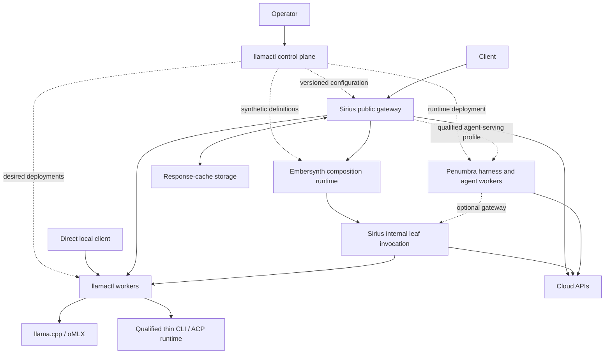

# AI platform boundaries: llamactl, Sirius, Embersynth, Penumbra and Nova

Status: recommended architecture for review, 2026-09-24. This document revises the ownership recommendation in the [unified-router design](./2026-09-23-unified-ai-router-architecture.md), particularly the proposed llamactl `packages/proxy`. It does not claim implementation, change running workloads, authorize a merge, or cancel work already in progress. The [roadmap #127](https://github.com/frozename/llamactl/issues/127), [design PR #147](https://github.com/frozename/llamactl/pull/147) and [registrar](../unified-ai-router-registrar.md) remain the initiative's tracking surfaces.

Deployment planning: [images, local/fleet/HA profiles, configuration, cache placement and control-plane authority](./2026-09-24-ai-router-deployment-topology.md). Proposed deployment subscopes attach to existing P4/P5 coordinators; Penumbra remains optional and no runtime is enabled.

## 1. Decision and alternatives

**Use Sirius as the full inference gateway, llamactl as the fleet control plane and model worker runtime, Embersynth as the synthetic-model composition runtime, and Penumbra as the developer/engineer harness. Keep Nova as the shared model-contract and protocol-adapter foundation.** Preserve llamactl's direct local inference endpoint for local operation and compatibility. Optionally provision a combined deployment through llamactl; separate ownership does not require users to manually assemble three products.

The [execution versus harness correction](./2026-09-24-penumbra-agentic-harness-reuse.md#infrastructure-execution-versus-developer-harness) narrows the earlier service-first recommendation. Infrastructure CLI/ACP may run in a thin llamactl worker host using qualified shared primitives. Penumbra owns developer workflows, memory, reviews and its own runs; full harness delegation is optional. Neither installation requires the other suite.

The standalone public proxy belongs in **Sirius**, not a second full gateway in llamactl. Engine KV/prefix state belongs to the **inference engine and its owning worker**. Public final-response exact and semantic cache policy belongs in **Sirius**. Recipe-stage artifact caching, if justified by measurement, belongs in **Embersynth**. Physical response-cache storage may scale independently and be provisioned by llamactl without making llamactl its request-policy owner.

| Strategy                                                             | Benefits                                                                                                                                             | Costs and failure modes                                                                                                                          | Decision                         |
| -------------------------------------------------------------------- | ---------------------------------------------------------------------------------------------------------------------------------------------------- | ------------------------------------------------------------------------------------------------------------------------------------------------ | -------------------------------- |
| Expand llamactl into the universal gateway                           | Reuses the existing local proxy and exact cache directly                                                                                             | Duplicates Sirius protocol/auth/routing policy; binds gateway evolution to worker internals; would require an explicit decision to retire Sirius | Reject for this platform         |
| Require Sirius for every local request                               | One public protocol implementation and uniform policy                                                                                                | Adds a service dependency to basic local serving; forces migration before Sirius's capability and streaming gaps are closed                      | Reject as the default local mode |
| One full Sirius gateway plus a narrow llamactl worker/local endpoint | Fits implemented responsibilities; supports standalone local use and independently scaled fleet traffic; preserves existing clients during migration | Two endpoint roles must be documented; compatibility codecs require shared fixtures; a combined deployment adds a network hop                    | **Recommend**                    |

Do not start by extracting a universal gateway framework or embedding NestJS in llamactl. Reuse small, framework-independent Nova contracts/adapters and protocol fixtures. Keep transport composition in each runtime. A one-command local composition can launch Sirius and the needed workers; it need not include Embersynth unless synthetic models are configured. Docker remains the default composition runtime; this proposal introduces no Kubernetes requirement.

### Installation simplicity is a required boundary

Penumbra remains a standalone harness with direct providers and local CLI/ACP execution. Sirius, llamactl, Embersynth and distributed storage are optional integrations, not installation prerequisites. Preserve existing settings and secret references; expose optional integration through the existing setup entry point without a new mandatory configuration layer or duplicate provider setup. The [installation and configuration contract](./2026-09-24-penumbra-agentic-harness-reuse.md#installation-and-configuration-contract) defines configuration ownership, failure behavior, reversible setup and clean-install/upgrade acceptance gates. Docker's composition default applies only when a user chooses that composition; it is not a Penumbra prerequisite.

## 2. What the inspected repositories actually do

Published main revisions were checked through GitHub on 2026-09-24:

| Repository     | Published review pin                       | Relevant implementation                                                                                                                              |
| -------------- | ------------------------------------------ | ---------------------------------------------------------------------------------------------------------------------------------------------------- |
| llamactl       | `c2a6a83c4bcbe36ff7651b7ca6d675068e2103a3` | Local/peer proxy, SQLite exact response cache, worker KV integration, model/process lifecycle, gateway configuration/reload and fleet transport      |
| sirius-gateway | `1ae980bd59951e9e23fdc738d05a3032e199d4c2` | Public OpenAI-shaped chat/Responses/embeddings/models, bearer guard, provider registry, routing and retry/circuit-breaker policies                   |
| embersynth     | `bd51abdb1b5f08f8293789c4444804b7b50656e6` | Synthetic aliases mapped to profiles; heuristic sequential memory/retrieval/vision/reasoning execution; evidence injection and final-stage streaming |
| nova           | `8a22acfb79ac113f17ae5308e49499073b337a76` | Shared `AiProvider`, request/response/stream/retrieval/usage contracts and OpenAI-compatible transport                                               |

Sirius's inspected local main `42f3ca8803c67383ab491a0e1b2e509563058ad1` contains additional observability integration; the cited published routing/policy/auth files were checked against it. Embersynth local main `c50706f55486e4725ba32ca1dda6465ac5c90476` differs from the published pin only in repository instructions. Local changes and other worktrees were preserved.

### Current implementation is not the target architecture

- llamactl authenticates and mounts `/v1` on its agent server [L1]. KV resolution explicitly excludes peer routes and reads the local workload epoch, engine state and slot directory [L2]. Its existing response-cache identity contains model, workload, epoch and `protocolVariant`, but no explicit tenant/account partition [L3]. Cacheable misses still buffer the response with `arrayBuffer()` before replay [L4]. This is valuable local functionality, not yet a general tenant gateway cache.
- llamactl already projects Sirius providers and Embersynth synthetic aliases into its catalog [L5]. Its gateway handlers validate configuration, persist managed catalog changes and reload the gateways [L6]. These are control-plane responsibilities; they are not synthetic-model execution.
- Sirius has working gateway routing and bearer authentication [S1, S2]. Actual routing defaults to `pinned`; richer strategy implementations are not proof that callers select them [S3]. No exact/semantic response cache, KV manager, rate limiter or tenant-quota implementation was found in the inspected application/library paths. Those are new work, even where high-level prose suggests otherwise.
- Sirius's published streaming policy retries after a yielded event. A test titled “does NOT retry” actually expects three attempts and repeated output [S4]. Legacy provider bridges also lose request/tool capabilities [S5]. Moving traffic through Sirius before fixing these paths would regress behavior.
- Embersynth's “fusion models” are **inference-time compositions**, currently a sequential pipeline with one selected node per stage [E1, E2]. There is no implemented recipe DAG, voting ensemble, model-weight merge, response cache or KV-state manager. Its evidence text is collected and compressed; that does not make it validated ground truth [E3]. Weight training/merging would be a separate artifact-production capability, outside this router initiative.
- Embersynth's HTTP server has no incoming authorization check, including reload [E4]. Its outward response usage is the final stage's usage; separate per-node observations do not yet provide a correlated recipe total [E5]. It should become an authenticated internal composition service before a shared deployment relies on that trust boundary.

### Preserve current contract work

P0.1 characterization is merged in [PR #148](https://github.com/frozename/llamactl/pull/148); baseline repairs are merged in [PR #149](https://github.com/frozename/llamactl/pull/149). Open issue state alone does not mean their implementation is missing.

At this review, [llamactl PR #150](https://github.com/frozename/llamactl/pull/150) at `07fdf84104e7c3e3c05ec8b7381cd39309089186`, [Nova PR #1](https://github.com/frozename/nova/pull/1) at `bff49af92caee44f97afe87c44a2f44aca0de021`, and [Embersynth PR #2](https://github.com/frozename/embersynth/pull/2) at `9c8c05401ddb57049f523a0c3ec61cb90f488538` are open. [Sirius PR #2](https://github.com/frozename/sirius-gateway/pull/2) at `1088be236ade966dbdcb693947521238e39be0ae`, opened on 2026-09-24, is also open and unmerged; its remaining review debt is tracked as registrar follow-up 1823. Re-fetch before dispatch or review.

Preserve the llamactl composition seam, explicit catalog identity, cancellation, honest usage and source-terminal evidence. A factory named `createProxy` is useful for worker/local composition without deciding that llamactl owns the full public gateway. Nova's pending execution context extends nonstream calls; its stream method still takes an `AbortSignal`, not the full context [N2]. Do not assume the proposed cross-service envelope below is already exported. Embersynth PR #2 propagates abort and rejects missing upstream completion; remaining work includes correlation IDs, abort-aware retry/health handling and durable V2 usage [E6]. This assessment does not reassign or stop these active slices.

## 3. Ownership and topology

| Capability                                                                                       | Accountable owner                                                                               | Collaborators and boundary                                                                                                                                                |
| ------------------------------------------------------------------------------------------------ | ----------------------------------------------------------------------------------------------- | ------------------------------------------------------------------------------------------------------------------------------------------------------------------------- |
| Desired deployments, model artifacts, process lifecycle, capacity, drain, health reconciliation  | llamactl                                                                                        | Sirius/Embersynth report effective state; they do not mutate worker desired state during a request                                                                        |
| Public Chat, Responses, Messages and model discovery                                             | Sirius                                                                                          | Nova shares contracts/codecs; worker-local compatibility remains in llamactl; native same-protocol passthrough is preferred                                               |
| Client identity, tenant/account scope, admission, request budgets and provider selection         | Sirius                                                                                          | llamactl manages policy configuration; server-derived identity must not come from arbitrary client headers                                                                |
| Replica placement and worker acceptance/fencing                                                  | llamactl worker domain                                                                          | Sirius selects a logical serving target; a worker placement client may run in Sirius using versioned llamactl data, without a control-plane database round trip per token |
| Synthetic definitions, stage selection, evidence, recipe retries and synthesis                   | Embersynth                                                                                      | llamactl manages desired configuration; Sirius exposes the synthetic model and its effective capabilities                                                                 |
| Cloud provider transport                                                                         | Sirius in the full gateway deployment                                                           | Reuse Nova adapters. A local compatibility/operator caller may use an existing adapter; it must not become a second independent fleet gateway policy engine               |
| CLI/ACP processes, login credentials, workspace access, permissions, sessions and tool execution | Selected runtime: thin llamactl worker or optional Penumbra harness                             | Sirius invokes qualified profiles; shared primitives avoid duplicate transport code; one selected runtime owns each child/session                                         |
| Agent goals, workflows, task/role routing, memory, approvals and run/initiative evidence         | Penumbra                                                                                        | Consume MCP/HTTP services; keep agent-run schemas in Penumbra and model payloads in Nova                                                                                  |
| Shared request/stream/error/usage payloads and adapter execution controls                        | Nova                                                                                            | Domain policy stays in its owner; do not duplicate chat/tool schemas or put recipe/fleet controllers into Nova                                                            |
| Operator CLI/UI/MCP, deployment manifests and fleet reports                                      | llamactl                                                                                        | Sirius owns gateway metrics; Embersynth owns recipe traces; Nova facade aggregates operator surfaces                                                                      |
| Metering                                                                                         | Outbound caller records physical upstream attempts; Sirius accounts for logical client requests | Correlate stage/attempt IDs. llamactl cost governance consumes records; wrapper and child records are not two physical bills                                              |
| Secrets                                                                                          | Deployment system manages references; actual executor resolves scoped credentials               | Cloud keys at the outbound gateway; CLI/ACP credentials at the selected owning worker. Runtime identity and tenant mapping require explicit contracts                     |

Penumbra owns its developer-run state and children. A thin llamactl worker owns infrastructure CLI/ACP execution; optional harness delegation does not transfer Penumbra sessions into that worker. The internal leaf invocation is a role within Sirius, not necessarily another process. It accepts authenticated, restricted child calls, with an allowlist of concrete leaf targets, a visited-model chain and a bounded hop count. It cannot route a child back into its parent synthetic model. Embersynth can initially preserve existing direct adapters; any later direct-worker optimization must retain the same identity, budgets, cancellation and usage contract. Do not force a routing migration merely to make the diagram uniform.

Configuration and execution remain independent. After loading a valid snapshot, the data plane can continue eligible requests during a control-plane outage. Unknown/expired authority for new fenced ownership fails closed; snapshots are observations, not consensus. Gateways must not silently promote themselves to owners when a lease expires.

The default local mode retains today's endpoint and embedded exact cache for its existing trust boundary. The full gateway mode adds Sirius; synthetic models add Embersynth; distributed semantic storage is optional. Do not broaden a local bearer credential into a multi-tenant cache scope by assumption.

## 4. Cache and routing taxonomy

| State                                  | Owner and key                                                                                                                          | Placement, invalidation and exclusions                                                                                                                                                                                                                        |
| -------------------------------------- | -------------------------------------------------------------------------------------------------------------------------------------- | ------------------------------------------------------------------------------------------------------------------------------------------------------------------------------------------------------------------------------------------------------------- |
| Engine KV / prefix / slot state        | Engine and owning worker; model/tokenizer/adapter/quantization/engine compatibility plus workload incarnation                          | Memory/SSD/slot files near execution. Worker manages budgets, save/restore and eviction. Affinity is a hint subordinate to eligibility and load. Do not replicate opaque engine bytes as ordinary response records                                            |
| Existing embedded exact response cache | llamactl local endpoint; current scoped request key, epoch, protocol                                                                   | Preserve while fixing bounded capture. Unknown peer epoch still bypasses. Before use behind a shared tenant gateway, add authenticated scope or bypass it; do not import unpartitioned legacy rows into a tenant cache                                        |
| Full-gateway exact response cache      | Sirius; exact normalized request plus tenant/account/credential scope, effective model revision, system/generation policy and protocol | First lookup at the response-cache owner. Independent storage service optional. Original expiry never slides; incomplete/error/cancelled streams never publish                                                                                                |
| Semantic final-response cache          | Sirius eligibility/calibration; same strict namespace plus embedder/version/dimension and profile                                      | Exact → semantic → upstream. Initially explicitly enabled safe text only; no cross-protocol sharing. Bypass tools, structured output, seed/reproducibility, sessions, CLI/ACP and side effects. Optional pgvector/HNSW, validated vectors and filtered search |
| Recipe intermediate artifact           | Embersynth; recipe/stage implementation revision, actual upstream model, input/evidence/source snapshot, trust scope                   | Deferred until useful measurements. Begin with exact deterministic artifacts; never reuse a stage across changed ACLs, evidence or policy. This is not the gateway's final answer cache                                                                       |
| Retrieval indexes / embeddings         | Domain data owner; provisioned/cataloged by llamactl, consumed through Nova retrieval contracts                                        | Reuse embedding connectivity where useful, but separate collections, ACLs, schemas and lifetimes from response caches. Embersynth owns how evidence participates in a recipe                                                                                  |
| Provider prompt-cache accounting       | Cloud provider; observed through Nova usage                                                                                            | Not a gateway response hit and not local KV state. Preserve distinct cache-read/write usage observations                                                                                                                                                      |

Synthetic models need an extra cache gate. Recipe revision alone cannot describe changing retrieval, memory, time or authorization. Default to bypassing final-response semantic reuse for these models. Exact answer reuse also requires proof of pure, versioned inputs: either an immutable evidence/source snapshot known **before lookup**, or an Embersynth preflight that supplies the effective context fingerprint. Provenance discovered after returning a cached answer is too late. Reusing the final answer must not skip required retrieval or permission checks.

A cache hit records logical delivery without inventing another physical upstream bill. A lower-layer exact hit must expose trusted replay provenance; if this cannot be represented safely during migration, bypass that layer in shared gateway mode. Do not enable two independent semantic policies for the same request scope.

Keep four routing decisions distinct:

1. Sirius resolves the public model, capabilities, policy and equivalent logical serving target.
2. llamactl worker placement selects an eligible replica using capacity, readiness, drain state, ownership term and optional KV locality. Weighted rendezvous remains a candidate policy, not a reason to ignore load or a session owner.
3. Sirius cache clients map exact keys and semantic namespaces to cache shards. Semantically similar prompts cannot use a prompt-byte hash as their affinity rule.
4. Embersynth chooses recipe stages and constrained leaf targets. It does not independently reschedule worker processes.

Machine/model execution leases, Penumbra agent-session ownership and cache shard-map generations are separate authorities. PostgreSQL transactional terms/fencing remain the proposed managed-fleet mechanism; model ownership belongs to llamactl, while new distributed session guarantees must be implemented by the selected session owner: llamactl for thin infrastructure execution, Penumbra for its developer runs. Existing Penumbra SQLite task leases do not establish that cross-host guarantee. Cache maps can use transactional metadata too, but cache misses do not confer execution ownership. Gateway shards may replicate completed response records with original expiry; partitions may bypass cache and invoke upstream only if execution policy permits. Sessions and uncertain accepted work must not be blindly retried.

These distinctions agree with external reference designs: [Envoy Gateway separates control-plane configuration from data-plane traffic](https://gateway.envoyproxy.io/community/design/system-design/); [llama.cpp exposes engine-local slot save/restore](https://github.com/ggml-org/llama.cpp/blob/master/tools/server/README.md); [vLLM describes token-block prefix caching](https://docs.vllm.ai/en/latest/design/prefix_caching/); [Triton ensembles present a model pipeline as one model](https://docs.nvidia.com/deeplearning/triton-inference-server/user-guide/docs/user_guide/ensemble_models.html). These are conceptual references, not proposed new dependencies or evidence that equivalent features already exist here.

## 5. Contracts to establish before the next ownership-dependent slice

The following are proposed contracts, not current exported schemas. Reuse the accepted P0.2 Nova changes before adding fields. Keep transport-neutral shared payloads in `nova/packages/contracts/src/`; keep domain schemas in their owner's modules. Network/tRPC/provider/ACP adapters remain outside `llamactl/packages/core`.

| Contract                                | Required semantics                                                                                                                                                                              | Producer → consumer and proposed module targets                                                                                                                                                                                                  |
| --------------------------------------- | ----------------------------------------------------------------------------------------------------------------------------------------------------------------------------------------------- | ------------------------------------------------------------------------------------------------------------------------------------------------------------------------------------------------------------------------------------------------ |
| Effective model/target descriptor       | Distinct public model, upstream model, deployment, worker, model revision; native protocol/features; recipe revision where relevant; observed readiness separated from desired configuration    | llamactl `packages/remote/src/config/provider-nodes.ts` and snapshot publisher → Sirius `libs/sirius-model-registry/src/model-registry.service.ts`, routing and Embersynth registry. Shared shape belongs in Nova only once both consumers agree |
| Invocation context                      | Request/parent/stage/attempt IDs, absolute deadline, cancellation, server-derived principal/scope, allowed targets, remaining attempt budget, selected target and ownership term where relevant | Nova `provider.ts` and domain envelopes; Sirius gateway → worker RPC / Embersynth → leaf provider. `AbortSignal` is process-local; RPC serializes deadlines and cancellation IDs/events, never the signal object                                 |
| Native/normalized payload boundary      | Preserve native vendor bodies/events for same-protocol calls; Nova canonical payload for translation; reject unsupported tools/vision/structured output before execution                        | Sirius controllers/provider adapters; Nova `schemas/chat.ts`, `schemas/stream.ts`; llamactl local executor. Do not silently advertise the richest upstream feature after a lossy adapter                                                         |
| Configuration snapshot and apply result | Authority/source, desired revision, validated content digest, effective revision, per-entry rejection, rollback target and secret references; one writer per managed field                      | llamactl gateway catalog/handlers → Sirius file-provider loader/reload and Embersynth loader/reload. File delivery remains viable locally; remote workers cannot assume a shared home directory                                                  |
| Recipe descriptor / execution record    | Immutable recipe/profile revision, stage IDs, allowed targets, required evidence, budget/retry/fallback policy, effective dependency revisions and cache eligibility proof                      | Embersynth `src/config/`, `src/router/`, `src/evidence/` → Sirius synthetic model metadata and operator APIs. Extend current profiles incrementally; no generic DAG requirement for initial correctness                                          |
| Completion and usage                    | Exactly one terminal outcome, raw source-completion proof, unknown versus observed usage, physical versus logical accounting, parent-child identities and cache replay provenance               | Nova `schemas/stream.ts`, `schemas/usage.ts` → all callers. Preserve V1 history; version new sinks. Finish-reason alone is not a universal proof that every native protocol completed                                                            |
| Cache namespace / record / shard map    | Strict identity above, completion status, original creation/expiry, owner/map generation, replication state and compatible schema version                                                       | Proposed Sirius `libs/sirius-cache/` → storage service; llamactl deploys it. Namespace/dimension incompatibility fails lookup safely; RAG search shape is not copied as the cache RPC                                                            |
| Worker acceptance/session               | Versioned request ID, accepted/started/emitted/terminal distinction, worker incarnation/fence, cancellation acknowledgement, session owner and explicit uncertain result                        | llamactl `packages/remote/src/inference/`, `packages/remote/src/tunnel/`, `packages/core/src/inference/`; Sirius worker adapter. A timed-out submit is not automatically safe to repeat                                                          |

Configuration authority needs repair in both siblings. Sirius MCP currently rewrites the provider YAML itself and calls guarded endpoints without a bearer [S6]. Route managed mutations through llamactl, or give explicitly unmanaged files a separate owner; do not allow two writers for the same fields. Embersynth's stdio MCP reload changes its own process-local registry, not necessarily a separate HTTP runtime [E7]. Report the effective target process/revision. An authenticated reload request without a matching server-side check is not authentication.

Retry budgets must compose. Sirius owns retries for a leaf request it sends; Embersynth owns recipe fallback before it commits visible output; model workers own model-process acceptance and cancellation, while each selected CLI/ACP runtime owns its acceptance, permissions and child cancellation. One shared total attempt/deadline budget prevents nested retry multiplication. No automatic retry after output, uncertain acceptance, tool side effects, or stateful execution. ACP agent-executed tools stay agent-owned; client-owned OpenAI tool calls are returned to the client rather than executed a second time.

## 6. Roadmap impact and executable task preflight

Keep R0/P0.1–P6.2 stable IDs and their existing issue history. The following allocation revises the proposed target ownership; it does not transfer issues, change active worktree fences or claim the old task payloads already implement the new allocation. Before filing the next affected task, reconcile its repository, exact write fence, dependencies and acceptance gates with this table. Keep a coordinator issue in llamactl and create linked repository-owned implementation slices when a work package spans repositories. Do not dispatch a stale llamactl-only payload for Sirius-owned code.

| ID                                                            | Proposed owner / treatment                                                      | Required adjustment                                                                                                       |
| ------------------------------------------------------------- | ------------------------------------------------------------------------------- | ------------------------------------------------------------------------------------------------------------------------- |
| [R0 #128](https://github.com/frozename/llamactl/issues/128)   | Completed research                                                              | Add this boundary evidence; retain completed Penumbra/ACP review                                                          |
| [P0.1 #129](https://github.com/frozename/llamactl/issues/129) | llamactl; merged                                                                | Preserve characterization and known-defect sentinels                                                                      |
| [P0.2 #130](https://github.com/frozename/llamactl/issues/130) | Nova plus current consumer seams                                                | Finish in-flight contracts; retain worker/local composition seam; do not expand its scope into a new universal gateway    |
| [P1.1 #131](https://github.com/frozename/llamactl/issues/131) | Sirius public catalog/provider execution; llamactl inventory adapter            | Split desired inventory from effective capabilities; converge model identity and explicit provider scoping                |
| [P1.2 #132](https://github.com/frozename/llamactl/issues/132) | Sirius full three-protocol ingress; Nova fixtures; llamactl local compatibility | Native Anthropic passthrough in Sirius; fix local stream propagation without duplicating policy                           |
| [P1.3 #133](https://github.com/frozename/llamactl/issues/133) | Sirius public streaming/cache/usage; worker capture and Nova contracts          | Preserve incremental delivery and bounded capture at each relevant boundary; split fixes by owning repository             |
| [P2.1 #134](https://github.com/frozename/llamactl/issues/134) | Thin llamactl execution; qualified shared primitives; optional harness adapter  | Enforce selected model; dispatch to the declared worker before spawn; no full harness prerequisite                        |
| [P2.2 #135](https://github.com/frozename/llamactl/issues/135) | Selected worker lifecycle; shared execution primitives                          | Qualify library packaging, admission, pools, cancellation and credential scope; keep developer orchestration outside      |
| [P3.1 #136](https://github.com/frozename/llamactl/issues/136) | Sirius semantic policy; Embersynth eligibility declaration                      | Add synthetic/dynamic-evidence default bypass and tenant identity gate                                                    |
| [P3.2 #137](https://github.com/frozename/llamactl/issues/137) | Sirius response-cache storage/client; llamactl provisioning                     | Reuse embedding/SQL adapters selectively; separate response records from RAG schemas                                      |
| [P3.3 #138](https://github.com/frozename/llamactl/issues/138) | Sirius integration/evaluation                                                   | Qualify exact → semantic → upstream at public ingress; no approximate reuse in worker/ACP paths                           |
| [P4.1 #139](https://github.com/frozename/llamactl/issues/139) | llamactl worker RPC plus Sirius client                                          | Establish direct/tunnel contract and acceptance fencing; it need not wait for semantic cache implementation               |
| [P4.2 #140](https://github.com/frozename/llamactl/issues/140) | Sirius standalone gateway; llamactl composition                                 | Replace proposed llamactl `packages/proxy` with scalable Sirius deployment; keep runtime/KV on workers                    |
| [P4.3 #141](https://github.com/frozename/llamactl/issues/141) | Sirius cache service; llamactl deployment                                       | Add authenticated scoped RPC, records and storage migration; no promotion of legacy unscoped rows                         |
| [P5.1 #142](https://github.com/frozename/llamactl/issues/142) | llamactl fleet coordination                                                     | Publish candidates, authoritative worker/session terms and effective revisions; separate cache topology                   |
| [P5.2 #143](https://github.com/frozename/llamactl/issues/143) | llamactl execution placement; Sirius cache affinity                             | Split policies and metrics. Synthetic aliases cannot obscure actual recipe/deployment revision                            |
| [P5.3 #144](https://github.com/frozename/llamactl/issues/144) | Sirius cache movement; llamactl worker drain                                    | Test each partition/drain/failover independently; keep engine KV migration out of response-cache replication              |
| [P6.1 #145](https://github.com/frozename/llamactl/issues/145) | Thin llamactl ephemeral ACP; optional Penumbra profile                          | Reuse qualified ACP primitives with worker host policy; enforce tools, isolation, stream completion and cancellation      |
| [P6.2 #146](https://github.com/frozename/llamactl/issues/146) | Selected runtime sessions/permissions/fencing; Sirius scoped routing            | Persistent vendor resume needs host-specific proof; preserve one owner and reject unsafe replay or cross-runtime takeover |

Add an Embersynth boundary slice under P0.2/P1 integration: authenticated invocation/reload, immutable profile revision, correlated stage/attempt evidence, truthful capabilities and retry/cancellation semantics. Defer recipe DAGs, ensembles and stage caches to separately justified work. These are proposed slices, not claims of newly created sibling issues.

The current 24 native dependency edges remain historical published coordination until the implementation registrar applies the rebase. The recommended dependency change removes semantic caching as a prerequisite for a useful worker RPC: the minimal model-worker RPC can follow shared contracts; thin CLI/ACP follows worker execution contracts; optional full-harness integration follows the Penumbra run/lifecycle contract. Full gateway and caching then build independently on accepted contracts. Session support still requires fencing. Recompute the DAG and ready/blocked labels together; never remove an edge without replacing its actual acceptance requirement.

Every revised fleet task must bind: owning repository/current base SHA; stable roadmap ID and linked implementation issue; exact permitted files and exclusions; consumed contract versions; accepted dependency commits; focused unit and producer-consumer integration commands; rollout flag/default/rollback; independent review evidence; and returned task/handoff/PR identities. Use existing strict `task.file` schema, not invented fields. Split repository writes into explicit sibling lanes. Preserve active P0.2 fences and ledger events; this review supplies a preflight requirement for subsequent affected work, not an instruction to restart completed work.

### Rebased dependency graph (decision 1828)

Registrar decision 1828 applies the recommended dependency change as option B. The graph keeps 24 edges and stays acyclic; five edges are removed and five added, and each removed edge's acceptance requirement is carried by a named replacement. Nothing becomes ready, because every open package still waits on P0.2. The [registrar ledger](../unified-ai-router-registrar.md#rebased-dependency-graph-decision-1828-d3) and the manifest `boundary_assessment.rebase.dag` carry the same table and the full edge list.

| Change  | Edge      | Replacement acceptance or rationale                                                                                                                                                                                                                                    |
| ------- | --------- | ---------------------------------------------------------------------------------------------------------------------------------------------------------------------------------------------------------------------------------------------------------------------- |
| Removed | P1.3→P2.1 | P2.1 no longer waits for gateway streaming/cache/usage. It follows P4.1 (worker RPC with bounded streaming, cancellation and P0.2 invocation context) and must itself enforce bounded CLI output capture and physical usage provenance.                                |
| Removed | P2.2→P4.1 | The worker RPC no longer waits for CLI lifecycle. P4.1 refuses CLI/ACP targets (fail closed, typed unavailable) until the owning lifecycle package (P2.2 for CLI, P6.1 for ACP) is accepted for that profile; the P4.2 exposure gate enforces the same at the gateway. |
| Removed | P3.3→P4.1 | The worker RPC carries no cache semantics. The worker path must never serve approximate reuse (asserted by the P3.3 llamactl test-only slice); the cache-service dependency moves to P3.3→P4.3.                                                                        |
| Removed | P4.2→P6.1 | P6.1 no longer needs the gateway deployment. Public reachability of ACP profiles is a Sirius slice gated on P6.1, P1.3 and the P4.2 fail-closed exposure gate.                                                                                                         |
| Removed | P5.2→P6.2 | Session fencing comes from P5.1 (leases, fencing tokens, session-owner handles); session turns route by owner handle and are never re-placed by rendezvous. P5.2 acceptance must honor P5.1 session-owner handles.                                                     |
| Added   | P0.2→P4.1 | The worker RPC consumes the P0.2 invocation context, usage observation and stream-completion contracts.                                                                                                                                                                |
| Added   | P4.1→P2.1 | Thin CLI/ACP follows worker execution contracts; P2.1 implements the CLI executor behind the single P4.1 worker RPC instead of adding a second RPC.                                                                                                                    |
| Added   | P1.3→P4.2 | The Sirius gateway deployment needs public incremental streaming, scoped exact cache and logical usage before it becomes the scalable tier.                                                                                                                            |
| Added   | P3.3→P4.3 | The durable cache-service RPC needs the accepted exact → semantic → upstream serve gate and eviction policy.                                                                                                                                                           |
| Added   | P5.1→P6.2 | Persistent sessions need P5.1 fencing and owner handles.                                                                                                                                                                                                               |

## 7. Migration sequence, tests and rollout gates

1. **Finish P0.2 and reconcile ownership.** Accept shared cancellation/usage/terminal contracts and current consumer repairs on their own evidence. Publish a revised file fence and dependency map for the next slice. No new runtime flag is enabled by this document.
2. **Establish the gateway–worker and gateway–composition boundaries.** Version invocation/configuration/identity; authenticate internal calls; prove reload reports effective revision and preserves the last valid state after rejection. Add loop/target restrictions and provider capability validation. Keep existing direct local clients working.
3. **Qualify Sirius before moving traffic.** Replay public-protocol fixtures across local, peer, cloud and synthetic paths. Test tools, images, structured output rejection, native vendor errors, Responses lifecycle, Anthropic `stream:true`, first-byte delivery, pending-read cancellation, timeouts and truncated/error EOF. Assert no retry after any output or uncertain acceptance. Test SSE usage-only frames and exactly-once physical usage across nested stages.
4. **Introduce gateway exact caching, then semantic shadow mode.** Prove tenant/account/model/epoch/protocol isolation and unknown-epoch bypass. Verify worker cache cannot undermine gateway scope. Require bounded capture, overflow bypass, cancellation cleanup, original TTL and source completion. Only move from shadow to serve after profile-specific false-hit, latency and cost gates; no universal threshold is invented here.
5. **Scale each state independently.** Exercise gateway replica loss without worker restart, worker drain/session ownership without cache-map election, and cache-owner partitions without duplicated execution. Rebalance only completed response records; validate fencing, stale-map rejection and original expiry. A control-plane outage must not invent fresh authority.
6. **Qualify thin ACP execution and then host-owned sessions.** Keep ephemeral text execution first. Verify selected model acknowledgement, executable version, sandbox/workspace permissions, cancellation, cleanup, session sequencing, tool ownership and usage uncertainty before stateful enablement. The selected runtime implements these guarantees. Qualify a small shared library before adopting it; optional Penumbra delegation is separate and must not become an infrastructure prerequisite.

Proposed rollout controls should be explicit configuration fields rather than assumptions about existing flags: gateway route mode `legacy-local | sirius`; gateway cache mode `off | exact | semantic-shadow | semantic-serve`; synthetic answer cache default `off`; worker RPC negotiated version; managed session mode default `off`. Names and storage become implementation contracts in the owning issue. Roll back new traffic to the prior route only for **new requests**; drain active streams and retain session owners. Do not retry an already accepted request through the old endpoint. Retain old cache data read-isolated until its TTL expires; disable new semantic writes/reads without deleting unrelated RAG data or KV files.

Unit targets include Sirius routing/policy/auth/model-registry and provider bridge suites; Embersynth router/executor/tools/usage/terminal suites; Nova schema and adapter suites; llamactl responsecache/KV, gateway-catalog, proxy characterization and direct/tunnel fixtures. Integration must mount actual guards and ingress dispatch, not just exported factories or mocked fetch. Use `bun:test`, temporary runtimes and existing fake-executable/cluster patterns. Contract changes require refreshed consumer installs and four-repository tests before an implementation slice is accepted.

This research ran focused existing tests: llamactl **43 passed / 0 failed / 67 assertions** across seven response-cache and gateway-catalog files; Sirius **90 passed / 0 failed / 206 assertions** across nine auth/routing/policy/discovery/gateway/reload files; Embersynth **81 passed / 0 failed / 216 assertions** across eleven non-socket files, plus typecheck exit 0. These establish the inspected behavior, including a known bad retry assertion; they do not certify the proposed architecture or replace an implementation's full gates. No production code changed.

## 8. Pinned evidence

All paths below are repository-relative. Proposed paths above are explicitly new; these evidence paths were inspected at the stated commits. No operational configuration or credentials are included.

### llamactl

- [L1 — agent auth and mounted proxy](https://github.com/frozename/llamactl/blob/c2a6a83c4bcbe36ff7651b7ca6d675068e2103a3/packages/remote/src/server/serve.ts#L295-L334).
- [L2 — local engine KV metadata and capability checks](https://github.com/frozename/llamactl/blob/c2a6a83c4bcbe36ff7651b7ca6d675068e2103a3/packages/core/src/openaiProxy.ts#L753-L832).
- [L3 — exact cache record and lookup scope](https://github.com/frozename/llamactl/blob/c2a6a83c4bcbe36ff7651b7ca6d675068e2103a3/packages/core/src/responsecache/registry.ts#L3-L40).
- [L4 — buffered response-cache miss and insertion](https://github.com/frozename/llamactl/blob/c2a6a83c4bcbe36ff7651b7ca6d675068e2103a3/packages/core/src/openaiProxy.ts#L1778-L1826).
- [L5 — provider and synthetic model catalog projection](https://github.com/frozename/llamactl/blob/c2a6a83c4bcbe36ff7651b7ca6d675068e2103a3/packages/remote/src/config/provider-nodes.ts#L11-L117).
- [L6 — Sirius managed configuration and reload](https://github.com/frozename/llamactl/blob/c2a6a83c4bcbe36ff7651b7ca6d675068e2103a3/packages/remote/src/workload/gateway-handlers/sirius.ts#L283-L367); [Embersynth reload integration](https://github.com/frozename/llamactl/blob/c2a6a83c4bcbe36ff7651b7ca6d675068e2103a3/packages/remote/src/workload/gateway-handlers/embersynth.ts#L250-L287).

### Sirius

- [S1 — mounted modules/controllers](https://github.com/frozename/sirius-gateway/blob/1ae980bd59951e9e23fdc738d05a3032e199d4c2/apps/sirius-api/src/app.module.ts#L23-L58).
- [S2 — bearer authentication and raw key assignment](https://github.com/frozename/sirius-gateway/blob/1ae980bd59951e9e23fdc738d05a3032e199d4c2/libs/sirius-auth/src/auth.guard.ts#L19-L63).
- [S3 — model routing and default strategy](https://github.com/frozename/sirius-gateway/blob/1ae980bd59951e9e23fdc738d05a3032e199d4c2/libs/sirius-routing/src/routing.service.ts#L59-L145).
- [S4 — streaming retry policy](https://github.com/frozename/sirius-gateway/blob/1ae980bd59951e9e23fdc738d05a3032e199d4c2/libs/sirius-policy/src/policy.service.ts#L64-L89); [test explicitly expecting repeated output](https://github.com/frozename/sirius-gateway/blob/1ae980bd59951e9e23fdc738d05a3032e199d4c2/libs/sirius-policy/src/__tests__/policy.test.ts#L123-L145).
- [S5 — legacy worker provider bridge](https://github.com/frozename/sirius-gateway/blob/1ae980bd59951e9e23fdc738d05a3032e199d4c2/libs/provider-llamactl/src/llamactl.adapter.ts#L136-L220).
- [S6 — MCP direct configuration mutation](https://github.com/frozename/sirius-gateway/blob/1ae980bd59951e9e23fdc738d05a3032e199d4c2/apps/sirius-mcp/src/server.ts#L178-L200); [HTTP helpers](https://github.com/frozename/sirius-gateway/blob/1ae980bd59951e9e23fdc738d05a3032e199d4c2/apps/sirius-mcp/src/server.ts#L37-L75).

### Embersynth

- [E1 — synthetic aliases and profiles](https://github.com/frozename/embersynth/blob/bd51abdb1b5f08f8293789c4444804b7b50656e6/src/config/defaults.ts#L11-L49); [sequential classification](https://github.com/frozename/embersynth/blob/bd51abdb1b5f08f8293789c4444804b7b50656e6/src/router/classifier.ts#L86-L134).
- [E2 — stage plan](https://github.com/frozename/embersynth/blob/bd51abdb1b5f08f8293789c4444804b7b50656e6/src/router/planner.ts#L18-L85); [stage execution](https://github.com/frozename/embersynth/blob/bd51abdb1b5f08f8293789c4444804b7b50656e6/src/router/executor.ts#L47-L95).
- [E3 — evidence envelope](https://github.com/frozename/embersynth/blob/bd51abdb1b5f08f8293789c4444804b7b50656e6/src/types/index.ts#L144-L158); [deterministic compression](https://github.com/frozename/embersynth/blob/bd51abdb1b5f08f8293789c4444804b7b50656e6/src/evidence/compressor.ts#L18-L74).
- [E4 — HTTP dispatch including reload](https://github.com/frozename/embersynth/blob/bd51abdb1b5f08f8293789c4444804b7b50656e6/src/api/server.ts#L36-L106).
- [E5 — outward final-response usage](https://github.com/frozename/embersynth/blob/bd51abdb1b5f08f8293789c4444804b7b50656e6/src/api/completions.ts#L74-L98); [per-node usage hook](https://github.com/frozename/embersynth/blob/bd51abdb1b5f08f8293789c4444804b7b50656e6/src/adapters/openai-compatible.ts#L23-L41).
- [E6 — pending PR #2 completion validation](https://github.com/frozename/embersynth/blob/9c8c05401ddb57049f523a0c3ec61cb90f488538/src/adapters/openai-compatible.ts#L224-L266); [pending retry/health path](https://github.com/frozename/embersynth/blob/9c8c05401ddb57049f523a0c3ec61cb90f488538/src/router/executor.ts#L462-L493).
- [E7 — process-local MCP reload](https://github.com/frozename/embersynth/blob/bd51abdb1b5f08f8293789c4444804b7b50656e6/src/mcp/server.ts#L375-L412).

### Nova

- [N1 — current shared provider/retrieval contracts](https://github.com/frozename/nova/blob/8a22acfb79ac113f17ae5308e49499073b337a76/packages/contracts/src/provider.ts#L16-L80).
- [N2 — pending execution context and method signatures](https://github.com/frozename/nova/blob/bff49af92caee44f97afe87c44a2f44aca0de021/packages/contracts/src/provider.ts#L16-L83).
- [N3 — pending usage observation and versioned records](https://github.com/frozename/nova/blob/bff49af92caee44f97afe87c44a2f44aca0de021/packages/contracts/src/schemas/usage.ts#L85-L164); [stream completion provenance](https://github.com/frozename/nova/blob/bff49af92caee44f97afe87c44a2f44aca0de021/packages/contracts/src/schemas/stream.ts#L46-L91).
