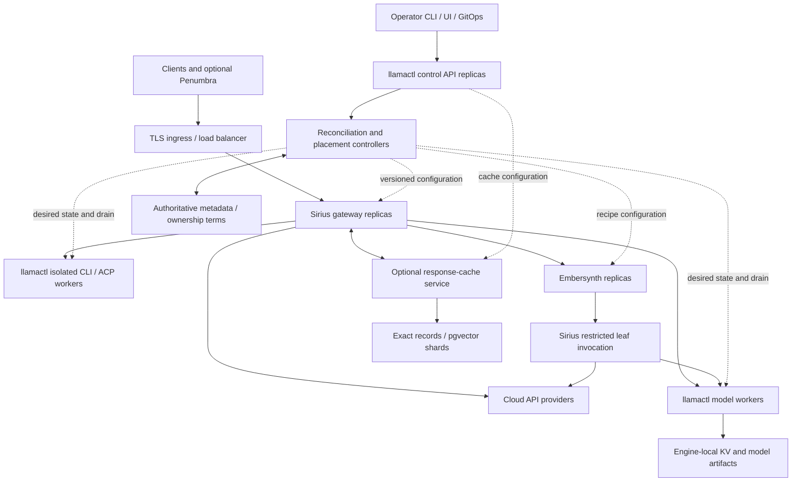

# AI router deployment images, clusters and control plane

Status: proposed deployment design, 2026-09-24. Extends [roadmap #127](https://github.com/frozename/llamactl/issues/127), [design PR #147](https://github.com/frozename/llamactl/pull/147), the [product boundaries](./2026-09-24-ai-platform-boundaries.md) and the [standalone installation contract](./2026-09-24-penumbra-agentic-harness-reuse.md#installation-and-configuration-contract). Images, fields and rollout profiles below are proposals unless explicitly identified as existing. This publication builds, pushes, deploys and enables nothing.

## 1. Recommended topology

**Sirius is the inference front door.** Its replicas route to cloud APIs, llamactl model/execution workers, or Embersynth synthetic-model replicas. A Sirius node serves the public API and model catalog; it need not load model weights or run vendor CLIs. llamactl supplies the administrative control plane and owning workers. Embersynth owns composition of a selected synthetic model. Penumbra is an optional developer harness, absent from the default infrastructure installation.

Logical roles may share a machine in a small installation. They are independently deployable services, not a requirement for one dedicated machine per role.

Sirius's restricted leaf role can initially use the same deployment with a separate internal authenticated route/profile. Separate replicas only when load or trust boundaries justify them. Embersynth child calls must carry delegated tenant identity, a remaining deadline/attempt budget, recipe/stage IDs, allowed concrete leaf targets and a visited-target/hop limit. A child must not resolve back to its parent synthetic alias. Existing direct Embersynth adapters remain available until equivalent routing, cancellation and accounting are proved; do not require a double gateway hop for standalone use.

Three alternatives:

| Approach                                                                            | Assessment                                                                                                                                |
| ----------------------------------------------------------------------------------- | ----------------------------------------------------------------------------------------------------------------------------------------- |
| One combined process/image for gateway, controller, engines and composition         | Easy initial launch, but couples updates, privileges, dependencies and scaling; reject as the release architecture                        |
| Independently versioned images with generated local/fleet profiles                  | Recommend: one setup entry point, role isolation, native workers where needed; colocate by default when scale does not justify separation |
| Kubernetes-only platform with mandatory operator, service mesh, Redis and event bus | Reject as the default. Add individual components only for demonstrated needs; Kubernetes remains an optional deployment backend           |

## 2. Existing implementation and gaps

Reviewed published pins: llamactl `c2a6a83c4bcbe36ff7651b7ca6d675068e2103a3`, Sirius `1ae980bd59951e9e23fdc738d05a3032e199d4c2`, Embersynth `bd51abdb1b5f08f8293789c4444804b7b50656e6`. Nova published main remains `8a22acfb79ac113f17ae5308e49499073b337a76`; the local Nova checkout differs and is not silently treated as released. Sirius container and llamactl source match their pins. Embersynth container files are untracked local drafts, explicitly recorded below rather than linked to nonexistent published blobs. No registry-image availability or successful container build is claimed.

- Sirius has a non-root Bun Dockerfile with `/health`, but builds from sibling Sirius/Nova source trees, carries the workspace into the image, and seeds dummy API keys to boot unconfigured adapters [S1]. Release packaging and lazy optional-provider construction are needed; a healthy process must not advertise a dummy-key provider as usable.
- The inspected untracked Embersynth draft has a non-root Bun Dockerfile, `/config/embersynth.yaml` mount and `/health`. Its entrypoint falls back to the bundled example when configuration is absent [E1, E2]. Production mode must reject missing selected configuration rather than route using an example. A demo profile may retain explicit fixture defaults.
- llamactl releases signed native agent binaries for macOS/Linux on x64/arm64 [L1]. A separate minimal control-plane image and thin worker images are proposed, not existing release artifacts.
- Composite already selects Docker/Kubernetes and has services, workloads, gateway registrations and a dependency DAG [L2]. Reuse it and the backend seam, rather than inventing an unrelated fleet installer.
- Kubernetes translators emit **one replica**, `Recreate` for Deployments and only a liveness probe from the existing healthcheck; StatefulSet also has one replica [L3, L4]. Supporting services run in Kubernetes; model processes still use agent dispatch [L5]. A StatefulSet is not PostgreSQL HA, and increasing its replica count would not configure replication.
- Current image references contain repository/tag, with no digest field [L6]. ConfigMap content does not by itself implement coordinated configuration activation. Existing replica reconciliation must be made compatible with HPA ownership [L7].
- Composite Kubernetes teardown deletes the namespace, including its PVCs, regardless of the Docker-style purge flag [L8]. Persistent coordination/session storage must be external or separately retained before the enterprise profile is offered; routine application teardown must not destroy it.

## 3. Image and artifact plan

Names below are proposed GHCR repositories, not links to published images. Use immutable release tags for discovery and resolved OCI digests for deployment. One release manifest records each repository SHA, Nova/shared-runtime package version, supported contract ranges, image digest per platform, engine/CLI versions and configuration schema revision. Use the versioned Nova channel required by registrar follow-up 1832; existing source-checkout coupling is a grandfathered baseline, not a solved install contract. Independent product releases remain possible; a tested bundle lock pins a compatible set without requiring synchronized version numbers.

| Proposed artifact                                          | Contents and runtime role                                                                                                      | Exclusions / state                                                                                                                            |
| ---------------------------------------------------------- | ------------------------------------------------------------------------------------------------------------------------------ | --------------------------------------------------------------------------------------------------------------------------------------------- |
| `ghcr.io/frozename/sirius-gateway`                         | Existing Bun gateway; direct API providers, worker and synthetic adapters; public and restricted internal roles                | No engines, weights, vendor CLIs or control-plane credentials; disposable local snapshots/connections                                         |
| `ghcr.io/frozename/embersynth`                             | Existing Bun composition runtime, versioned recipe parser and adapters                                                         | No implicit training/weight merging; immutable recipes plus bounded in-flight evidence; durable audit export if selected                      |
| `ghcr.io/frozename/llamactl-control`                       | Proposed minimal CLI/remote composition root for management API and controller roles                                           | No Electron, model weights, vendor executables or host process-management privileges; shared metadata external in HA mode                     |
| `ghcr.io/frozename/llamactl-worker`                        | Linux owning worker, execution RPC, node identity, model/engine supervision and optional isolated CLI/ACP host                 | No full Penumbra suite; no public gateway role by default; credentials and local state mounted explicitly                                     |
| Worker variants                                            | CPU and separately qualified NVIDIA CUDA variants; optional pinned vendor-runtime derivative for each approved CLI/ACP profile | Do not bundle every vendor executable/account into one image. Other accelerators require a tested variant rather than a compatibility promise |
| Native `llamactl-agent` releases                           | macOS Apple/Metal/oMLX workers and hosts best served by native processes; reuse existing signature/update path                 | No claim that a Linux arm64 image supplies macOS Metal/MLX. Keep native and container workers on the same versioned RPC contracts             |
| `ghcr.io/frozename/sirius-response-cache` (later optional) | Extracted cache service when independent placement/scale is justified; no eligibility-policy duplication                       | First use embedded exact cache or direct PostgreSQL adapter. Do not require this additional image merely to enable a gateway                  |
| PostgreSQL/pgvector and telemetry                          | Supported upstream/managed services pinned in the deployment lock                                                              | Do not maintain a private database distribution. No mandatory Redis, Kafka or service mesh                                                    |

The control image should initially run a validated role selection (`api`, `controller`, or combined single-host role); these are proposed entrypoint modes, not flags that exist today. Separate role processes allow controller replicas to elect/fence owners without replicating an unfenced loop. Workers should initially supervise host processes as today; Kubernetes-owned model Pods are a separate qualified mode where the agent does not also spawn/kill the same engine.

Packaging gates: deterministic locked dependency closure, actual production dependency pruning, no sibling checkout on the install host, no private source/credential leakage, non-root process, writable paths explicitly declared, read-only root where supported, graceful signals and image/native entrypoint parity. Build both `linux/amd64` and `linux/arm64` only where dependencies support them; publish separate manifests for unsupported GPU/vendor combinations. Native smoke tests are required in addition to emulated build success. Docker documents multi-platform build approaches and their tradeoffs [O1]. Produce SBOM, signature and build provenance; reuse the agent-release signing policy. Release workflows are proposed artifacts; publication itself still requires the normal release authorization.

## 4. Deployment profiles and configuration

| Profile | Suggested initial placement                                                                                                                                                  | State and guarantees                                                                                                                                                                             |
| ------- | ---------------------------------------------------------------------------------------------------------------------------------------------------------------------------- | ------------------------------------------------------------------------------------------------------------------------------------------------------------------------------------------------ |
| `local` | One native worker; optionally one Sirius and one Embersynth instance on the same host                                                                                        | Existing local configuration and embedded exact cache; no database or coordination cluster required; no HA claim                                                                                 |
| `fleet` | One control instance; one or more Sirius replicas; optional Embersynth pool; registered native/Linux workers                                                                 | Docker or host-service management; one authoritative controller initially. HA ownership or semantic storage opts into PostgreSQL. Multiple frontends do not make a single controller/database HA |
| `ha`    | Example starting layout: 2+ gateway and composition replicas across failure domains; 2+ control API/controller candidates; qualified worker pools; managed HA metadata store | Independent scaling and rolling updates after gates; synchronous durability/fencing for acknowledged ownership; no single-zone HA claim. Counts are a starting layout, not a sizing result       |

Kubernetes is a runtime choice for `fleet`/`ha`, not a fourth product or mandatory prerequisite. Docker multi-host operation means llamactl agent-dispatched placement on registered hosts; Docker Compose alone is not a distributed scheduler. Do not label the existing single-host Docker backend as already providing fleet placement.

One operator entry point should extend the existing Composite authoring/apply flow. A generated plan contains the release lock, selected roles/pools, public address, provider references, synthetic recipes, optional storage and deployment policy. The user edits that logical configuration once; runtime-specific mounts, service addresses and secrets are generated. Standalone products retain their current configuration files. For GitOps, render resources and let GitOps own apply; do not run a second controller writing the same fields.

Proposed additions to existing schemas (not currently accepted manifest syntax):

| Contract                | Fields and rules                                                                                                                                                                  |
| ----------------------- | --------------------------------------------------------------------------------------------------------------------------------------------------------------------------------- | ---------- | ------------------------------------------------------------------------------------------------------------------ | ----------- | ----------- | ----------------------------------------------------------------------------------- |
| Release/image reference | `repository`, optional `tag`, immutable `digest`, supported OS/arch and artifact manifest; require resolved digest in managed production mode; old tag-only manifests still parse |
| Deployment profile      | `local                                                                                                                                                                            | fleet      | ha`, selected Docker/Kubernetes backend, enabled roles, release-lock reference; defaults preserve existing install |
| Role placement          | pools/selectors, requests/limits, replicas or autoscaling owner, min/max bounds, spread policy, max concurrent requests, queue bound and drain deadline                           |
| Configuration snapshot  | schema version, monotonic generation, content hash, source ownership, compatibility range and acknowledgement; secret references only; explicit activate/reject state             |
| Worker enrollment       | node identity, capabilities, approved executor profiles, TLS trust reference, advertised execution endpoints and optional tunnel route; no arbitrary caller-selected argv/cwd     |
| Storage bindings        | exact/semantic/metadata roles, external or managed service, secret reference, retention and backup policy; no automatic shared SQLite volume                                      |
| Gateway target          | `cloud                                                                                                                                                                            | model-pool | synthetic-pool                                                                                                     | cli-profile | acp-profile | optional-harness`; explicit canonical target/model revision and authenticated scope |

These are deployment/execution contracts in llamactl, gateway configuration in Sirius and recipe configuration in Embersynth. Extend Nova only for genuinely shared inference fields; do not duplicate its request/error/usage schemas. The profile compiler must reject unavailable features rather than emit a manifest the backend silently ignores.

Ordinary configuration examples, expressed as intent rather than copy/paste YAML:

- Local workstation: local profile, one native Apple worker, existing models, optional Sirius endpoint; no PostgreSQL, Embersynth or Penumbra dependency unless selected.
- Small mixed fleet: one control host and two gateway instances; registered Linux GPU and macOS workers; one optional synthetic pool; provider credentials entered once at Sirius; model artifacts stored on workers. Metadata HA stays off until an HA store is configured.
- Enterprise: HA profile, private control endpoint, public Sirius ingress, two isolated model/agent worker pools, synthetic pool, external HA metadata and optional separate pgvector cache, release digests and retained state; GitOps or llamactl owns deployment, explicitly chosen.

Configuration rollout is validate → stage on selected replicas → acknowledge compatibility/hash → activate a generation → drain incompatible old replicas. Catalog entries advertise their supported generation; a gateway must not send a new recipe/model contract to an old replica. Rollback activates a compatible previous generation and release lock, not an unconditional database downgrade. Unknown future schema versions fail explicitly.

## 5. Control plane, authority and network

llamactl owns desired deployments, enrollment, capabilities, model/recipe/catalog generation, health observations, placement, drain and rollout. The control API handles administrative reads/writes; reconcilers act from persisted desired state. Neither API nor reconcilers belong in the token streaming path. Existing router, fleet-supervisor, snapshots, TLS pinning, bearer authentication and tunnels are foundations, not proof of an HA control plane.

For local mode, preserve existing local persistence and one controller. For managed HA, use transactional PostgreSQL metadata with scoped monotonically increasing ownership terms. Start with one elected controller owner per reconciliation scope and standby candidates; shard scopes only after measured need. Workers verify current authorization/term at acceptance and relevant side effects, using bounded leases with conservative expiry/self-demotion. A successor cannot safely act while the old owner might still have authority; enforce non-overlapping grants, clock assumptions, cancellation/quiescence and fencing at the resource boundary. Snapshots remain observations. Do not use a cache's shard map or Kubernetes Pod existence as execution authority.

Use separate logical databases/users for authoritative metadata and disposable response cache; one server may host both in a small opt-in fleet. At larger scale, split their failure/resource domains. PostgreSQL streaming replication is asynchronous by default [O2]; managed ownership guarantees require durable acknowledgement, a fenced single primary and a failover policy that cannot resurrect old grants. After uncertain metadata restore/failover, stop new ownership, reconcile/quiesce workers and establish a new authority epoch before resuming. Merely launching three database containers does not meet this contract.

Private network services: worker execution/control, Embersynth, internal leaf invocation, cache/storage and control API. Public inference clients reach Sirius only. Workers behind NAT retain outbound tunnels; qualify the execution RPC/stream/cancel path over that transport rather than assume ordinary proxy forwarding is tunnel-aware. Remote paths retain endpoint identity verification and scoped credentials. Gateway pods do not receive a Docker socket or cluster-admin credentials; containerized worker/control privileges are explicit and separated. No universal privileged host-agent container for all tenants.

The control plane may be unavailable while eligible serving continues from a valid generation. Expired ownership or stale security/revocation authority stops new affected admissions. Define separate freshness bounds for routing and authorization; a last-known catalog is not indefinite permission. Cache hits still authenticate and authorize the caller. An explicitly selected unreachable provider never triggers a policy-bypassing fallback.

## 6. Scale each role according to its work

| Layer           | Scale unit and signals                                                                                       | Limits / scale-in behavior                                                                                                                                                                                         |
| --------------- | ------------------------------------------------------------------------------------------------------------ | ------------------------------------------------------------------------------------------------------------------------------------------------------------------------------------------------------------------ |
| Sirius          | Stateless request replicas; active streams, bounded admission queue, latency, memory/CPU and provider quotas | No required sticky sessions for ordinary inference. Remove readiness before drain; preserve streams to deadline then cancel; never replay uncertain output                                                         |
| Embersynth      | Recipe-request replicas; active recipes, stage wait, concurrency, memory and leaf budgets                    | In-flight recipes remain with their replica initially. On loss, report failure; durable stage recovery needs a separate idempotent workflow contract. Streaming recipe completion is not replicated by adding pods |
| Model workers   | Eligible loaded-model replicas; VRAM/RAM, context budget, tokens/s, TTFT, queue and load/unload cost         | Weighted rendezvous across eligible replicas, bounded queue; warm minimum capacity. Drain before model eviction. Tensor-parallel ranks form one atomic serving group, not independent replicas                     |
| CLI/ACP workers | Isolated execution slots by account/profile/runtime revision; active sessions and queue wait                 | Vendor/account limits constrain scale. Credentials/workspaces never spread via shared home directories. No session migration or uncertain tool replay on scale-in                                                  |
| Cache API       | Stateless cache-service replicas if extracted; request rate/latency/queue                                    | Cache owns no execution acceptance. Avoid a DB connection storm with bounded per-replica pools                                                                                                                     |
| Cache storage   | Capacity/index/IOPS and compatible namespace partitions                                                      | PostgreSQL write capacity is not increased by adding read replicas. Rebalance versioned namespaces; do not hash semantic requests by prompt bytes                                                                  |
| Control         | API replica load; reconciliation lag and ownership scope                                                     | API replicas share durable state; one controller owner per scope. Scale candidates does not mean all reconcile simultaneously                                                                                      |

Kubernetes HPA can use resource/custom metrics; it needs the relevant metrics pipeline [O3]. It must be the sole owner of a Deployment's replica count while enabled; llamactl should manage min/max/policy, not continuously reset replicas. GPU workloads require resource-aware placement and supported device plugins [O4]. Keep engine warm-up in startup/readiness gates rather than treating a listening TCP port as model readiness. Readiness/drain, graceful termination and disruption budgets are complementary; none guarantees completion of arbitrary long streams [O5]. Docker/native mode reuses the same capacity policy through agent execution rather than adding a second independent placement loop.

## 7. Cache and state topology

| Data                                  | Owner / location                                                                                         | Correctness and availability                                                                                                                                                                                                                |
| ------------------------------------- | -------------------------------------------------------------------------------------------------------- | ------------------------------------------------------------------------------------------------------------------------------------------------------------------------------------------------------------------------------------------- |
| Exact final response                  | Sirius policy; embedded per-instance SQLite for local mode, optional shared PostgreSQL/service for fleet | Exact first. Strict tenant/account/model/revision/system/generation/protocol scope; source-complete publication; original TTL never slides. Local replica caches may duplicate work safely; do not share a SQLite file over network storage |
| Semantic final response               | Sirius policy; optional pgvector/HNSW with separately provisioned embeddings                             | Safe explicitly enabled text only. No initial cross-protocol sharing; bypass tools, sessions, CLI/ACP, structured outputs and reproducibility requests. Affinity by compatible namespace; embedder generation is part of identity           |
| Engine KV/prefix/slots                | Worker and engine local RAM/SSD                                                                          | Not response-cache records; tokenizer/model/adapter/engine compatibility and incarnation. Residency affinity does not override eligibility/ownership; cold recomputation is the safe failover default                                       |
| Model artifacts                       | Immutable revision/checksum in registry/object store or local source, staged into worker-local storage   | Do not bake large weights or accounts into service images. Verify before admission, retain rollback versions, budget transfer and disk space; model retrieval is separate from response-cache traffic                                       |
| Synthetic stage artifacts             | Embersynth, only if justified                                                                            | Recipe/stage/model/retrieval revision and scope required; no automatic stateful-stage caching. Final synthetic response eligibility includes resolved recipe and leaf revisions; unknown dynamic dependencies bypass caching                |
| Sessions, ownership and configuration | Selected execution runtime and authoritative metadata store                                              | Durable, backed up and fenced; never treat as evictable cache. No implicit transfer between Penumbra and thin infrastructure workers                                                                                                        |

Exact key affinity and semantic namespace affinity are independent of execution placement. Optional cache singleflight reduces duplicate misses but cannot promise exactly-once execution. Replicated cache entries preserve TTL/scope/generation and terminal evidence; stale invalidation state yields a miss. Cache failure may bypass to an already-authorized eligible upstream under bounded admission, not create a thundering herd or revive an expired owner. Metadata failure has stricter admission consequences than a cache miss. Optional embedding failure bypasses semantic lookup; it never silently swaps embedding spaces.

No default distributed cache is required to scale stateless gateway replicas. Add shared storage for hit rate and evaluated semantic benefit; add sharding only after namespace size/throughput warrants it. Keep response cache rebuildable so backup priority stays with configuration, ownership/session records and audit evidence.

## 8. Failure, upgrades and operational gates

| Event                             | Required behavior                                                                                                                                                                               |
| --------------------------------- | ----------------------------------------------------------------------------------------------------------------------------------------------------------------------------------------------- |
| Gateway/composition replica drain | Stop new admissions, remove readiness, preserve accepted requests to a bounded deadline, cancel remaining owner executions; no transparent replay after output                                  |
| Worker loss or partition          | Remove stale capacity; keep uncertain/stateful execution non-retryable; invalidate known incarnation-dependent cache; unknown generation is not safe invalidation                               |
| Controller loss                   | Serving continues only within valid authority; a fenced successor reconciles; no simultaneous grants from snapshot-based election                                                               |
| Database outage/failover          | Cache path can miss/bypass under admission controls; new ownership and required durable acceptance stop until authoritative recovery. Preserve policy-specific quota/authorization requirements |
| Deploy/update                     | Validate image/platform/contract/config compatibility, stage capacity, canary, drain, then roll. Preserve previous release lock and compatible schemas; no auto-merge or auto-enable            |
| Restore                           | Restore metadata under a new authority epoch after worker reconciliation; response caches can be discarded. Test that stale sessions/terms cannot become current                                |

Use explicit startup, readiness and liveness endpoints: liveness reports process viability; readiness reports loaded compatible configuration and admission capability without demanding every optional provider be online. Provider failures should generally degrade their catalog entries rather than remove a gateway serving unrelated routes. Export role/version/config generation, active streams/recipes, queue rejections, terminal reasons, cache hits/misses/eligibility exclusions, ownership term changes and drain duration. Use correlated request/stage/attempt IDs, bounded cardinality and no prompt/secret labels. Configure application payload retention separately.

## 9. Implementation slices and rollout gates

Shared-library package home and distribution channel remain an operator decision after P2.2 qualification; this plan does not choose them. These deployment subscopes extend existing P4/P5 coordinators under Maestro decision 1828; they are not five new top-level issues. Owning-repository slices are filed just in time under registrar follow-up 1831, after concrete fences and accepted dependencies are verified. Existing ownership-dependent task payloads still need Maestro rebase. Packaging may be developed with fixture backends before inference features are complete; release eligibility is gated per advertised capability, so optional ACP or semantic caching never blocks basic gateway/model packaging. All paths below are repository-relative; new paths are proposals.

| Slice                                                  | Owning repositories / concrete targets                                                                                                                                                                                                                                            | Dependency and required evidence                                                                                                                                                                                                                                                                  |
| ------------------------------------------------------ | --------------------------------------------------------------------------------------------------------------------------------------------------------------------------------------------------------------------------------------------------------------------------------- | ------------------------------------------------------------------------------------------------------------------------------------------------------------------------------------------------------------------------------------------------------------------------------------------------- |
| DEP1 — Release artifacts and role images               | Sirius `apps/sirius-api/Dockerfile`; Embersynth `Dockerfile`, `docker/entrypoint.sh`; llamactl `.github/workflows/release-agent.yml`, proposed `deploy/images/`, `deploy/releases/`, `packages/remote/test/deployment-images.test.ts`; each owning repo's proposed image workflow | P0.2 contracts; own-repo image consumers, multi-arch/native smoke, no source checkout on install host, no dummy-key readiness or example-config production fallback. Publishing images remains a separate release action                                                                          |
| DEP2 — Configuration compiler and control role         | llamactl `packages/remote/src/composite/schema.ts`, `service/schema.ts`, `runtime/backend.ts`, `server/serve.ts`, proposed `deployment/` and `server/control.ts`; CLI `commands/composite.ts`; existing composite/schema tests plus proposed `deployment-config.test.ts`          | P0.2 and worker RPC P4.1; schema migration/round-trip, generated ownership and secrets, digest/platform validation, control-only boot with no model directories, staged generation/rollback                                                                                                       |
| DEP3 — Local/Docker fleet profiles                     | llamactl `runtime/docker/`, composite apply/store, gateway handlers, `docs/composites.md`; proposed `deploy/profiles/`, `packages/remote/test/deployment-profile.test.ts`                                                                                                         | DEP1, DEP2 and reallocated standalone gateway P4.2; clean install/disconnect, two workers, cloud/synthetic stubs, native mixed-fleet contract, isolation and drain; disabled optional services never required                                                                                     |
| DEP4 — Kubernetes stateless scaling and retained state | llamactl `runtime/kubernetes/translate-deployment.ts`, `translate-statefulset.ts`, `backend.ts`, existing translator/backend tests; proposed `deployment-k8s.test.ts`; `docs/composites-kubernetes.md`                                                                            | DEP1, DEP2 and P4.2; distinct probes, rolling updates without shared RWO volumes, sole HPA replica authority, requests/limits/spread, private service/RBAC boundaries, retention-safe teardown. Retain native workers; model Pods are not silently enabled                                        |
| DEP5 — HA and recovery qualification                   | llamactl `packages/fleet-supervisor/src/`, existing P5 coordination modules, proposed `packages/remote/test/deployment-ha.test.ts`, `deploy/qualification/`; Sirius/Embersynth service-specific drain/config tests                                                                | DEP3, DEP4, P5.1–P5.3; fault-injected owner loss/partition/restore, stale-term rejection, live-stream drain, no duplicate side effects. Cache-enabled profile additionally needs accepted P3/P4.3, CLI/ACP-enabled profiles P2/P6; no new production coordinator implemented inside the test task |

Coordinator mapping: DEP1/DEP3 under [P4.2 #140](https://github.com/frozename/llamactl/issues/140), DEP2 under [P4.1 #139](https://github.com/frozename/llamactl/issues/139), DEP4 under P4.2 with [P5.2 #143](https://github.com/frozename/llamactl/issues/143) scaling integration, DEP5 under [P5.3 #144](https://github.com/frozename/llamactl/issues/144) with [P5.1 #142](https://github.com/frozename/llamactl/issues/142) ownership gates. [P4.3 #141](https://github.com/frozename/llamactl/issues/141) owns optional cache-service deployment. These are slice-level planning requirements; the Maestro's rebased 24-edge DAG remains authoritative and unchanged here.

Sequence: contracts → DEP1/DEP2 → DEP3 and DEP4 → DEP5 per qualified profile. Unit gates use `bun:test` and existing temp-runtime/fake-executable fixtures. Integration gates build real images and run isolated Docker/Kubernetes clusters where available; no production credentials or cloud calls. Record unavailable runtimes as unverified, not PASS. All implementation changes retain the four-repository gate and independent review at an exact head. No production suites, image builds or cluster experiments were run for this documentation-only extension.

## 10. Source evidence

- [S1: Sirius Dockerfile, source context and runtime](https://github.com/frozename/sirius-gateway/blob/1ae980bd59951e9e23fdc738d05a3032e199d4c2/apps/sirius-api/Dockerfile#L1-L80).
- E1/E2: untracked local Embersynth drafts inspected 2026-09-24, absent from published pin: `Dockerfile` lines 1–107, SHA-256 `19b307401d6f4c4ec61c006e02f365fc7e66229e402c3401cb5a231b2e061428`; `docker/entrypoint.sh` lines 7–23, SHA-256 `4518ae3169edcca734e7557b6e0d18a35ca5136d5a5a342056e894e82c8453b2`. These files were read only, not adopted, committed or represented as published artifacts. DEP1 must coordinate their owner and review before reuse.
- [L1: native agent release and signing](https://github.com/frozename/llamactl/blob/c2a6a83c4bcbe36ff7651b7ca6d675068e2103a3/.github/workflows/release-agent.yml#L1-L140).
- [L2: Composite and runtime selection](https://github.com/frozename/llamactl/blob/c2a6a83c4bcbe36ff7651b7ca6d675068e2103a3/packages/remote/src/composite/schema.ts#L93-L129).
- [L3: single-replica Deployment and probes](https://github.com/frozename/llamactl/blob/c2a6a83c4bcbe36ff7651b7ca6d675068e2103a3/packages/remote/src/runtime/kubernetes/translate-deployment.ts#L96-L183); [L4: StatefulSet count](https://github.com/frozename/llamactl/blob/c2a6a83c4bcbe36ff7651b7ca6d675068e2103a3/packages/remote/src/runtime/kubernetes/translate-statefulset.ts#L307-L344).
- [L5: current Kubernetes workload scope](https://github.com/frozename/llamactl/blob/c2a6a83c4bcbe36ff7651b7ca6d675068e2103a3/docs/composites-kubernetes.md#L1-L29); [L6: image/runtime contract](https://github.com/frozename/llamactl/blob/c2a6a83c4bcbe36ff7651b7ca6d675068e2103a3/packages/remote/src/runtime/backend.ts#L20-L115).
- [L7: existing replica reconciliation](https://github.com/frozename/llamactl/blob/c2a6a83c4bcbe36ff7651b7ca6d675068e2103a3/packages/remote/src/runtime/kubernetes/backend.ts#L1045-L1080); [L8: namespace teardown](https://github.com/frozename/llamactl/blob/c2a6a83c4bcbe36ff7651b7ca6d675068e2103a3/packages/remote/src/runtime/kubernetes/backend.ts#L548-L565).
- Official platform documentation reviewed 2026-09-24: [O1: Docker multi-platform builds](https://docs.docker.com/build/building/multi-platform/), [O2: PostgreSQL replication/durability](https://www.postgresql.org/docs/18/warm-standby.html), [O3: Kubernetes HPA](https://kubernetes.io/docs/concepts/workloads/autoscaling/horizontal-pod-autoscale/), [O4: GPU scheduling](https://kubernetes.io/docs/tasks/manage-gpus/scheduling-gpus/), [O5: Pod termination](https://kubernetes.io/docs/concepts/workloads/pods/pod-lifecycle/).
