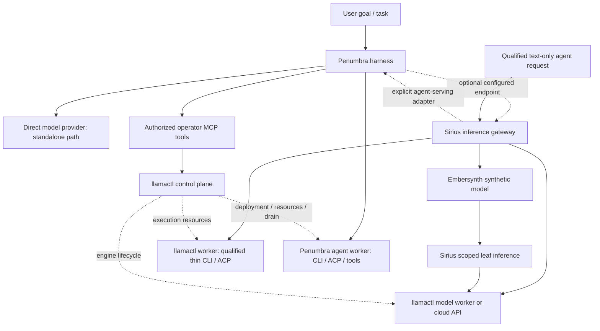

# Penumbra as the family agentic harness: ownership and reuse

Review date: 2026-09-24. Published Penumbra main and the inspected local checkout both resolve to `c264644bc2b4f1e1429e845208fd6ca7f6426d62`. This extends the [family boundary assessment](./2026-09-24-ai-platform-boundaries.md) and the [earlier ACP/CLI reference matrix](./2026-09-23-unified-ai-router-architecture.md#111-penumbra-reuseadaptreject-matrix). It is a source-backed design recommendation in [PR #147](https://github.com/frozename/llamactl/pull/147), tracked by [roadmap #127](https://github.com/frozename/llamactl/issues/127). No implementation, deployment, live agent dispatch or merge is included.

Penumbra is private. References require access; this document records interface findings and reuse decisions without reproducing private implementation code, credentials, operational configuration or transcripts.

## Infrastructure execution versus developer harness

The product split is **llamactl/Sirius/Embersynth for infrastructure serving, Penumbra for developer and engineer workflows**. Enterprise deployment is a target use case, not certification of current isolation, failover or protocol readiness. This correction supersedes the earlier blanket recommendation that every managed CLI/ACP backend must run through Penumbra. The installation contract applies in both directions: neither product family requires the other's full suite.

| Execution need                                                             | Recommended path                                                                                                       | Owner                                                                                                |
| -------------------------------------------------------------------------- | ---------------------------------------------------------------------------------------------------------------------- | ---------------------------------------------------------------------------------------------------- |
| Model inference, including a qualified constrained CLI/ACP backend         | Sirius selects the target; a llamactl worker executes through a thin adapter using qualified shared runtime primitives | Selected llamactl worker owns process, credentials, permissions and any explicitly supported session |
| Coding task with goals, worktrees, reviews, memory, approvals or workflows | Explicit optional Penumbra run integration; expose a run API and only deliberately qualified inference profiles        | Penumbra owns its run and child/session lifecycle                                                    |
| Local developer use                                                        | Penumbra uses its direct HTTP/CLI/ACP paths; optional gateway/resources as configured                                  | Penumbra; no infrastructure stack required                                                           |

**Preferred reuse: a small versioned execution library, not a second harness or a required Penumbra daemon.** Candidate scope: stdio framing, request correlation, cancellation/termination, bounded I/O, executable/model capability negotiation and pool lifecycle primitives. Keep task orchestration, agent selection, workflow scheduling, memory, registrar, worktree management, UI and approval persistence outside it. The host injects credentials, permission decisions, logging and storage hooks; the library must not read a Penumbra home directory, connect to its daemon or auto-register workflows. It is an implementation dependency bundled into the consuming install, not another operator-managed service or configuration file. Its final package name/location must follow dependency inspection and real consumer tests; Nova remains the owner of model schemas, not a container for process supervisors.

This is feasible to investigate, not an existing package claim. The inspected [stdio client imports](https://github.com/frozename/penumbra/blob/c264644bc2b4f1e1429e845208fd6ca7f6426d62/packages/agentchat/src/adapters/stdio-acp-client.ts#L1-L40) use standard stream/readline interfaces; [CLI spawn inputs](https://github.com/frozename/penumbra/blob/c264644bc2b4f1e1429e845208fd6ca7f6426d62/packages/agentchat/src/adapters/cli-spawn.ts#L1-L27) include harness event/thought-capture types that need neutral host callbacks. Type-only references are coupling to remove, not proof of runtime database loading. The package dependency closure and full adapter imports still need validation; importing all of private `@penumbra/agentchat` is rejected. Preserve license notices and existing fixtures during any extraction.

Qualification must demonstrate:

- A packed artifact installs and executes fake CLI/ACP fixtures in both consumers without a Penumbra checkout, daemon, database, memory setup or extra config. Measure install dependencies and required setup against current baselines. Retain direct adapters until consumer parity is proved; if extraction is too coupled, keep the existing narrow CLI path and defer expanded ACP rather than forcing a full-suite dependency.
- Host-selected identity, credentials, executable/model selector, workspace and permission policy are enforced before spawn. Start with explicit opt-in constrained ephemeral text profiles; a text-only label alone does not disable an agent's tools or isolate its process. Deny unsupported profiles until enforced isolation and tool ownership are proved. Do not copy the developer harness's trust settings into shared serving.
- Cancellation, source completion, bounded queues, process cleanup, credential-scoped pooling, unavailable usage and uncertain acceptance retain the existing safety gates. Full harness delegation earns its complexity only when the requested workflow actually needs it; it is not the default CLI transport.
- Exactly one selected runtime owns a process/session. Library reuse is code reuse, not shared distributed state. Session leases/fencing and resume belong to that runtime; infrastructure sessions are llamactl worker work, developer sessions are Penumbra work. No automatic fallback, session transfer or duplicate tool execution across them. Client-owned OpenAI tool calls return to the caller; agent-executed tools remain with the declared runtime under its permission policy.

P2 should qualify selectors, ownership and lifecycle on the thin worker path, reusing extracted primitives when viable. P6 should qualify ephemeral ACP there before managed sessions. Add optional Penumbra delegation as a separately scoped integration when there is a concrete harness use case; it must not block basic infrastructure serving or semantic caching. Rebase future repository/file fences, acceptance dependencies and task payloads accordingly; preserve active P0.2 work. No extraction, runtime implementation or readiness claim is made by this documentation change.

## 1. Ownership correction

**Penumbra owns developer-harness execution: goals, agent selection, workflows, its tool permissions and CLI/ACP children, conversations, memory, review/handoff lifecycle and durable initiative tracking.** Infrastructure CLI/ACP execution may use a thin llamactl worker adapter and shared primitives without the harness. Reuse the full service only for explicit harness semantics.

| Product    | Owns                                                                                                                   | Uses the others for                                                                                                                                                          |
| ---------- | ---------------------------------------------------------------------------------------------------------------------- | ---------------------------------------------------------------------------------------------------------------------------------------------------------------------------- |
| Penumbra   | Agent runs, task/role routing, tool policy, managed agent processes, workflow execution, agent memory and run evidence | Direct model providers by default; optional Sirius inference, Embersynth synthetic models and llamactl operator tools                                                        |
| llamactl   | Machines, deployments, model artifacts, engine KV and qualified infrastructure CLI/ACP execution                       | Provision/register a Penumbra worker as a managed service; report runtime readiness without claiming ownership of its individual agent sessions                              |
| Sirius     | Public inference protocols, client identity/admission, provider selection, response caching and request accounting     | Penumbra only through explicitly qualified agent-serving profiles; ordinary inference does not require a harness run                                                         |
| Embersynth | Versioned synthetic-model composition, stage routing and evidence inside one inference contract                        | Sirius leaf inference; optional explicit Penumbra agent-run stage only where a recipe declares its side effects and lifecycle                                                |
| Nova       | Shared model request/response/stream/usage contracts and neutral protocol adapters                                     | Penumbra keeps its own agent-run/task/permission domain schemas in `@penumbra/api-contract`; bridge compatible model payloads instead of moving the harness domain into Nova |

llamactl may start, health-check, drain or replace a **Penumbra worker service** as infrastructure. Penumbra remains the owner of agent execution and permission/session state; its worker owns the managed CLI/ACP children and process pool, while daemon services retain durable authorization and run state. One runtime can be colocated with model-serving workers without sharing ownership. Infrastructure replacement must first request harness drain and wait for the defined terminal/timeout policy; it cannot reinterpret a live agent run as a restartable model request.

Keep standalone model and qualified infrastructure CLI/ACP serving independent of Penumbra. Developer workflow features target Penumbra; thin execution targets the selected worker. Declare the runtime-owner binding; never have both runtimes claim the same process, credentials or session.

### Reuse strategies considered

| Strategy                                                                  | Evaluation                                                                                                                                           |
| ------------------------------------------------------------------------- | ---------------------------------------------------------------------------------------------------------------------------------------------------- |
| Copy Penumbra adapters, sessions, permissions and workflows into llamactl | Reject. Duplicates ownership, release fixes, approval state and run history; imports harness assumptions into an inference worker                    |
| Make every inference request a Penumbra chain                             | Reject. Ordinary model serving needs neither worktree creation nor agent/task lifecycle, and current chain output is not a transparent OpenAI stream |
| Share qualified execution primitives; optionally invoke Penumbra          | Recommend. Thin infrastructure execution avoids a full-suite dependency; explicit harness delegation preserves developer workflow semantics          |

An agent-serving request must restrict subsequent model calls to allowed leaf targets and carry a visited-target/hop budget. It must not recursively invoke its own agent alias through Sirius. A general goal/task goes to Penumbra's run surface; a `/v1` text profile is a deliberately smaller capability, not a generic way to hide workspace mutation behind a model name.

## Installation and configuration contract

**Ownership is a code and domain boundary, not a mandatory deployment graph. Penumbra must remain independently installable and usable.** The user requirement is to avoid making installs or configuration harder, especially for Penumbra. This contract governs the service-reuse recommendations below.

| Mode                                           | Setup and dependencies                                                                                                                                                             |
| ---------------------------------------------- | ---------------------------------------------------------------------------------------------------------------------------------------------------------------------------------- |
| Standalone Penumbra (default)                  | Existing direct HTTP providers, local CLI/ACP adapters and local storage/embedder modes; no new family service                                                                     |
| Optional gateway                               | Configure one Sirius endpoint and its access reference/profile when centralized policy or response caching is wanted; upstream provider credentials remain with their chosen owner |
| Optional managed resources or synthetic models | Add llamactl or Embersynth only for explicitly selected capabilities; a combined installation may generate wiring without requiring manual configuration in every product          |

1. **No additional default prerequisites.** This roadmap must not require Sirius, llamactl, Embersynth, PostgreSQL, Docker/Kubernetes or a sibling source checkout to install or run Penumbra. Package or service reuse must demonstrate a supported install artifact; existing private workspace dependencies are not proof of standalone distribution.
2. **Keep direct adapters.** A harness calling its model provider directly is ordinary client functionality. Preserve those paths and existing credential references; gateway integration is opt-in. Small, versioned transport or ranking primitives may be reused without an extra daemon when there is a real consumer and bounded dependencies. Managed agent processes still have one lifecycle owner.
3. **One setup/configuration entry point.** Extend Penumbra's existing setup flow to manage optional integration choices over its compatible configuration files. Do not introduce another mandatory family YAML, require duplicate provider/credential entry, or force existing split files into a new physical file. Endpoint, existing secret reference and selected profile should suffice for ordinary integration setup; discover capabilities and default advanced controls.
4. **Explicit configuration ownership.** Existing Penumbra configuration stays Penumbra-owned. Generated integration overlays must identify their owner and origin, preserve user overrides and unrelated settings, and never silently transfer configuration authority to llamactl. Users should not maintain the same provider definition in several products.
5. **Optional means operationally optional.** Unconfigured services do not participate in startup or health checks and are not auto-started. Failure of an explicitly selected integration affects that route with a clear error; it does not silently send data to a different provider or bypass gateway policy. Unaffected direct routes keep working.
6. **Reversible integration.** Upgrade, disconnect and rollback preserve standalone settings and credentials. Distributed cache/coordination prerequisites apply only to the explicitly enabled fleet capabilities that need them; local memory, embedded exact caching and basic inference retain their existing modes.
7. **Evidence before acceptance.** Add clean-install, existing-config upgrade, optional-service-absent, selected-service-unavailable, disconnect and rollback fixtures. Compare required commands, services, configuration fields and credential entries against today's baseline: no extra required setup for standalone Penumbra. Check precedence and generated-overlay cleanup without deleting user settings. Record these gates in each affected future task during scope rebase; preserve active P0.2 fences.

These defaults fit the inspected code: the [adapter registry](https://github.com/frozename/penumbra/blob/c264644bc2b4f1e1429e845208fd6ca7f6426d62/packages/agentchat/src/adapters/registry.ts#L18-L62) includes direct HTTP and CLI/ACP adapters with existing credential-reference options; the [embedder resolver](https://github.com/frozename/penumbra/blob/c264644bc2b4f1e1429e845208fd6ca7f6426d62/packages/core/src/embedder/resolve.ts#L14-L49) supports bundled/auto fallback; [initialization](https://github.com/frozename/penumbra/blob/c264644bc2b4f1e1429e845208fd6ca7f6426d62/packages/cli/src/commands/init.ts#L73-L88) preserves existing agentchat configuration by default. A unified setup experience and integration overlays are proposed work, not claims that all current configuration is already consolidated. Embedding fallback must still respect the namespace-isolation requirements below.

## 2. Concrete reuse/adapt/reject matrix

All source links in this section pin the reviewed Penumbra commit. Tests establish the stated local contracts, not distributed production readiness.

| Existing capability                                     | Reuse decision                                                      | Evidence and required boundary                                                                                                                                                                                                                                                                                                                                                                                                                                                                                                                                                                                                                                                                                                                            |
| ------------------------------------------------------- | ------------------------------------------------------------------- | --------------------------------------------------------------------------------------------------------------------------------------------------------------------------------------------------------------------------------------------------------------------------------------------------------------------------------------------------------------------------------------------------------------------------------------------------------------------------------------------------------------------------------------------------------------------------------------------------------------------------------------------------------------------------------------------------------------------------------------------------------- |
| CLI/ACP adapter dispatch and agent selection            | **Adapt primitives; service only for harness runs**                 | [Adapter input/output](https://github.com/frozename/penumbra/blob/c264644bc2b4f1e1429e845208fd6ca7f6426d62/packages/agentchat/src/sdk/adapter.ts#L14-L70) carries conversation, permission callback, executor, abort and dispatch identity. [Chain schema](https://github.com/frozename/penumbra/blob/c264644bc2b4f1e1429e845208fd6ca7f6426d62/packages/api-contract/src/chains.ts#L160-L219) returns conversation/handoff and routing identities. It does not define a generic model override or inference messages/tools contract                                                                                                                                                                                                                       |
| Warm processes and cancellation-safe pool ownership     | **Qualify shared pool primitives; host owns state**                 | [Pool semantics](https://github.com/frozename/penumbra/blob/c264644bc2b4f1e1429e845208fd6ca7f6426d62/packages/agentchat/src/adapters/acp-warm-pool.ts#L4-L25), [fresh session creation](https://github.com/frozename/penumbra/blob/c264644bc2b4f1e1429e845208fd6ca7f6426d62/packages/agentchat/src/adapters/stdio-acp.ts#L1786-L1807). Reuse warm-pool/reload/abort fixtures. Extend tenant/account/credential-generation/workspace/executable scoping for any serving profile; a fresh ACP session does not clear process credentials                                                                                                                                                                                                                    |
| JSON-RPC transport and bounded subprocess helpers       | **Possible small-library extraction for a real consumer**           | [ACP client](https://github.com/frozename/penumbra/blob/c264644bc2b4f1e1429e845208fd6ca7f6426d62/packages/agentchat/src/adapters/stdio-acp-client.ts#L69-L173), [CLI spawn](https://github.com/frozename/penumbra/blob/c264644bc2b4f1e1429e845208fd6ca7f6426d62/packages/agentchat/src/adapters/cli-spawn.ts#L291-L380). Preserve tests and license; add explicit byte/request/backpressure limits where missing. Do not import the worker dispatcher as an inference SDK                                                                                                                                                                                                                                                                                 |
| Permissions and tool execution                          | **Host policy; optional harness service; no sandbox claim**         | [Permission callback](https://github.com/frozename/penumbra/blob/c264644bc2b4f1e1429e845208fd6ca7f6426d62/packages/agentchat/src/worker/permission-callback.ts#L40-L66), [spawn implementation](https://github.com/frozename/penumbra/blob/c264644bc2b4f1e1429e845208fd6ca7f6426d62/packages/agentchat/src/worker/sandbox-spawn.ts#L128-L145). Existing approvals and scoped execution are valuable; plain `Bun.spawn` plus cwd/environment/time limits is not OS isolation. Never force `trust_mode: all` to make a gateway call finish                                                                                                                                                                                                                  |
| Conversation history, active injection and cancellation | **Reuse, with explicit semantics**                                  | [Cancellation handler](https://github.com/frozename/penumbra/blob/c264644bc2b4f1e1429e845208fd6ca7f6426d62/packages/mcp/src/tools/chain-cancel.ts#L25-L59) cancels the entire conversation resolved from a handoff. `cancel_requested` is an acknowledgement, not process exit. History-based continuation and active-session injection are not durable ACP resume                                                                                                                                                                                                                                                                                                                                                                                        |
| Agent memory and retrieval                              | **Consume Penumbra memory through its service**                     | [Recall fusion/cancellation](https://github.com/frozename/penumbra/blob/c264644bc2b4f1e1429e845208fd6ca7f6426d62/packages/core/src/readers/recall.ts#L31-L75), [project-filtered memory query](https://github.com/frozename/penumbra/blob/c264644bc2b4f1e1429e845208fd6ca7f6426d62/packages/core/src/readers/recall.ts#L245-L260). Keep agent memory, provenance and retention in Penumbra; do not expose a caller-selected project filter as tenant authorization. Memory can supply explicit recipe evidence, not silent state in a cacheable model                                                                                                                                                                                                     |
| Embedding provider selection and liveness fixtures      | **Adapt narrowly, preferably to existing Nova embedding contracts** | [Remote/auto resolver](https://github.com/frozename/penumbra/blob/c264644bc2b4f1e1429e845208fd6ca7f6426d62/packages/core/src/embedder/resolve.ts#L14-L49), [remote validation](https://github.com/frozename/penumbra/blob/c264644bc2b4f1e1429e845208fd6ca7f6426d62/packages/core/src/embedder/openai-compat.ts#L45-L110). Reuse real embedding round-trip and dimension/count fixtures. Add cancellable deadlines, unique valid indexes, finite/nonzero vector checks and immutable embedder namespace. Auto fallback must never silently switch embedding spaces in a response-cache namespace                                                                                                                                                           |
| Reciprocal-rank fusion                                  | **Reuse or extract for retrieval ranking**                          | [Pure RRF implementation](https://github.com/frozename/penumbra/blob/c264644bc2b4f1e1429e845208fd6ca7f6426d62/packages/core/src/readers/rrf.ts#L49-L95), [ranking/provenance tests](https://github.com/frozename/penumbra/blob/c264644bc2b4f1e1429e845208fd6ca7f6426d62/packages/core/test/readers/rrf.test.ts#L11-L55). Useful for combining evidence candidates. An RRF rank is not a calibrated semantic answer-equivalence threshold                                                                                                                                                                                                                                                                                                                  |
| Embedding-version guard and query-rewrite cache         | **Reuse lessons/fixtures; reject as response-cache correctness**    | [Version guard](https://github.com/frozename/penumbra/blob/c264644bc2b4f1e1429e845208fd6ca7f6426d62/packages/core/src/db/embedding-version-guard.ts#L3-L22) only returns a warning, [logged at startup](https://github.com/frozename/penumbra/blob/c264644bc2b4f1e1429e845208fd6ca7f6426d62/packages/daemon/src/serve.ts#L1662-L1668). [Rewrite-cache key/TTL](https://github.com/frozename/penumbra/blob/c264644bc2b4f1e1429e845208fd6ca7f6426d62/packages/daemon/src/dreaming/query-rewriter-cache.ts#L63-L86) is memory ID/update/model, not strict tenant/model/protocol response identity. Gateway mismatch must miss or reject safely, not merely warn                                                                                              |
| Sirius observation integration                          | **Reuse supported integration, then harden the boundary**           | [Opt-in capture and supplied identity headers](https://github.com/frozename/penumbra/blob/c264644bc2b4f1e1429e845208fd6ca7f6426d62/packages/integrations/sirius-middleware/src/plugin.ts#L215-L235), [nonblocking dispatch/drop accounting](https://github.com/frozename/penumbra/blob/c264644bc2b4f1e1429e845208fd6ca7f6426d62/packages/integrations/sirius-middleware/src/plugin.ts#L167-L193), [raw-stream taps](https://github.com/frozename/penumbra/blob/c264644bc2b4f1e1429e845208fd6ca7f6426d62/packages/integrations/sirius-middleware/src/plugin.ts#L384-L445). Extend to approved protocol/event types with bounded capture, trusted scope, content minimization and retention controls. It is not cache-completion proof or billing authority |

### Workflows, scheduling and durable tracking

| Existing capability                                  | Reuse decision                                                                             | Implementation evidence and limits                                                                                                                                                                                                                                                                                                                                                                                                                                                                                                                                                                                                                                                                                                                                                                                                                                                                                                              |
| ---------------------------------------------------- | ------------------------------------------------------------------------------------------ | ----------------------------------------------------------------------------------------------------------------------------------------------------------------------------------------------------------------------------------------------------------------------------------------------------------------------------------------------------------------------------------------------------------------------------------------------------------------------------------------------------------------------------------------------------------------------------------------------------------------------------------------------------------------------------------------------------------------------------------------------------------------------------------------------------------------------------------------------------------------------------------------------------------------------------------------------- |
| Executable workflows and run history                 | **Reuse Penumbra service** for agent research, review, implementation and operational work | [Run route](https://github.com/frozename/penumbra/blob/c264644bc2b4f1e1429e845208fd6ca7f6426d62/packages/daemon/src/routes/workflows.ts#L924-L1019) validates/registers execution and persists outcomes; [run registry](https://github.com/frozename/penumbra/blob/c264644bc2b4f1e1429e845208fd6ca7f6426d62/packages/daemon/src/services/workflow-runs-registry.ts#L112-L173) retains run records. Persisted status/results do not establish arbitrary function checkpoint/replay after a crash. Supply explicit project/cwd; never inherit the daemon checkout accidentally                                                                                                                                                                                                                                                                                                                                                                    |
| Fanout, deadlines and retry classification           | **Reuse service; adapt the deadline contract only when needed elsewhere**                  | [Shared fanout](https://github.com/frozename/penumbra/blob/c264644bc2b4f1e1429e845208fd6ca7f6426d62/plugin/workflows/_shared/fanout.ts#L319-L407) bounds waits when a deadline exists, but uses `Promise.all` without its own concurrency cap and does not automatically cancel timed-out children. Worker/provider admission is separate. Do not advertise this as a bounded general inference scheduler                                                                                                                                                                                                                                                                                                                                                                                                                                                                                                                                       |
| Agent quality/role routing and constraint evaluation | **Keep agent-seat policy in Penumbra; selectively adapt pure constraints**                 | [Decision engine](https://github.com/frozename/penumbra/blob/c264644bc2b4f1e1429e845208fd6ca7f6426d62/packages/core/src/routing/router.ts#L108-L183), [production caller](https://github.com/frozename/penumbra/blob/c264644bc2b4f1e1429e845208fd6ca7f6426d62/packages/daemon/src/routes/role-routing.ts#L128-L186). The caller omits comprehensive candidate facts; [derived facts](https://github.com/frozename/penumbra/blob/c264644bc2b4f1e1429e845208fd6ca7f6426d62/packages/core/src/routing/router.ts#L498-L521) do not prove capabilities/context/quota eligibility. [Pure filter](https://github.com/frozename/penumbra/blob/c264644bc2b4f1e1429e845208fd6ca7f6426d62/packages/core/src/routing/constraint-filter.ts#L61-L99) permits several unknown values. A serving profile needs explicit fail-closed constraints; agent router fallback is not gateway admission                                                                 |
| Task leases and deterministic eligibility/auction    | **Reuse task service; adapt small pure policies only if useful**                           | [Transactional task claim](https://github.com/frozename/penumbra/blob/c264644bc2b4f1e1429e845208fd6ca7f6426d62/packages/core/src/tasks/writer.ts#L625-L672), [eligibility](https://github.com/frozename/penumbra/blob/c264644bc2b4f1e1429e845208fd6ca7f6426d62/packages/core/src/tasks/eligibility.ts#L25-L70), [ordering](https://github.com/frozename/penumbra/blob/c264644bc2b4f1e1429e845208fd6ca7f6426d62/packages/core/src/tasks/auction.ts#L9-L39). These schedule agent work, not GPU/KV capacity. Unknown cost treated as zero is not a hard budget guarantee; lease expiry does not prove side effects are safe to repeat                                                                                                                                                                                                                                                                                                             |
| Registrar and result/recovery evidence               | **Reuse existing ledger and services**                                                     | [Registrar transactions/CAS](https://github.com/frozename/penumbra/blob/c264644bc2b4f1e1429e845208fd6ca7f6426d62/packages/core/src/registrar/writer.ts#L46-L189), [dispatch reliability](https://github.com/frozename/penumbra/blob/c264644bc2b4f1e1429e845208fd6ca7f6426d62/packages/core/src/services/dispatch-reliability.ts#L140-L293), [orphan recovery](https://github.com/frozename/penumbra/blob/c264644bc2b4f1e1429e845208fd6ca7f6426d62/packages/daemon/src/services/orphan-handoff-recovery.ts#L141-L205). Keep initiative/run evidence in Penumbra and deployed-state facts in their owning services. Artifact/reliability evidence does not imply semantic correctness or exactly-once execution                                                                                                                                                                                                                                   |
| Long-lived operational agents and tool approvals     | **Reuse harness supervision with explicit infrastructure policy**                          | [Tick exclusion](https://github.com/frozename/penumbra/blob/c264644bc2b4f1e1429e845208fd6ca7f6426d62/packages/daemon/src/long-lived/tick-gate.ts#L135-L198) and [action gate](https://github.com/frozename/penumbra/blob/c264644bc2b4f1e1429e845208fd6ca7f6426d62/packages/daemon/src/long-lived/action-gate.ts#L173-L236) provide useful machinery. The [baseline tool tiers](https://github.com/frozename/penumbra/blob/c264644bc2b4f1e1429e845208fd6ca7f6426d62/packages/daemon/src/long-lived/action-gate.ts#L17-L32) are domain-specific and unknown tools default to tier 1; [snapshot failure policy](https://github.com/frozename/penumbra/blob/c264644bc2b4f1e1429e845208fd6ca7f6426d62/packages/daemon/src/long-lived/action-gate-callbacks.ts#L92-L102) defaults open. Family infrastructure actions require explicit tier mapping, unknown-tool denial and required-precondition checks; no replacement for llamactl reconciliation |

Several workflow output shapes are declared without implementation: [executor validation](https://github.com/frozename/penumbra/blob/c264644bc2b4f1e1429e845208fd6ca7f6426d62/packages/workflows/src/exec.ts#L93-L113) rejects commit/dispatch output sinks and unsupported process gates. A workflow wait timeout can leave the underlying run active. Test cancellation and crash/recovery behavior rather than inferring it from a successful schema parse or stored run row.

Penumbra and Embersynth can both use fanout, judging and synthesis without owning the same product capability. Penumbra's unit is an agent task with workspace/tools/approvals and run evidence. Embersynth's unit is one synthetic inference result with recipe/stage semantics. Keep those contracts separate; an explicit cross-service stage may connect them, but a model recipe must not silently create worktrees or agent handoffs.

### Specific limits of current runtime reuse

The pool keeps a live process and initialized transport; every dispatch starts a new session. No `session/load` or `session/resume` path was found in the inspected agentchat source. The current official [ACP session specification](https://agentclientprotocol.com/protocol/v1/session-setup) requires capability negotiation for load/resume, and distinguishes load with history replay from resume without replay. Persistent vendor sessions therefore remain new, Penumbra-owned work. The existing implementation's protocol/executable qualification gaps in the earlier matrix still apply.

The ACP adapter captures context occupancy and optional currency cost [usage handler](https://github.com/frozename/penumbra/blob/c264644bc2b4f1e1429e845208fd6ca7f6426d62/packages/agentchat/src/adapters/stdio-acp.ts#L1158-L1185). These are not interchangeable with per-request input/output tokens. Its accumulated response/capture callbacks do not establish a bounded, native-protocol streaming API. Reuse Nova usage provenance and preserve unknown values in the bridge.

ACP tool activity is agent-owned execution. Return client-owned OpenAI tool calls to their client; never execute an ACP tool and then present it as a new client instruction to execute the same action. The [ACP prompt-turn specification](https://agentclientprotocol.com/protocol/v1/prompt-turn) distinguishes updates, tool/permission activity and the terminal prompt result. Tool-free serving needs enforcement at the executor and advertised capability boundary; a prompt instruction or `tool_free` hint alone is not a sandbox.

## 3. Memory, caching and observability stay distinct

Penumbra's t0/t1/t2 data supports agent context and operational evidence. A memory hit retrieves information for another reasoning step; it does not assert that a previous answer is safe to return unchanged. Leave final-response exact/semantic policy with Sirius, engine KV with inference workers, and recipe artifacts with Embersynth.

Concrete incompatibilities prevent substituting Penumbra recall for the proposed response cache:

- Recall can fuse different tiers and apply ranking boosts. Its score is retrieval relevance, not an evaluated answer-equivalence probability.
- Its embedding interface lacks an `AbortSignal`; recall checks cancellation before and after embedding, but cannot abort that in-flight embedding call [recall source](https://github.com/frozename/penumbra/blob/c264644bc2b4f1e1429e845208fd6ca7f6426d62/packages/core/src/readers/recall.ts#L31-L44).
- The remote embedder validates response cardinality/dimension, but does not establish all finite-value/index/revision guarantees needed by cache ingestion.
- Project filtering is useful but insufficient for tenant/account/credential/model/system/generation/protocol separation. Missing embedder revision cannot mean compatible.

Agent runs and managed sessions bypass outer answer caching because they can observe mutable memory, workspace state and tools. A separately declared pure leaf-model call inside a run can qualify under Sirius's ordinary policy using its complete effective prompt/scope; that does not authorize caching the whole run.

The Sirius middleware is real code with passing fixtures. Its consumer registration is present in local Sirius commit `42f3ca8803c67383ab491a0e1b2e509563058ad1`, while published Sirius main `1ae980bd59951e9e23fdc738d05a3032e199d4c2` has no such registration in `apps/sirius-api/src/main.ts`. Do not claim published integration solely from the local checkout.

The plugin is opt-in through a project header and currently captures Chat Completions. It accumulates content, retains a last usage observation and drops failed observation sends. Its [event builder](https://github.com/frozename/penumbra/blob/c264644bc2b4f1e1429e845208fd6ca7f6426d62/packages/integrations/sirius-middleware/src/observation-builder.ts#L42-L89) preserves unavailable token counts as null. That is useful telemetry, but it is not durable billing, request admission or an authenticated tenant boundary. Map project/user identity from trusted gateway context, bound capture/export buffers, and apply explicit content-retention policy before shared deployment. Penumbra ingestion [normalizes identity and payload](https://github.com/frozename/penumbra/blob/c264644bc2b4f1e1429e845208fd6ca7f6426d62/packages/core/src/normalize/ingest.ts#L35-L65); it must not be assumed to preserve every caller-supplied identity field unchanged.

Keep physical usage at the actual model/agent attempt and logical delivery at Sirius. Join Penumbra run/handoff, Embersynth stage and Nova request/attempt IDs; avoid billing an observation and its originating model call twice. Observation export failure can be isolated from inference, while required permission decisions and run acceptance must retain their stricter failure semantics.

## 4. Service contract and package boundaries

For explicitly selected developer-harness operations, use Penumbra's existing MCP/HTTP chain, workflow, memory, task and registrar surfaces. Do not add a second queue, approval database, task registry or workflow runner to llamactl. Existing chain submission returns conversation/handoff identities; acceptance is not completion. There is no idempotency key in the inspected chain-start schema. A caller-supplied conversation ID must not be assumed to deduplicate submissions.

For optional full-harness delegation, define a versioned **agent-serving bridge** in Penumbra's API contract and a consumer adapter in Sirius. These are proposed integration contracts, not new APIs claimed to exist:

| Contract area              | Required semantics and owner                                                                                                                                                                                                              |
| -------------------------- | ----------------------------------------------------------------------------------------------------------------------------------------------------------------------------------------------------------------------------------------- |
| Identity and target        | Authenticated principal, mapped project/workspace, declared agent profile and actual selected agent/model. Server-owned bindings; no public arbitrary binary, argv, cwd, environment or trust override                                    |
| Lifecycle                  | Submit/accepted/running/awaiting-approval/terminal/unknown distinguished; explicit run and attempt IDs; result/artifact/error shape. Preserve full agent output on the run API; constrain `/v1` profiles deliberately                     |
| Cancellation and deadlines | One isolated conversation per external run until narrower cancellation is implemented; cancellation request versus confirmed termination; propagate client disconnect and deadline to the owning Penumbra worker                          |
| Retry and recovery         | Durable idempotency contract or explicit non-retryable uncertain submission; no replay after output/side effect/uncertain acceptance. Historical conversation continuation is a new run unless negotiated vendor-session resume is proved |
| Streaming and usage        | Bounded event delivery, source terminal proof, late-event rejection, consumer-return cleanup and optional observed usage. Use Nova model payloads where appropriate, Penumbra events for approvals/artifacts/tools                        |
| Deployment and ownership   | llamactl publishes runtime endpoint/capabilities/readiness and invokes drain; Penumbra owns agent admission, process/session state and any future distributed session fencing. Machine leases do not imply agent-session authority        |
| Permissions and secrets    | Penumbra selects approved tool/workspace/credential policy. Gateway receives opaque scope references and results. Worker-local credentials stay with the executor; no shared home directory or copied login state is assumed              |

The root [MIT license](https://github.com/frozename/penumbra/blob/c264644bc2b4f1e1429e845208fd6ca7f6426d62/LICENSE#L1-L21) supports code reuse with the required notice. It does not confer vendor executable licenses or account permissions. The inspected [agentchat package](https://github.com/frozename/penumbra/blob/c264644bc2b4f1e1429e845208fd6ca7f6426d62/packages/agentchat/package.json#L1-L35) is private, exports TypeScript source and depends on workspace core/config. [Core](https://github.com/frozename/penumbra/blob/c264644bc2b4f1e1429e845208fd6ca7f6426d62/packages/core/package.json#L1-L32) brings database/embedding/runtime dependencies. Importing it wholesale into llamactl core or Sirius is not a small adapter dependency.

Prefer service reuse for full harness semantics, without adding an external service to standalone Penumbra. If ACP framing, process termination, RRF or another primitive gets a second real consumer, extract a deliberately versioned package with limited dependencies and its existing fixtures. Do not deep-import private sibling `src` paths. Share model contracts through Nova; keep goal/task/run/permission schemas in Penumbra. No premature universal workflow framework is required.

## 5. Roadmap amendments and acceptance gates

Preserve stable issue IDs and active P0.2 work. The prior allocation and strict task payloads must be rebased before the next affected dispatch; this document does not transfer issues or cancel running lanes.

| Existing scope                                                                                                                                                                                    | Revised destination and concrete work                                                                                                                                                                                                                                              |
| ------------------------------------------------------------------------------------------------------------------------------------------------------------------------------------------------- | ---------------------------------------------------------------------------------------------------------------------------------------------------------------------------------------------------------------------------------------------------------------------------------- |
| R0 / P0.2 ([#128](https://github.com/frozename/llamactl/issues/128), [#130](https://github.com/frozename/llamactl/issues/130))                                                                    | Distinguish thin worker execution from optional Penumbra delegation. Keep Nova model schemas and existing consumer fixes; define Penumbra run/profile descriptors in `packages/api-contract/src/chains.ts` or a new adjacent agent-serving module, not duplicate chat/tool schemas |
| P1.1 / P1.3 ([#131](https://github.com/frozename/llamactl/issues/131), [#133](https://github.com/frozename/llamactl/issues/133))                                                                  | Sirius catalog and proposed `libs/provider-penumbra/` expose only qualified profiles. Bridge usage, terminal/error/cancel and trusted trace identity; use the existing observation integration with its stated gaps                                                                |
| P2.1 / P2.2 ([#134](https://github.com/frozename/llamactl/issues/134), [#135](https://github.com/frozename/llamactl/issues/135))                                                                  | Qualify shared primitives from Penumbra `packages/agentchat/src/adapters/`; llamactl `packages/remote/src/providers/` and worker RPC own infrastructure dispatch and host policy. Penumbra retains its harness host; avoid copying orchestration                                   |
| P3.1 / P3.2 / P3.3 ([#136](https://github.com/frozename/llamactl/issues/136), [#137](https://github.com/frozename/llamactl/issues/137), [#138](https://github.com/frozename/llamactl/issues/138)) | Sirius semantic cache stays separate. Reuse embedding-validation fixtures and retrieval ideas; enforce complete namespace/cancellation guarantees. Agent runs remain ineligible                                                                                                    |
| P4.1 ([#139](https://github.com/frozename/llamactl/issues/139))                                                                                                                                   | Distinct model-worker RPC and Penumbra agent-run adapter, both with explicit capabilities; do not carry agent tasks through an undocumented model-worker envelope                                                                                                                  |
| P5.1 / P5.2 ([#142](https://github.com/frozename/llamactl/issues/142), [#143](https://github.com/frozename/llamactl/issues/143))                                                                  | Keep infrastructure placement/session ownership in llamactl, provider/cache affinity in Sirius, developer task/seat routing and its session ownership in Penumbra. Do not copy quality routing as a fleet lease or cache-shard algorithm                                           |
| P6.1 / P6.2 ([#145](https://github.com/frozename/llamactl/issues/145), [#146](https://github.com/frozename/llamactl/issues/146))                                                                  | Qualify shared ACP primitives in a thin llamactl worker host: ephemeral constrained text first, then host-owned sessions/fencing. Full Penumbra delegation is an optional separate scope, not an ACP prerequisite                                                                  |

Recommended sequence:

1. **Bind ownership and contracts.** Rebase next-task repository/file fences and dependency evidence. Finish active P0.2 fixes without expanding them into this service integration. Record one process/session owner and existing capability gaps.
2. **Qualify the thin runtime before public inference exposure.** First prove packed-library dependency closure and both consumer fixtures. For optional harness delegation, separately verify submit/status/results, idempotent or explicitly uncertain acceptance, cancellation scope, permission waiting and artifacts. A lost acknowledgement must not launch a second side-effecting run.
3. **Qualify an ephemeral text-only profile.** Fake executables verify actual model selection, denied tools/filesystem access, bounded output/queues, terminal proof, cancellation and unknown usage. Same tenant with changed credentials/workspace must not reuse an incompatible pool entry. Opt-in real-agent qualification pins executable/protocol versions separately.
4. **Join observations without coupling availability.** Test trusted project mapping, protocol coverage, bounded buffers, dropped exports, replay provenance and no double counting across gateway/model/agent/stage events. Keep raw prompts out of default metric labels and apply explicit payload-retention rules.
5. **Add managed state only after proof.** Capability-gated load/resume, history replay isolation, expected turn sequencing, owner-loss fencing and restart recovery belong to the selected runtime, not automatically Penumbra. Test worker loss, stale callbacks, duplicate submit and cancellation during approval; no new owner may continue uncertain tool execution automatically.

Proposed controls are profile-specific and default off: agent-serving exposure, worker pool reuse for shared serving, and persistent vendor sessions. Keep the existing harness available to current users while qualifying the new profiles. Rollback removes new profile eligibility, stops accepting new runs and drains existing owners; it must not cancel an unrelated conversation or silently fall back to another CLI. This does not introduce new runtime configuration in this documentation change.

## 6. Verification scope

Current focused read-only research tests passed at the pinned Penumbra source:

- Workflow/fanout/constraints/run-registry and task eligibility/auction/reliability/registrar/tick/action gates: **174 passed, 0 failed, 469 assertions** across ten suites.
- Agentchat pool/spawn/permissions/warm cancellation/dispatcher: **144 passed, 0 failed, 415 assertions** across seven suites. Local fake subprocesses only; no vendor login or live dispatch.
- Core remote embedder/resolution/version guard/recall abort: **25 passed, 0 failed, 51 assertions** across four suites; RRF: **8 passed, 0 failed, 33 assertions**.
- Sirius observation builder/plugin/noop client: **31 passed, 0 failed, 110 assertions** across three suites, using mocked transport/Fastify injection.

These tests verify existing behavior, including its limitations. They do not prove a public agent-serving contract, cross-host isolation, managed session failover or production compatibility. Source/fixture evidence must accompany each extracted primitive or service adaptation. Any later implementation requires Penumbra's relevant package gates plus the affected Nova/Sirius/Embersynth/llamactl consumer gates. No production source files were changed for this review.
